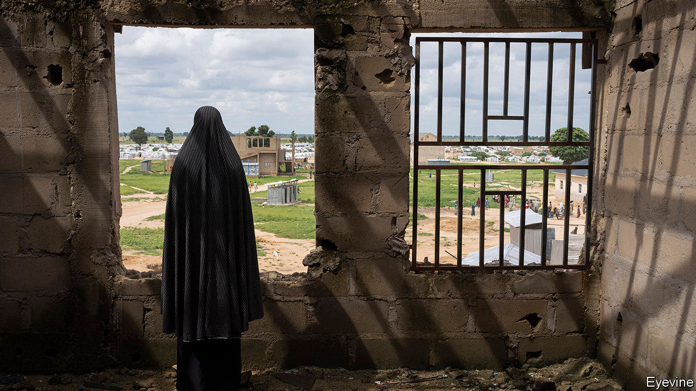
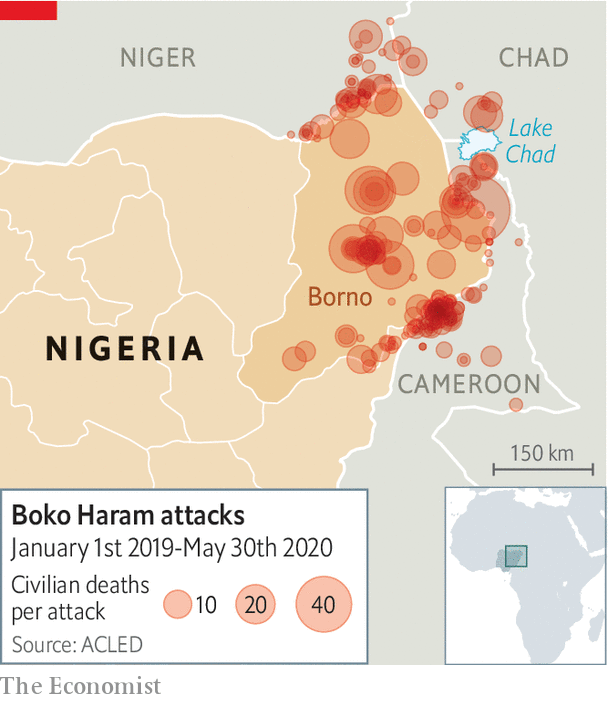

## No rain, slow gains

# In the dry season, Nigeria’s army puts Boko Haram on the back foot

> But the coming rains could bog it down and let the jihadists regroup

> Jun 4th 2020LAGOS

THE CHIEF OF STAFF of Nigeria’s army, General Tukur Buratai, has often declared victory over Boko Haram, a jihadist group known for kidnapping girls and strapping bombs to children. But it was only in April, after soldiers from neighbouring Chad attacked the rebels’ bases, that he felt confident enough to move his headquarters from Abuja, the sleepy federal capital, to Borno state, the heart of the insurgency. It was intended as a signal that Nigeria was entering the final stages of a bloody war that has raged for more than ten years and cost perhaps 40,000 lives, according to the Armed Conflict Location & Event Data Project (ACLED), a non-profit organisation based in America.

Nigerian forces claim to have made big advances and to have killed more than 1,000 insurgents in recent weeks. Few Nigerians believe the government’s numbers or that it is winning the war, since it has been saying so since late 2015. But audio messages released by Abubakar Shekau, the leader of Boko Haram’s main faction, since April suggest the group is indeed hard-pressed. In one of them he wept and prayed for protection from the “devilish” army as he urged his men to stand firm.

But some Nigerian soldiers, casting a weather eye at the horizon, are less confident that the army can keep up its advance in the months ahead. In the dry season, which runs roughly from October to April, the cloudless sky is ideal for air strikes. The ground is baked hard enough for armoured vehicles to move around. Leaves and grass shrivel up, enabling government troops to spot insurgents far away.

The coming rains, though, will turn the earth to knee-deep mud, says a staff sergeant in the army. Soldiers in bogged-down trucks will become sitting ducks. The insurgents, who often zip around on motorbikes, may regain the initiative. “The only thing we do in the rainy season is ambush,” says the sergeant. Artillery shells often fail to detonate when hitting the damp soil, leaving a trove of explosives that the rebels turn into roadside bombs, says Ahmad Salkida, the editor of HumAngle, a digital news site.

The seasonal ebb and flow of the war is becoming wearingly familiar. ACLED data suggest that government attacks on Boko Haram pick up in the dry season. At this time the group lies low, leaving most of the attacking to Islamic State West Africa Province, a splinter group with links to jihadists in Syria and Iraq.

In the rainy season the army usually retreats into its base camps dotted across Borno. But last year several of them were overrun. Some reckon that 750 soldiers and police were killed in 2019, almost twice as many as have been killed in any other year of the war (the government withholds figures). As a result, the army retreated even farther, into a handful of “super camps”. The lull let Boko Haram recruit men and raise funds.

Yet there is some hope that this time the seasonal cycle may be broken. After Mr Shekau’s faction killed 92 Chadian troops in March, Chad retaliated fiercely with an offensive that killed 1,000 rebels and led to the capture of huge weapon caches. Nigerian forces are also adapting their tactics to the weather, swapping their heavy trucks for lighter Toyota pickups, says Murtala Abdullah, a security analyst. These may have lighter armour and firepower but are less likely to get bogged down. Much will depend on whether the army keeps up the pressure or takes another rain-check. ■