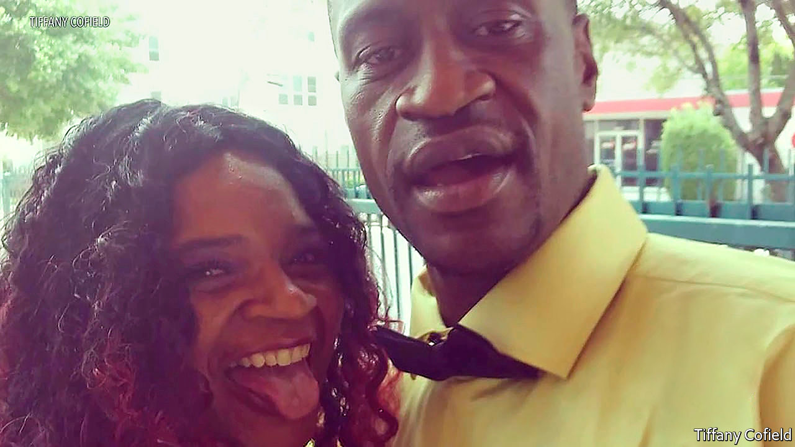

## The life pressed out

# George Floyd was killed on May 25th

> The unarmed black man whose death has convulsed America was 46

> Jun 4th 2020

TUESDAYS WERE usually George Floyd’s night on security-guard duty at El Nuevo Rodeo club, the “hottest venue” for Mexican music in Minneapolis. That was urban-music night, when blacks came crowding in to hear R&B, soul, hip-hop and rap. Things could get rowdy sometimes, but he kept order with calm and a big smile and the sheer presence of himself, six-feet-six and with bulging muscles under his coat. That wasn’t the style of another guy there who had done the job for 17 years, an off-duty white police officer with jittery eyes, who would reach for his pepper spray as soon as a fight broke out and fire it over everyone. But few thought their paths had crossed, or that they ever would.

He liked being a bouncer. His regular stint was at the Conga Latin Bistro on East Hennepin, another Mexican-Latino joint with dining and dancing. There he sometimes wore a blue boiler suit with “Security” in large white letters, but also a navy jacket and black polo-neck that made him look a million dollars. At the door he always beamed out his warm welcoming smile, and expected a hug in return from the regulars. He would dance badly, just to make them laugh. (Jovanni Thunstrom, the owner, once tried to teach him Bachata dance, but he was so tall he couldn’t turn him.) Some customers came early to eat the spicy Mexican food with him. In return he did favours for them: drove them home if they were drunk, put their things in his own closet if they didn’t bring spare change for the coat-check. At the end of business, he helped clean down the bar. Mr Thunstrom (“Bossman”, as he kept calling him), was a friend, almost family, and rented him a duplex in St Louis Park, uptown. He liked his neighbours there, and would spend time chatting over the fence to their little boy, teaching him the proper way to shoot hoops. He had been pretty good at basketball, back in Texas.

Since coming to Minneapolis from Houston, several years ago, he had had no problem getting a job. Friends who had gone north before him had persuaded him to come, and they were right. There was no shortage. He worked as a truck driver, revelling in taking big rigs on the Interstate, and found his two security places. He also found a new girlfriend, Courtney Ross. And with that he seemed determined to stay in Minnesota.

That was not the plan at first. H-Town was still home. He grew up there in the Third Ward, the old black section of the city, full of shotgun shacks and run-down public housing as well as more notable buildings, like the Jack Yates High School, which he attended, and Wheeler Avenue Baptist church, where Martin Luther King preached. At Yates, with his height, more than six feet at 12 years old, he shone at sports: he was recruited by South Florida State to play basketball, and was on the Yates football team that made the final of the Texas state championship in 1992 in the Astrodome. The Houston music scene drew him, too; he was “Big Floyd” in a group that backed DJ Screw, a legendary hip-hop DJ, inventor of a new remix technique of slowing tracks down and playing the same track on different turntables (“chopped-and-screwed”, hence the “Screw”). Best of all, he met attractive women, by several of whom he had children. He was a good father while he was around.

Yet Houston was tough, too, especially in the Third Ward. He lived in Cuney Homes, otherwise known as “The Bricks”, a project overrun with drugs, gangs and guns. In 1997 the place was modernised and even won an award, but its reputation did not change much. And as a “brickboy” he did not escape it. In his early 20s he did jail time for theft with a firearm. After that came various arrests for possession of cocaine. He was not made for crime; he admitted in a video later that “bustin’ a gun” was crazy and made his knees shake. But he seemed to drift into these things because there was no line of work or life he was especially good at. His friend Stephen Jackson had become a player for the NBA, in the San Antonio Spurs, and he liked to call Stephen his “twin”, excited by his successes as if they were his own. But he, Big Floyd, was famous mostly for his size—a size that made people think he was not gentle or calm, but a fighting person.

So it could turn out. In 2007 he and five other men forced their way into a woman’s house. He held a gun to her stomach and then searched through the rooms and cabinets, looking for money and drugs. This aggravated robbery earned the “large suspect” five years in prison. When he emerged, he pledged himself to a new life. He became active in his church, Resurrection Houston, organising not only barbecues and basketball games but Bible studies and open-air baptisms, pushing the big tub right into Cuney Homes to evangelise the hardest part of town. It was a Christian work programme that drew him to Minnesota, and he felt ready for that challenge, too. There he could make a completely fresh start, perhaps earn enough money to be a better father. His calls to his friends bubbled with hope for the future.

By the end of May the picture was cloudier. He had been laid off from his security jobs when covid-19 had closed the restaurants. The rent-money for Mr Thunstrom was scraped together somehow, but it was not clear when work would return. He made many calls to friends asking for advice. Meanwhile, the old life brushed him again. On the evening of the 25th he went with two acquaintances to buy cigarettes at Cup Foods on 38th and Chicago, where he was a regular. He tried to pay with a $20 bill which the store clerk thought looked counterfeit, then would not return the cigarettes. The clerk, thoroughly frightened, called 911 and identified the “tall guy” as the man to blame.

When the police arrived he struggled at first, but calmed down once the cuffs were on. Then he refused to get into the squad car. An officer dragged him aside, threw him to the ground helpless and then, for almost nine minutes, knelt on his neck, pressing, pressing, as he cried out for his mother and his breath and his life. He possibly never knew that this was the same white guy with jittery eyes who had worked at El Nuevo Rodeo, the one so ready with the pepper spray to keep the blacks in line. ■