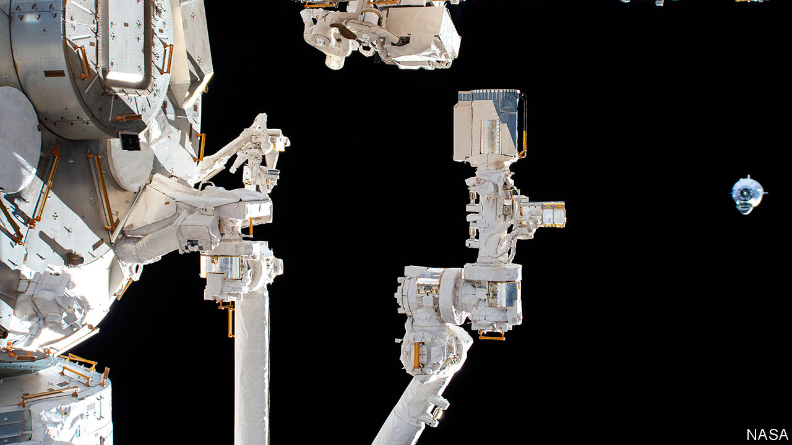
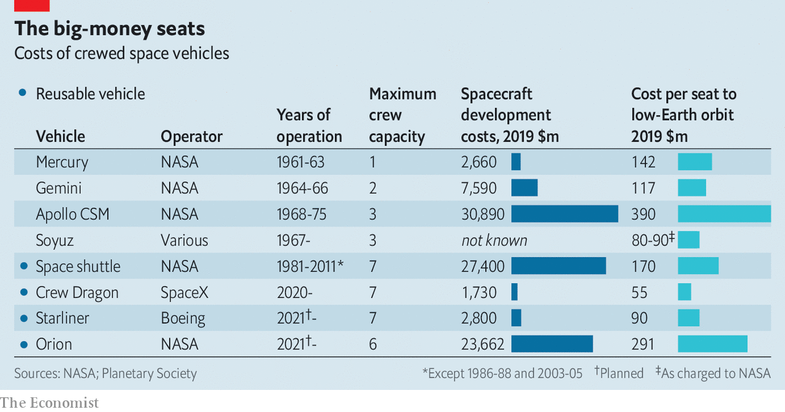

## The shape of things to come

# The Crew Dragon mission is a success for SpaceX and for NASA

> The most eagerly anticipated space mission for a decade or more

> Jun 4th 2020

THE ECHOES were obvious. The first launch of an Apollo spacecraft with a crew took place in 1968, an election year in which the country was reeling from assassination and riot, at war abroad and divided at home. To some on both sides of that divide, the Apollo programme remained an inspiration, a revelation of what the nation could do if determined to. It was “Man’s noblest venture”, declared Ralph Abernathy, a civil-rights leader, as he demonstrated outside the Kennedy Space Centre in Florida—but moving and heroic as it was, he went on, it threw into sharp relief the priorities of a nation which badly needed to improve the lot of its poorest people. Others were less magnanimous about what they saw as a distraction. “Was all that money I made last year”, asked the poet Gil Scott-Heron, “for Whitey on the Moon?”

On May 30th, in the most eagerly anticipated space mission for a decade or more, a Falcon 9 rocket launched a new space capsule, the Crew Dragon, from the same Florida launch pad that saw those Apollo missions blast off to the Moon. Less than a day later the spacecraft delivered her crew, Robert Behnken and Douglas Hurley, to the International Space Station.

America’s first crewed spacecraft since the space shuttle, which first flew in 1981 and was retired in 2011, had done its job perfectly. This coup for NASA, America’s space agency, which President Donald Trump wants to see land people on the Moon by 2024, might in other circumstances have been much ballyhooed. The return to space could even have been a boost to the morale of a nation reeling from disease—had it not been for protests and violence 400km below bringing to mind other aspects of 1968.

The mission was eagerly anticipated for two reasons. One is that it has been something of an embarrassment for America to go so long without the capacity to launch its own astronauts, relying instead on rides into space provided by the Russians (and paying handsomely for the privilege).

The other, deeper, reason for excitement was that the Crew Dragon programme proved that human space flight can be far cheaper than NASA’s previous record would lead you to expect. The Planetary Society, which lobbies for space exploration, reckons the Dragon cost NASA just $1.7bn, making it the cheapest crewed spacecraft developed in America (see chart).

Dragon is cheap largely because of the way it was procured. Previous NASA practice was to offer “cost plus” contracts for building rockets and spacecraft which met specific design requirements. There was little competition involved and few incentives to keep costs down, not least because the giant defence contractors which won such contracts have many friends in Congress happy to see NASA spend generously as long as it does so in their own districts and states.

This produces programmes like the Space Launch System (SLS), which has been made integral to NASA’s Moon plans. The SLS is a very big rocket conceived as part of George W. Bush’s plans for missions to the Moon and Mars. Barack Obama had no time for those plans, but the Senate made sure that a version of the rocket was kept in development regardless. According to NASA it will have cost at least $17bn by the time of its first mission, slated for 2021. Developing the Orion spacecraft that the SLS is meant to launch has cost even more.

In the mid-2000s Mike Griffin, then NASA’s administrator, began experimenting with a new approach. Instead of specifying what a rocket or spacecraft should look like, NASA would tell firms what it wanted and agree to pay for some of the R&D which might be required while allowing them much more room for manoeuvre when it came to choosing technologies and making trade-offs in design.

That approach opened the door for companies beyond the established military-industrial complex—including SpaceX, a firm founded in 2002 by Elon Musk in order to further his dream of establishing a civilisation beyond the Earth. When Dr Griffin left NASA in 2009, SpaceX had launched just one small payload into orbit. But it had also become part of NASA’s Commercial Orbital Transportation Services programme. By 2012 money from NASA, some earned by meeting specified R&D milestones, had allowed it to use a new rocket, the Falcon 9, to launch a new cargo spacecraft, the Dragon, to the space station. The investment by NASA had not only given SpaceX new capabilities, it had also helped build up a truly innovative company in an area sorely bereft of innovation.

A spacecraft for humans was the next step. Not everything went to plan. The crewed version of Dragon was supposed to fly in 2015 but was delayed by technical problems and funding constraints. But NASA’s new, cost-saving approach now has a human-rated spaceship to add to its list of accomplishments. It should soon add a second. The programme which saw SpaceX develop Crew Dragon has seen Boeing, a giant defence contractor, develop something similar, the Starliner. But a test flight last December went badly, and no crewed flight is expected until 2021. The next Crew Dragon flight—the first of six routine crewed flights that NASA has signed contracts for—is due in August.

Now NASA is applying a similar approach to its lunar ambitions. In April it announced it was spending $1bn with three industry groups to develop the capacity to take humans from lunar orbit down to the surface. One group is led by Blue Origin, owned by Jeff Bezos, the founder of Amazon. Blue Origin has yet to fly a rocket to orbit, but its technology appears first-rate. Mr Bezos, like Mr Musk, thinks that developing a human presence in space will assure him a place in the history books of a civilisation too grand for a single planet.

The second recipient of funds was a consortium led by Dynetics, a subsidiary of Leidos, a defence contractor formerly known as SAIC. The third was SpaceX, which offered a version of Starship, a new spacecraft it is developing off its own bat. The Starship and its booster are designed to be as capable as the SLS and also fully reusable. Things have not, so far, gone smoothly: four test vehicles have blown themselves apart, the most recent on May 29th.

None of these three lunar-lander options requires the SLS to get into orbit. Starship would be launched with a new booster SpaceX is designing for exactly that. The Blue Origin lander could be launched on the company’s New Glenn rocket, somewhat more powerful than the Falcon 9, or on Vulcan, a similarly sized booster made by Boeing and Lockheed which is Dynetics’s ride of choice: both launchers are due to make their debuts next year. But the SLS and its Orion capsule are still integral to NASA’s Moon plans. They will fly the astronauts to lunar orbit before the new spacecraft takes them to the surface.

This looks even less sensible now than it ever did. With a big SpaceX rocket—the Falcon Heavy—already available, two new big boosters due to debut next year and Starship being developed, American industry offers a number of options for getting astronauts up to the Moon. A programme truly aimed at improving the state of the spacefaring art, demonstrating a unique national capability or providing a shared experience around which Americans could, in principle, unite needs no more. And it would cost much less. The idea that a trip to the Moon might heal national wounds looks even less likely now than it did half a century ago. But it could at least take less of the money that Scott-Herron’s heirs earned last year. ■