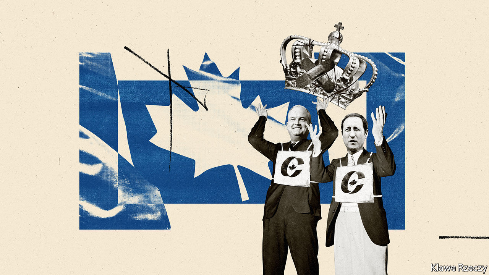
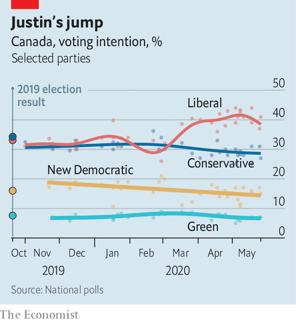

## Cracked crown

# Canada’s Conservative contenders

> The job of leading the opposition to Justin Trudeau looks like a thankless one, for now

> Jun 6th 2020VANCOUVER

“WE SIGNED UP more new members than have ever been signed up in the history of Conservative Party leadership campaigns.” So said Peter MacKay (pictured right), one of two front-runners to be the party’s leader, in an email to supporters on May 17th. His main rival, Erin O’Toole (pictured left), declared that “our campaign set a record for most membership sales in party history!”

The success in minting Conservatives is deceptive. Canada’s main opposition party is in a funk (see chart). It won 200,000 more votes than Justin Trudeau’s Liberal Party in the parliamentary election last October. But Mr Trudeau won enough seats to remain prime minister at the head of a minority government. Andrew Scheer, the Conservatives’ leader, is bowing out. The postal ballot to choose a successor is expected to produce a result by late August. (The party does not say how many members it has; 141,000 voted in the last leadership election.)

The winner will face a prime minister who looks far more formidable than he did in October. Voters think he has handled the pandemic well. As a share of the population, Canada’s 7,579 confirmed deaths are half that of the United States. Four-fifths have been in old-age homes. More than two-thirds of Canadians approve of the government’s handling of the pandemic, according to EKOS, a pollster. Even in oil-producing Alberta, where the Liberals won no seats, Mr Trudeau’s approval rating has doubled since February to 35%, according to Angus Reid, another polling firm. A snap election could happen “by this time next year”, says Kory Teneycke, who was communications director for Stephen Harper, Canada’s last Conservative prime minister.

Perhaps as disconcerting for Conservatives is that Mr Trudeau is using covid-19 to remake Canada in unconservative ways. Like many governments, Canada’s is spending lots of money to shield citizens from the pandemic’s economic impact. The Parliamentary Budget Office expects the federal deficit to reach at least C$252bn ($187bn), a record 13% of GDP, in the fiscal year ending in March. The largesse includes grants of C$500 a week for 16 weeks to workers who have been furloughed or laid off or are self-employed. Employers can apply to get subsidies worth 75% of a worker’s wage for up to 24 weeks.

During the global financial crisis of 2007-08 Mr Harper let deficits rise but rebalanced the budget before leaving office in 2015. Conservatives fear that under Mr Trudeau high deficits will become permanent. So might a bigger role for the state in telling industry what to do. “The idea that Canada can just rely on traditional market forces to remain competitive while everyone else is adopting more active industrial strategies is foolhardy,” declares a recent blog post by the Public Policy Forum, a think-tank.

Mr Trudeau may agree. Even before the pandemic, he was an advocate of government support for industries he deemed promising. Left-wing activists are lobbying for the nationalisation of privately owned care homes, where people are more likely to die than in public ones. The idea is popular, even in Alberta, known for its rugged individualism; 54% of Albertans support it, according to Angus Reid.

The front-runners to lead the Conservatives object to the drift towards bigger government. Maintaining direct payments to workers after the crisis would be “unsustainable”, says Mr O’Toole. But neither aspirant is resisting loudly. The time for advocating such Conservative principles as balanced budgets will come after the pandemic recedes.

Even then, neither of the two men is likely to do so with the fervour of Mr Harper. In 2003 he fused his Canadian Alliance Party, which reflected the anti-elitism of the prairies, with the mainly central Canadian Progressive Conservative Party, then led by Mr MacKay, to form the Conservative Party. As prime minister for nearly a decade Mr Harper governed more in the missionary spirit of Ronald Reagan and Margaret Thatcher than with the moderation of past Conservative prime ministers. Mr MacKay and Mr O’Toole are milder men, though to please the party’s base they do not always sound like it. Neither has roots in Alberta, the Conservatives’ heartland (and Mr Harper’s political home). Mr MacKay is from Nova Scotia; Mr O’Toole is an MP from Ontario, the most populous province.

Rather than Mr Harper, they resemble each other. Both studied law at Dalhousie University in Nova Scotia and have fathers who were politicians. Both served in Mr Harper’s cabinet. Mr MacKay, a keen rugby player, had the bigger jobs (foreign affairs, defence and justice) and is better known. Mr O’Toole, once an air-force helicopter navigator, was in charge of veterans’ affairs.

Mr MacKay wants to make the tax system more “competitive” with that of the United States to lure talent back from abroad. Mr O’Toole appeals more directly to the party’s base, promising to reduce federal support for the Canadian Broadcasting Corporation, which many Conservatives accuse of pro-Liberal bias. Both follow Conservative orthodoxy in promising to build oil pipelines and opposing Mr Trudeau’s policy of setting a minimum price on carbon emissions. Both pledge to be tough with China, with which Canada has strained relations.

Neither contender will jeopardise the Conservatives’ claim to be one of the few centre-right parties that supports immigration. Last year Canada admitted 313,000 newcomers, more than any other G7 country as a share of population. But support for immigration could weaken. The unemployment rate nearly doubled to 13% in April. It might now be 20%. Mr O’Toole thinks the number of immigrants may need to come down temporarily. If the pandemic slump persists, that position could prove popular.

Mainstreet Research, a polling firm, puts him nine points behind Mr MacKay among party members. The party uses a ranked ballot, which means that second- and third-choice votes from backers of two long-shot candidates could decide the outcome. The four are due to meet in a debate on June 17th and 18th.

The winner’s task will look thankless at first. It will be hard to tackle Mr Trudeau while Canadians approve of the way he is handling the country’s worst crisis since the second world war. But if hardship worsens he will become vulnerable. The job of leading Canada’s opposition may turn out to be more rewarding than it looks.■

Correction (June 4th, 2020): The original version of this article described Erin O'Toole as a former air-force helicopter pilot. This has been corrected.

## URL

https://www.economist.com/the-americas/2020/06/06/canadas-conservative-contenders
