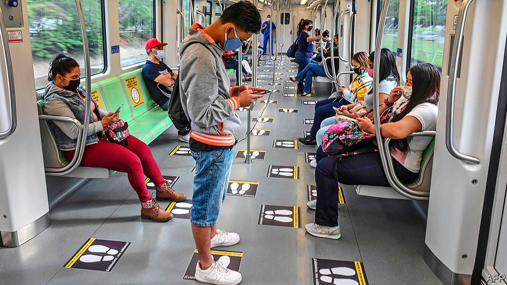

## Medellín’s medical marvel

# How Colombia’s second-largest city is controlling the pandemic

> By acting early and gathering lots of data

> Jun 4th 2020BOGOTÁ

Editor’s note: Some of our covid-19 coverage is free for readers of The Economist Today, our daily [newsletter](https://www.economist.com/https://my.economist.com/user#newsletter). For more stories and our pandemic tracker, see our [coronavirus hub](https://www.economist.com//news/2020/03/11/the-economists-coverage-of-the-coronavirus)

DANIEL QUINTERO, the mayor of Medellín, has had an unusual career. He sold bonsai trees and home-made desserts on the streets to pay university fees, became an engineer and was vice-minister of information and technology in an earlier Colombian government. That biography may help explain his unconventional approach to covid-19. He began to prepare Colombia’s second-largest city in late January. Many Colombians called him paranoid. As February passed with no cases in the country, he wondered if they might be right. When the virus arrived in March, the province of Antioquia, of which Medellín is capital, locked down—five days earlier than most of the country. Mr Quintero acted faster than any other mayor.

The biggest challenge, as in many Latin American cities, is to keep people at home when many get no income if they do not work. Mr Quintero’s programme, called Medellín Me Cuida (Medellín Takes Care of Me), rests on collecting data. Like other big cities, Medellín allocated money to help workers who lost their incomes. Bogotá and Cali struggled to find them. Medellín asked residents to register for help online. To sign up, people must provide a lot of information, including the size of their household and details of their electricity bills. (The billing information stops families from getting more than one aid package.) More than 3m people, nearly 90% of the metropolitan area’s population, have signed up. Those in need have received food or, more commonly, two payments of 100,000 pesos ($28), enough for a family to survive for some weeks when many have suspended paying rent and utility bills. People in Medellín have respected the lockdown more than other Colombians.

When they register, people are asked whether they have symptoms of covid-19 or conditions that would make it harder to treat. They can update the information on a hotline. The city maps the data to identify outbreaks and predict them. Health Promotion Units (EPSs)—mainly private firms that provide health insurance to most Colombians—send teams to test neighbours of covid-19 patients. Officials make sure patients and people exposed to them stay at home. Covid-19 patients get kits with oxymeters, which test their blood oxygen. If it falls to dangerous levels, an EPS sends a team with oxygen. The metro uses Medellín Me Cuida’s data to block cards belonging to patients and their families.

Colombia has controlled covid-19 better than many of its neighbours. It has had 33,466 confirmed cases and 1,099 deaths. In Brazil, Chile, Ecuador and Peru the death rate is at least three times higher. Even by Colombia’s standards, Medellín, once home of the drug lord Pablo Escobar, excels. Just three people in the city have died of the disease and eight are in hospital; 304 people have recovered, more than are sick. In Cartagena, a touristy city on Colombia’s Atlantic coast, hospitals are unable to cope with the caseload. Medellín’s success continues a record of innovation by earlier mayors, such as reducing poverty by improving poor neighbourhoods’ transport links to the rest of the city.

Not everyone is happy with Mr Quintero’s data-gathering. Carolina Botero, director of the Karisma Foundation, which advocates digital rights, says it is not clear what the city will do with its database after the pandemic or how it is being protected. Colombia has a history of state-sponsored spying on journalists, politicians and foreigners. Last month news reports revealed illegal snooping by the army.

Mr Quintero responds that only health officials have access to the information and promises to let people decide what data the city can keep when the pandemic ends. The data gave the city, which sets some lockdown rules, the confidence to begin reopening shopping malls and small shops this week, he says. Mr Quintero expects the number of covid-19 cases to rise, but thinks Medellín will be able to identify the most vulnerable people early. Colombians in other cities are looking on enviously, as they remain under lockdowns that are getting harder to enforce. Few still doubt Mr Quintero’s sanity. ■