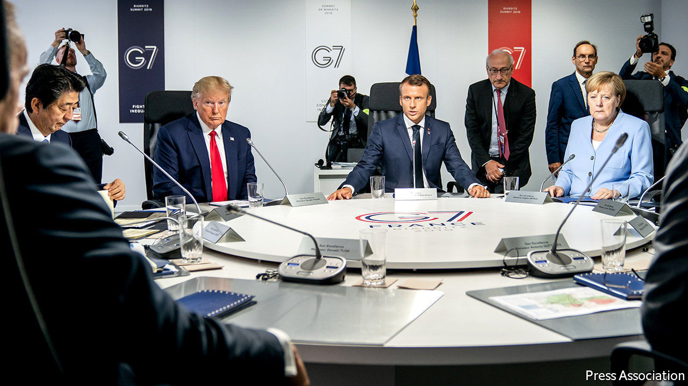

## Introducing the G11

# Donald Trump is right that the G7 needs updating. But what for?

> Tinkering with the world’s top table

> Jun 4th 2020

AMERICA’S YEAR of chairing the Group of Seven (G7) club of advanced economies has become something of a soap opera. In the latest episode the star of the show, President Donald Trump, due to host fellow leaders at the presidential retreat of Camp David on June 10th-12th, decided to postpone the summit until at least September, after the leading lady, Chancellor Angela Merkel of Germany, made it clear she was not minded to travel to America during a pandemic. Mr Trump also said he wanted to add to the cast the leaders of Australia, India, Russia and South Korea, since he did not think the current “very outdated” collection of countries “properly represents what’s going on in the world”. That sets up more drama for the coming months.

In an early episode in the series Mr Trump shocked audiences by announcing his intention to hold the summit at one of his own golf resorts; a bipartisan backlash truncated that subplot. In March Mr Trump chaired a videoconference with G7 leaders, after prodding by the French co-star, Emmanuel Macron, who was concerned at the lack of concerted Western leadership in the face of the covid-19 crisis. A virtual meeting of G7 foreign ministers later that month ended in farce. The ministers could not issue a statement because Mike Pompeo, America’s secretary of state, insisted it referred to the “Wuhan virus”.

Now comes controversy over Mr Trump’s proposed expansion of the club. He has long been keen to find a way to bring Russia back into the fold (it joined what became the G8 in 1998 but was suspended after its annexation of Crimea in 2014). Some other G7 members, including France and Italy, might favour that, too.

But Canada and Britain have already said they would veto Russia’s readmission. Justin Trudeau, Canada’s prime minister, said this week that Russia’s continued defiance of international rules meant that it would remain out. The G7’s host is free to invite guests to a summit. Last year, for example, Mr Macron extended a welcome to several African leaders as well as to the prime ministers of Australia and India. But the British government made it clear on June 1st that any decision on membership had to be unanimous, and its opposition to Russia’s was unchanged.

In truth, Mr Trump is right that the G7 could do with rethinking. When it started in 1975—with six members, Canada joining a year later—it represented about 70% of the world economy and was a cosy club for tackling issues such as the response to oil shocks. Now it accounts for about 40% of global GDP. Since the global financial crisis of 2007-09 it has sometimes been overshadowed by the broader G20.

So what is the point of it? With his suggested four extra members, Mr Trump seems to envisage a G11 (or perhaps G12, if Brazil came in too) becoming a China-containment club. But having China’s junior partner, Russia, in the mix would undermine that idea. By contrast, points out Michael Fullilove of the Lowy Institute, an Australian think-tank, “if this is to be the steering committee of the world economy, then China deserves to be included.”

Perhaps it should simply be a modernised version of what the G7 has aspired to be all along, a powerful group of like-minded democracies. With their impressive response to the pandemic, Australia and South Korea can claim to have earned a place at the top table. The problem is that it is less clear how well America itself fits into the club these days. Under Mr Trump, especially since a contentious summit in Canada two years ago, when he withdrew his name from the concluding statement, the group has often looked more like a G6+1. The next episodes should be gripping. ■

## URL

https://www.economist.com/united-states/2020/06/04/donald-trump-is-right-that-the-g7-needs-updating-but-what-for
