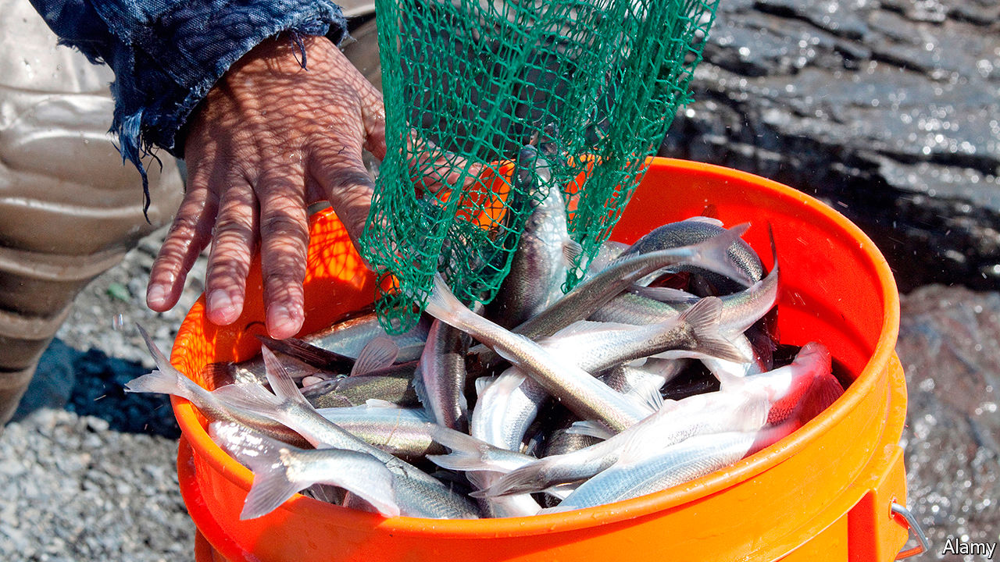

## Alaska welcomes hooligans

# In praise of the tiny, oily candlefish

> Disrupted supply chains make a source of wild food even more welcome

> Jun 4th 2020KENAI, ALASKA

EACH SPRING Alaskans gather on riverbanks wearing chest waders and carrying long-handled nets in search of one of the earliest sources of wild foods in the year: silver, pencil-length smelts called hooligans that are the workhorse of marine food webs and an obsession of many state residents who, coming out of winter, are looking for fresh, local food.

Also called candlefish because they are so oily, you can dry them, insert a wick, and light them like a candle, hooligan school in coastal waters of the North Pacific as soon as the ice breaks up, before running up glacial rivers each spring to spawn. Alaska Natives have long depended on these high-fat fish for oil and food, and traded them with inland tribes across the “grease trails” of southeast Alaska and British Columbia.

Alaskans of all stripes enjoy them baked, pan-fried, smoked, dried, pickled, and canned. No need to remove the head or bones, or the teaspoon of innards they hold inside. Bill Hague has been catching them for more than 20 years. Along the muddy banks of the Kenai River, one of the state’s famous salmon streams, Mr Hague and a dozen others fish beneath a highway bridge hoping to fill their buckets weeks before the salmon arrive.

Extending his net perpendicular to the river’s current, Mr Hague wades waist-deep and slowly walks downstream. Lightweight gill netting hangs like a sheet from the net’s frame, snagging hooligan as they swim upriver. When the handle of the net shudders, it means Mr Hague has caught some fish.

With a genus name—Thaleichthys—that is Latin for “rich fish,” hooligan are golden links in the marine food chain. Belugas nose into the mouths of streams following schools of them. Salmon devour the juveniles. Seabirds gorge on them, as do sea lions, humpbacks and sharks. After spawning, when most die, dead hooligan provide an easy meal for eagles, ravens and bears. Their decomposing bodies fertilise the riverbanks.

For many Alaskans, hooligan usher in the season of harvesting as locals fan out into meadows to gather fiddlehead ferns and wild greens, head to charred sites of old wildfires in search of morel mushrooms and launch skiffs to drop a hook for the first time of the year.

When panic-shopping emptied grocery store shelves earlier in the year, and Alaskans were reminded of the fact that they live at the end of a very long supply chain, many felt a renewed drive to become more self-reliant. While some stores still restrict the amount of meat customers can buy here, there are no limits on hooligan catches.

## URL

https://www.economist.com/united-states/2020/06/04/in-praise-of-the-tiny-oily-candlefish
