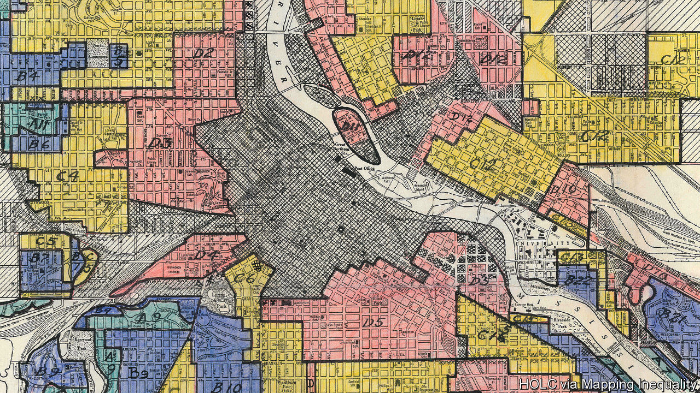
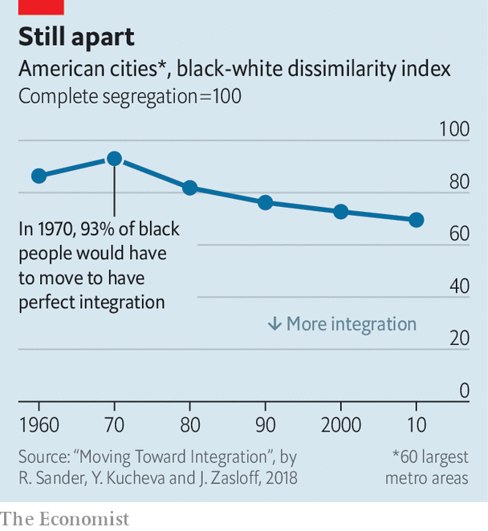

## Measuring racial progress in America

# Segregation and poverty have declined among blacks since 1968

> Yet deep disparities still persist

> Jun 4th 2020WASHINGTON, DC

“EVERY TIME I think about it I feel like somebody’s poking a red-hot iron down my throat,” says Bigger Thomas, the poor black boy living in a Chicago slum in the novel “Native Son”. “Goddamit, look! We live here and they live there. We black and they white. They got things and we ain’t. They do things and we can’t. It’s just like living in jail.” Richard Wright penned those lines about the debilitating psychological effects of the ghetto in 1940, before the civil-rights era; before the assassination of Martin Luther King in 1968 and the ensuing widespread racial unrest and riots; and well before the current seething protests against racial injustice in several hundred American cities. How relevant are those sentiments today?

In recent years the most prominent episodes of unrest over the deaths of black men in police custody have erupted in places with histories of segregation that persist to this day. They include Chicago, where Laquan McDonald was killed in 2014; Baltimore, where Freddie Gray was killed in 2015; and now Minneapolis, where George Floyd was killed on May 25th. Ghettos are no longer legally enforced as of 1948, though the proliferation of restrictive single-family zoning rules in cities does not help. Patrick Sharkey, a sociologist at Princeton, evaluated the effects of the civil-rights era on black families and found, depressingly, that “the stark racial inequality in America’s neighbourhoods that existed in the 1970s has been passed on, with little change, to the current generation.”

America did not segregate accidentally. At the beginning of the 20th century, blacks began moving from the rural South to the urban north in large numbers, both for better work in factories and to escape government-sanctioned oppression and lynching. White residents responded by mandating segregated neighbourhoods; when these were struck down by the Supreme Court, private racial covenants between homeowners in effect barred would-be black homeowners from white neighbourhoods. Breaches of the colour line were met with violence.

Urban sociologists use a measure called a dissimilarity index to quantify segregation: the percentage of blacks that would have to move to ensure equal dispersion across a city. In 1970 this number was 93%, according to calculations from census data by the social scientists Richard Sander, Yana Kucheva and Jonathan Zasloff, meaning nearly complete segregation. By 2010, the dissimilarity index had declined to 70%—an improvement, but far from the integrated society that civil-rights activists may have hoped for 60 years ago (see chart). “Brown [v Board of Education] made it clear that we couldn’t have racially separate and equal schools, but we never got to that point with respect to housing,” says Stefanie DeLuca, a professor of sociology at Johns Hopkins University. Segregation by class, both in housing and schooling, has grown in the meantime.

In 1970, according to one more sophisticated measure of poverty calculated by scholars at Columbia University and Mathematica Policy Research, roughly 47% of black Americans were poor. By 2014 that had fallen to 27%—a sizeable drop, but still nearly triple the level experienced by whites. Although this represents some progress, the poor are increasingly clustered together. Since 2000, the number of poor Americans who live in areas of concentrated poverty (defined as places where more than a fifth live below the federal poverty line) has increased by 57%. And black children are seven times as likely as white children to experience this more corrosive form of poverty.

Concentrated disadvantage becomes deeper disadvantage. Social scientists have compiled a mountain of evidence linking life in such neighbourhoods to worse outcomes for health, education, income and risk of incarceration. To live in segregated areas plagued with poverty and violence for generations is to experience continuous loss of opportunity. And it can corrode democratic cohesion as well, by creating separate spheres of race and class—one for “us” and one for “them”.

Three important social indicators for black men have also worsened over the past half-century, even as out-and-out racial animus has declined. Joblessness has become more common. In 1972 nearly 80% of black men above the age of 20 were in the labour force. That rate dropped slowly but substantially over the ensuing decades to 67% on the eve of covid-19, and then to 63% now. The share of births to unmarried couples has increased from nearly 40% to 70%. These family arrangements are highly unstable; about 70% will have broken up five years after a child is born. And incarceration has risen to extraordinary levels. Between 1960 and 2010, it more than tripled for black men.

The three phenomena are interrelated in a complex way. But they probably account for much of the observed extraordinary downward mobility of black boys compared with black girls or whites. Black boys born to families in the top 1% of the income distribution are as likely to go to prison as white boys born in the bottom third. Other stagnant outcomes—whether flat rates of home ownership or unchanged gaps in household wealth—are probably due to the same trends. At some point, glacial progress spills over into anger. “I think America must see that riots do not develop out of thin air,” King argued in 1967. “In a real sense our nation’s summers of riots are caused by our nation’s winters of delay. And as long as America postpones justice, we stand in the position of having these recurrences of violence and riots over and over again.” In 2020, they are indeed happening again.■

## URL

https://www.economist.com/united-states/2020/06/04/segregation-and-poverty-have-declined-among-blacks-since-1968
