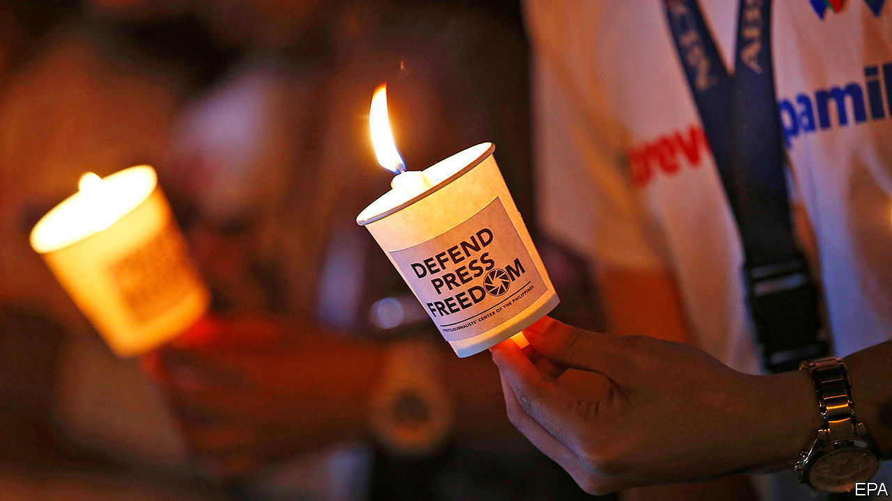

## Muffled cries

# Governments all over Asia are silencing critical journalists

> They have used covid-19 to justify a crackdown that was already under way

> Jun 13th 2020SINGAPORE

IT IS OVER a month now since the screen went dark. At 7.52pm on May 5th ABS-CBN, the biggest broadcaster in the Philippines, ceased transmission. In theory, its licence simply expired—nothing to do with a years-long feud with President Rodrigo Duterte. But his administration had warned the regulator against giving the company a temporary extension, and Congress, which is dominated by the president’s allies, had dawdled for months over renewing its 25-year franchise (it still offers online programming and a cable channel). The Supreme Court may yet allow ABS-CBN to resume broadcasting until Congress makes up its mind. But even if it does, a clear signal has been sent to journalists and their commercial backers about the consequences of criticising the government too fiercely.

The story will not surprise Asia’s journalists and media firms. All over the continent, they are under pressure from the withdrawal of government advertising, unwarranted tax investigations, spurious criminal charges, hostile takeovers, suspect fake-news campaigns, online trolling and old-fashioned thuggery. Since 2018 press freedom has declined in more than a dozen Asian countries, according to Reporters Without Borders, a watchdog. The backsliders include Bangladesh, China, India, Myanmar, Pakistan and Singapore, as well as the Philippines. The group ranks 180 countries by the leeway granted journalists; about a third of the most repressive regimes are in Asia, led by North Korea, which came rock bottom in the latest index, Turkmenistan, which placed 179th, China (177th) and Vietnam (175th).

In many countries where press freedom is declining, there was never much of a tradition of it. The prime minister of Cambodia, Hun Sen, has held power since the demise of the genocidal Khmer Rouge regime some 40 years ago. He has worked methodically to undermine international efforts to turn the country into a democracy. The closure in recent years of several independent radio stations and a critical newspaper, Cambodia Daily, were only part of a broader campaign that also saw the main opposition party banned.

By the same token, it was perhaps too much to hope that the authorities in Myanmar would slough off the legacy of decades of military dictatorship overnight. Over the past four years the armed forces have filed 52 legal complaints against their critics, more than half of them in the past year alone. Two journalists from Reuters, a news agency, were jailed for over a year after they exposed a massacre of civilians by soldiers. The soldiers themselves spent far less time in prison.

It is worrying, nonetheless, that governments which have always manhandled the press are getting rougher. In Pakistan critics of the army are intimidated and attacked, at home and abroad. A popular but spiky news channel, Geo, found itself off the air for months in 2018, as cable firms mysteriously dropped it. The government does little to protect reporters, meanwhile, from Islamist militants. Of 33 murders of journalists in Pakistan from 2013 to 2019, not a single one has resulted in punishment for the killers. Sluggishness also besets investigations into violence against journalists in Sri Lanka and Bangladesh.

More alarming still, countries with a long history of press freedom have begun to pick on journalists. Narendra Modi, India’s prime minister since 2014, rarely deigns to talk to the media. Whereas he is merely aloof, his underlings are downright hostile. It has become more common for reporters to face lawsuits filed by private citizens in response to criticism of the government. On June 8th, for example, the Editors Guild of India released a statement decrying Delhi’s police for investigating a journalist based on a complaint submitted by a spokesman for Mr Modi’s party. Armies of trolls, meanwhile, attack critical reporters online, sometimes publishing their addresses or other personal details. Rana Ayyub, a journalist who has investigated anti-Muslim violence in the state of Gujarat when Mr Modi was its chief minister, has endured her face being superimposed onto pornographic videos, not to mention threats of gang rape.

There is commercial pressure, too. Unfriendly newspapers seem to miss out on government advertising. And since the conglomerates that own most television channels and newspapers are sprawling businesses that depend on the government for umpteen licences, approvals and loans, it is easy for those in power to press them for favourable coverage.

The Philippines is another place where freedoms thought to be firmly established are eroding. Condemning Mr Duterte’s policies, such as his campaign of shooting suspected drug dealers, carries risk for reporters online and in person. Maria Ressa, the boss of a needling news site, faces up to 12 years on a libel charge. “Just because you’re a journalist you are not exempted from assassination, if you’re a son of a bitch,” Mr Duterte declared in 2016.

His latest threat to media freedom appears within a sweeping new anti-terrorism act. It passed the Senate in February and the House of Representatives this month, awaiting only the president’s signature to become law. The bill’s critics ask why it is such a priority, when the country is battling the coronavirus and an unemployment rate of 18%. They fear its broad scope and hazy definitions could be used to target critics of the government. “The only way that government can curtail freedom of expression is if there is a clear and present danger that the state has a right to prevent,” is the far from reassuring response of Mr Duterte’s spokesman. “Never since the Marcos dictatorship has press freedom been so in danger of being suppressed as under the Duterte administration,” counters Nonoy Espina of the National Union of Journalists in the Philippines.

Covid-19 is accelerating Asian governments’ attacks on journalists. In Indonesia 51 people have been arrested for allegedly spreading falsehoods about the disease. In Malaysia, too, where a new government has abandoned the more relaxed attitude to the press of its predecessor, some 29 people have appeared in court for supposedly spreading fake news about the epidemic. A correspondent there for the South China Morning Post is under investigation for reporting on the authorities’ efforts to arrest and test illicit migrants. Sweeping emergency powers in Thailand, Cambodia and beyond, ostensibly introduced to help fight the pandemic, give governments freer rein to squash detractors.

In India, Mr Modi told reporters in a video conference to focus on positive coverage during the country’s battle with the coronavirus. The police in Mumbai went further. They passed an order banning “any person inciting mistrust towards government functionaries and their actions taken in order to prevent spread of the covid-19 virus”. Needless to say, the actions India’s government functionaries have taken during the outbreak have not been beyond reproach (see [Banyan](https://www.economist.com//asia/2020/06/11/indias-bureaucrats-are-fighting-covid-19-with-red-tape), albeit discreetly if you happen to be in Mumbai).

These sinister developments have largely escaped international censure. When Michelle Bachelet, the UN’s human-rights commissioner, took a dozen countries to task this month for exploiting the covid epidemic “to restrict dissent or the free flow of information and debate”, they simply shrugged off her criticism. Eight of them, including India, the Philippines and Vietnam, retorted that the epidemic “requires extraordinary and unprecedented measures”. It is indeed extraordinary and unprecedented that those three countries would find themselves in agreement about the proper role of the media. It is sadly predictable, though, that their governments, without a vigorous press to hold them to account, will manage the epidemic worse than they otherwise would have. ■