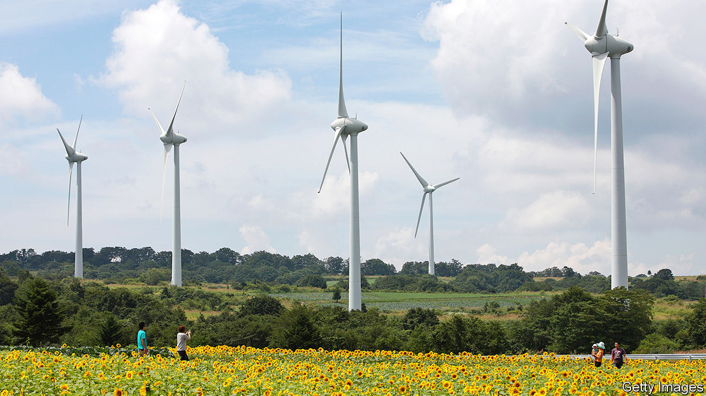
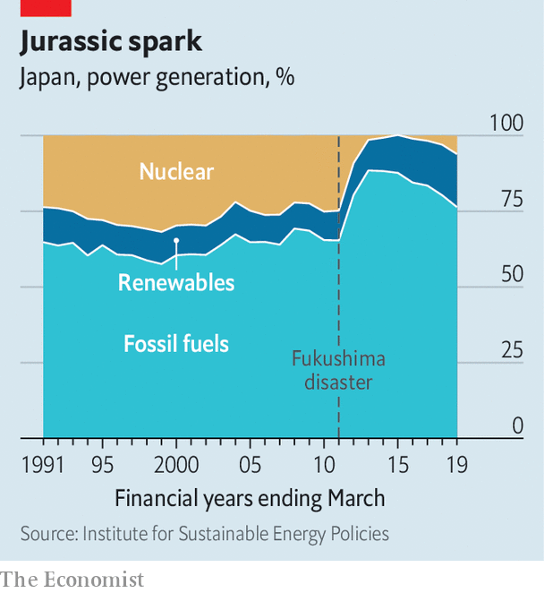

## No mill will

# The reinvention of Japan’s power supply is not making much headway

> The government is timid and big utilities are resistant

> Jun 13th 2020TOKYO

IN THE WAKE of the Fukushima nuclear disaster in 2011, an IT expert, a restaurant owner, an agribusiness manager and a sake brewer, all from the afflicted prefecture, hatched a plan. Japan needed to generate more electricity from renewable sources, they believed, so they founded Aizu Electric Power Company to speed the transition. Yamada Jun, the IT expert, became the CEO and travelled to Germany to swot up on renewables. He spent two winters studying the effects of snowfall on solar panels. In 2014 Aizu Electric installed its first solar farm on the edge of a mountain overlooking terraced rice paddies, 125km west of the ruined nuclear plant. “At the time, we were fairly optimistic,” Mr Yamada says.

He was not alone. Enthusiasm for renewable energy swelled after the disaster. Kan Naoto, the prime minister at the time, declared that Japan would draw up a new energy strategy “from scratch” and “elevate” renewables. One of his government’s last acts before losing power was to pass a law to stimulate renewable energy. Dozens of small firms like Aizu sprang up. Fukushima prefecture itself pledged to get all its power from renewable sources by 2040.

The hoped-for transformation, however, has been “slow and almost invisible”, Mr Yamada laments. Renewable generation has grown from 10% of the power supply in 2010 to 17% in 2018, almost half of which comes from old hydropower schemes. Most nuclear plants, which provided more than a quarter of the country’s power before the disaster, have been shut down, at least for the time being (see chart). But for the most part they have been replaced not by wind turbines and solar panels but by power stations that burn coal and natural gas. The current government wants nuclear plants to provide at least 20% of electricity by 2030. It also wants coal’s share of generation to grow, and has approved plans to build 22 new coal-fired plants over the next five years. The target for renewables, by contrast, is 22-24%, below the current global average, and far lower than in many European countries.

“Why can’t Japan make a really significant energy transition?” asks Tanaka Nobuo, the former head of the International Energy Agency (IEA). Geography and geology provide part of the answer. Japan is densely populated and mountainous. That makes solar and onshore wind farms costlier to build than in places with lots of flat, empty land. The sea floor drops away more steeply off Japan’s coasts than it does in places where offshore wind has boomed, such as the North Sea. And although geothermal power holds promise, the most suitable sites tend to be in national parks or near privately owned hot springs.

Government policies also help stifle the growth of renewable energy. Since the end of the second world war, privately owned, vertically integrated regional utilities have dominated the electricity market. These ten behemoths provide stable power within their regions, but do little to co-ordinate supply and demand across their borders. As one official puts it, “Each company is like a separate country.” Power is not transmitted at the same frequency throughout the country: the west runs at 60 hertz and the east at 50, a legacy of competition in the late 19th century, when some power companies imported equipment from America, while others bought from Germany. The limited transmission between regions makes it even harder than usual to cope with intermittent generation from wind turbines and solar panels. It also reduces competition, which suits the incumbent utilities just fine.

Recent reforms have attempted to promote renewables both directly and indirectly. Mr Kan’s government introduced a “feed-in tariff”, obliging utilities to pay a generous fixed price for certain forms of renewable energy—a policy that has prompted investors to pile into solar and wind in other countries. In 2016 the current government fully liberalised the retail electricity market. It has also set up new regulatory bodies to promote transmission between regions and to police energy markets. In April a law came into force that requires utilities to run their generation, transmission and distribution units as separate businesses. Taken together, says Llewelyn Hughes of the Australian National University, these reforms constitute a policy of “radical incrementalism”.

Critics say the steps have been too incremental and not radical enough. Utilities continue to make it time-consuming and costly for new entrants to get access to the grid, imposing rules that are “not fair for newcomers”, according to Takahashi Hiroshi of Tsuru University. Existing power plants are favoured over new facilities, and the share of renewables is limited, on the ground that their intermittency threatens the grid’s stability.

This resistance spooks investors. The government’s relatively paltry targets for renewables compound the worries. “When we look at investment opportunities in different countries, government targets are key,” says Aizawa Yumi of Copenhagen Offshore Partners Japan, an offshore wind firm. “In that respect, Japan has not been ambitious.”

But even if the government is timid, investors can still make a difference, Mr Tanaka argues. Several of Japan’s big multinationals have pledged to switch to clean power on a scale and schedule that put the government’s targets to shame. Environmental activism has made banks and businesses wary of investments in coal. Even big utilities have come to see business opportunities in renewables, especially in the government’s imminent auction of sites for offshore wind plants. Two of them, Tohoku Electric Power and Tokyo Electric Power (TEPCO), have announced plans this year to issue “green bonds” to finance renewables projects. In March TEPCO established a joint venture with Orsted, a Danish oil firm that has become a pioneer in offshore wind. Despite the sluggish pace of change, Mr Yamada remains sanguine. Japan is like a tortoise, he suggests, which may eventually catch up with the hare. ■

Sign up to our fortnightly climate-change newsletter [here](https://www.economist.com//theclimateissue/)