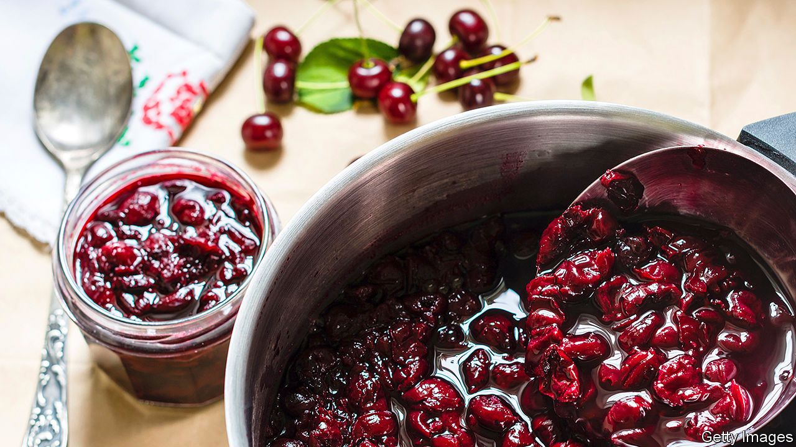

## Home Entertainment

# Jam embodies resilience—and dogged optimism

> Making it is a therapeutic ritual and a useful distraction for bored children

> Jun 11th 2020

EVEN IN THIS strangest of summers, June marks the beginning of the jam calendar. As the first fruits come into season—pallid green strawberries turning ruby red, gooseberries swelling, apricots donning their downy fuzz—sweet-toothed hoarders set to work. Bread-making may be the culinary craze of the lockdown, but it helps to have something to slather on top.

Sugary yet reliable, jam’s history is sandwiched inside mankind’s. Versions of it were savoured by ancient Romans and Seljuk sultans alike; Joan of Arc ate one for courage before battles; sailors stockpiled it to combat scurvy. Jars of jam have accompanied Edmund Hillary to the summit of Mount Everest, explorers to the South Pole and astronauts into space. Russians and Ukrainians stir it into tea; Swedes serve it with fried herring. You can spread it on Brie, or add it to tarts, sponge-cakes and peanut-butter sandwiches.

Amid the pandemic, jam-making has found new purposes. It can keep bored children occupied (particularly if the fruit-picking is included), supply gifts for vulnerable neighbours or serve as a therapeutic ritual in muddled days. You do not, as you might fear, need a thermometer, beautiful gingham-topped jars or a preserving pan to make good jam. You need only time and a watchful eye.

Novices should start with raspberries, which are naturally high in pectin, a starchy gelling agent that helps the jam set. (Later you can progress to marmalade, quince jelly and chutney.) Purists use a 1:1 ratio of sugar and fruit, but deviation is permissible. Warm the mixture on a low heat until the sugar is dissolved, then bring it to a rolling boil. Drop a dollop onto a chilled dish, leave it for about a minute and push a finger through. If it crinkles, the jam is ready to be decanted into jars. These can be sterilised in boiling water, the oven, even the dishwasher.

Whisking the gloop from the heat at precisely the right moment is vital, lest it solidify into a rigid blob. If this happens, you will be tempted to throw the pan out with the jam, and chuck in the towel for good measure. Don’t. Embrace the sweltering, syrupy heat of the summertime kitchen, and start again. It will be messy—transferring molten liquid from a bubbling cauldron into a jar takes deftness and patience. When you succeed, and wipe your brow in relief, you will leave a warm sticky smear across your forehead.

All this requires resilience; but then, that is what the stuff itself embodies. During the second world war the Women’s Institute in Britain preserved 5,000 tonnes of fruit to help sustain the hungry population. Jam is also a form of reassurance—those dusty jars kept at the back of a cupboard, just in case, are a silent comfort. Above all, it is an expression of dogged optimism, since preserves reflect a tacit intention to hang around long enough to reap the benefits. As Joanne Harris, a novelist, has put it, jam betokens “seasons that turn in the same place, in the same way, year after year, with sweet familiarity”. ■