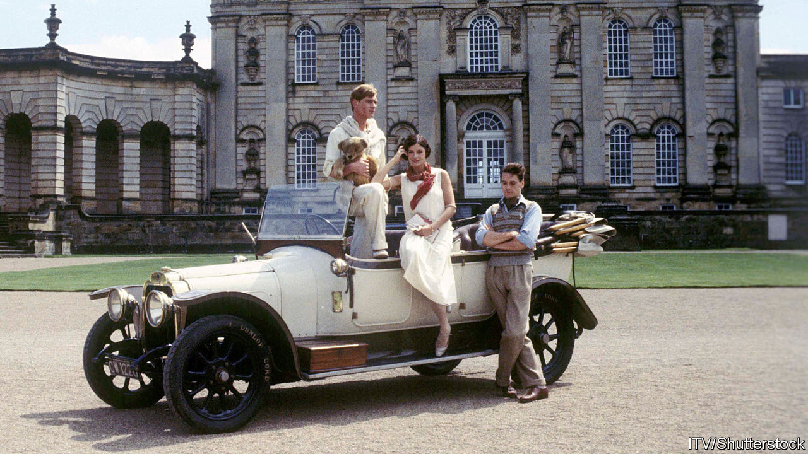

## The Flyte club

# Published 75 years ago, “Brideshead Revisited” set off a lasting cult

> Evelyn Waugh’s ode to aristocratic languor mourned Britain’s past—and coloured its future

> Jun 11th 2020

IN THE WEEKS after VE day, as British voters prepared to swap Winston Churchill for the Labour Party, the country’s fiction leapt into a radiant past. Published 75 years ago, at the end of May 1945, Evelyn Waugh’s “Brideshead Revisited” offered not a Utopian vision of the future but a wistful dream of vanished faith and grace. In his seventh novel, a writer formerly known for mordant satire evoked—with a glamorous alloy of lyricism and rueful irony—a lost domain of “peace and love and beauty”, smashed by modernity, democracy and war.

At first glance, no story could have suited the progressive climate of 1945 worse than Waugh’s “sacred and profane memories of Captain Charles Ryder”, a middle-class, middlebrow artist turned lukewarm army officer. A chance billet sends Ryder back to the great house owned by the old, dysfunctional Catholic family who had bewitched him when he met Sebastian Flyte, its younger son, at Oxford in the 1920s. The levelling forces of the new age take the form of his junior officer, Hooper, whose outlook fuses practicality with the anti-aristocratic disdain shared, then and now, by many on both the British left and free-enterprise right.

To the romantic reactionary Waugh, the undignified future belonged to Hooper, with his trademark, cheery chirp of “Rightyoh”. “We possess nothing certainly except the past,” muses Ryder. With divine grace as his underlying theme and the time-encrusted splendours of the English Catholic elite as his frame, Waugh set out to give that past a last hurrah.

But this swansong heralded a strange rebirth. “Brideshead” sold very well—and critics adored it. “Most of the reviews have been adulatory except where they were embittered by class resentment,” Waugh wrote. Sceptics included Edmund Wilson of the New Yorker, who excoriated the “mere romantic fantasy” of this “Catholic tract” disfigured by “shameless and rampant” snobbery. Yet even he predicted a triumph—and the novel duly became a bestseller in America, too. Waugh affected to find the book’s success across the Atlantic “upsetting because I thought it in good taste before and now I know it can’t be”.

It turned out that an age of change loved escaping into faded glories. In a preface written in 1959, Waugh noted that amid the wartime austerity of 1944 it had been “impossible to foresee…the present cult of the English country house”, many of which had in the intervening years found salvation in tourism. Brideshead today would not be derelict, he speculated, but “open to trippers”, and better maintained than Lord Marchmain, its fictional master, ever managed. On the brink of the 1960s the author thought his book had been “a panegyric preached over an empty coffin”.

Still, Waugh, who died in 1966, might have been shocked by the next stage in this zombie afterlife. Directed by Charles Sturridge and Michael Lindsay-Hogg, with a star-strewn cast including Laurence Olivier, Anthony Andrews (pictured left) and Jeremy Irons (right), an 11-hour television adaptation of his novel began to air in Britain in October 1981. This lavish feast of nostalgia set off a national cult. Students and others mimicked the languid extravagance of doomed, drunken Sebastian, toting his teddy bear at Oxford, and his spoiled pals.

Smokestack industries were dying under Margaret Thatcher’s government; unemployment soared and inner cities rioted. But in many living rooms, the aristocracy was back in vogue. The fairy-tale nuptials of Prince Charles and Lady Diana Spencer fed the mood. “We have really touched a nerve,” said Derek Granger, the producer of the series. After PBS broadcast it in America early in 1982, Bloomingdale’s in New York filled its windows with Flyte-style fashion. The Brideshead backwash lingered. In 1985 the National Gallery in Washington scored a hit with its “Treasure Houses of Britain” exhibition. David Cannadine, a British historian, denounced the “neonostalgic, pseudopastoral, manufactured world” on display in a critique headlined “Brideshead Re-Revisited”.

In Britain hardly any members of this new Flyte club actually belonged to the sparse upper classes. They came from the bourgeois middle and, after some play-acting at university, went back to it. For most, Brideshead mania left no lasting trace. For a fateful few, it did.

Waugh’s novel scoffs at the Bullingdon Club, a notorious Oxford drinking society, and its “cretinous porcine” hearties. The Bullingdon, though, revived in the TV show’s wake and recruited two future British prime ministers, Boris Johnson and David Cameron. More widely, a Flyte-flavoured pursuit of charm and panache spread across the gilded crust of British society. The novel’s waspish choric figure, the gay aesthete Anthony Blanche, warns Ryder against charm as “the great English blight” that “kills anything it touches. It kills love; it kills art.” But Brideshead chic promoted a genial, born-to-rule insouciance that elevated repartee above accomplishment, and cloaked the grubby business of winning and keeping power.

This tendency towards a kind of louche, showy entitlement did not begin with the drama. Yet according to David Kynaston, perhaps the pre-eminent historian of post-war Britain, “the TV adaptation did have some specific effect” on attitudes. He sums up the sentiments that “Brideshead” channelled: “No need any longer, despite all the Thatcher talk of meritocracy, to feel guilty about hereditary privilege. And OK to knock/despise the working class…An end, in short, to worthiness.”

The cult of the British country house, real and imaginary, lives on. The National Trust, a charity that looks after many of them, has 5.6m members, more than the population of Finland. “Downton Abbey”, one of Brideshead’s TV offspring, ran for six much-watched seasons. And even in Brexit-era Britain, a sense of entitlement, ironclad in charm, can still clear a path to the top of politics—witness Mr Johnson’s quip-fuelled and scandal-proof rise. For some, Waugh’s bittersweet elegy became a sort of handbook of patrician showmanship. As Ryder remarks when the noble house is reduced to a drab barracks: “The builders did not know the uses to which their work would descend.” ■

## URL

https://www.economist.com/books-and-arts/2020/06/11/published-75-years-ago-brideshead-revisited-set-off-a-lasting-cult
