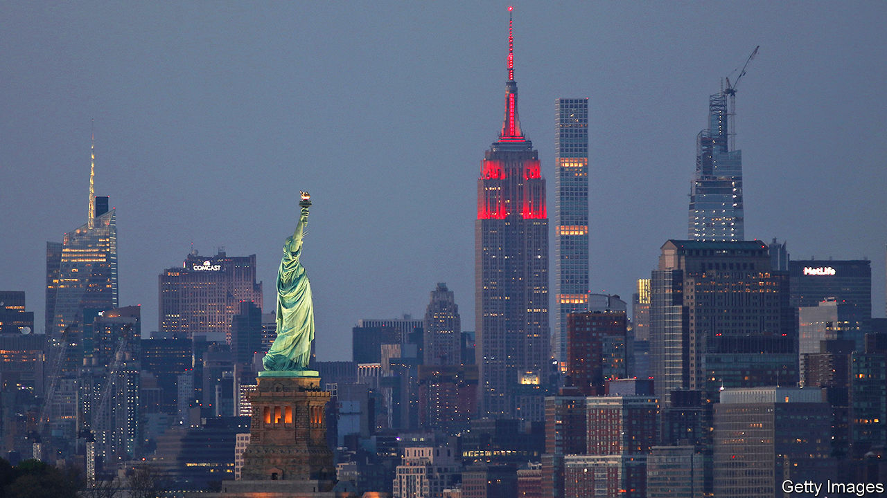
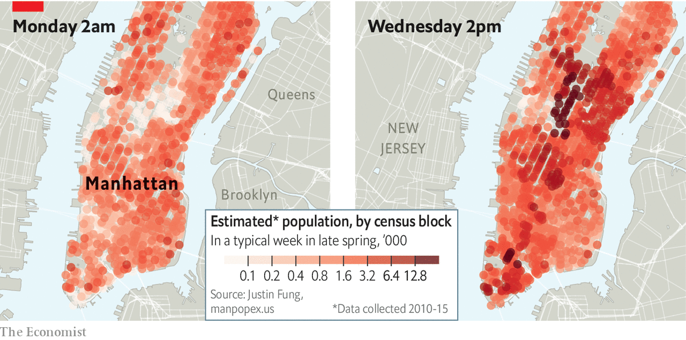
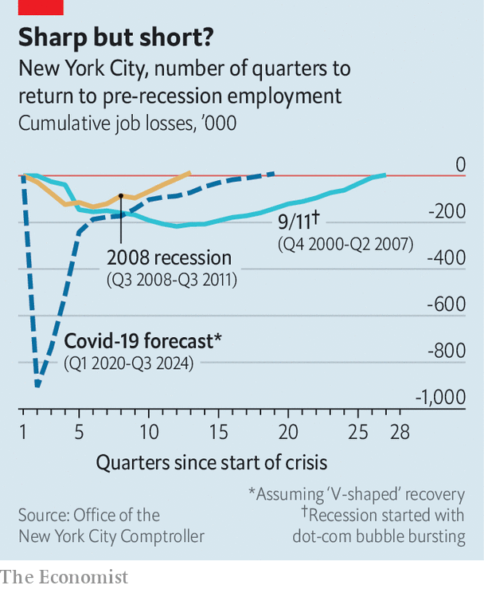
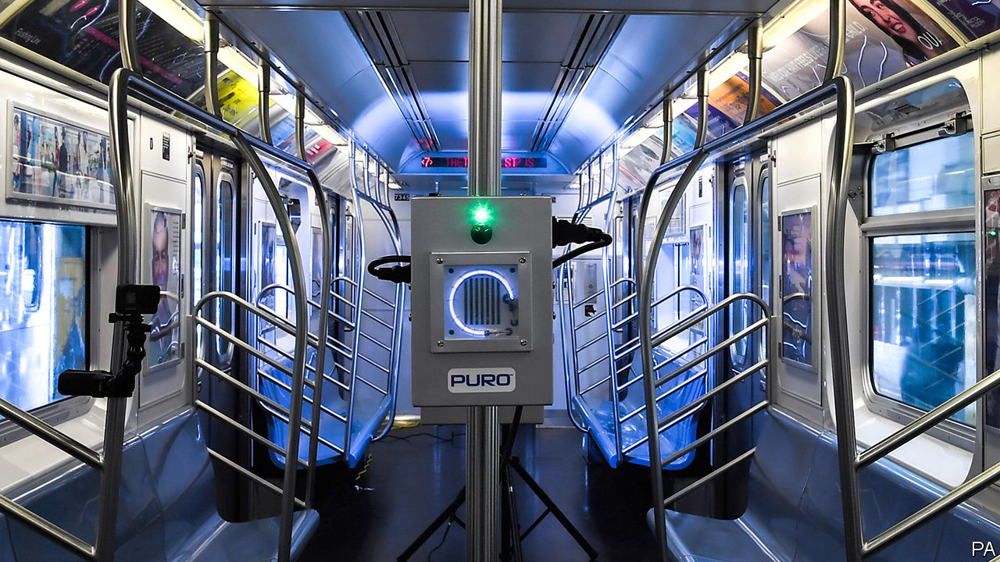

## Centres of excellence

# Covid-19 challenges New York’s future

> Cities around the world, take heed

> Jun 11th 2020

Editor’s note: Some of our covid-19 coverage is free for readers of The Economist Today, our daily [newsletter](https://www.economist.com/https://my.economist.com/user#newsletter). For more stories and our pandemic tracker, see our [coronavirus hub](https://www.economist.com/http://www.economist.com/coronavirus)

BY NIGHT, Manhattan holds 1.6m souls, a large number for a small island. In the morning over twice as many more rush in like a tide, filling up office blocks, coffee shops and spin classes. In the evening this tide drains back out over bridges and through tunnels, leaving just a thin residue of small-hours stop-outs and shift workers. The ebb and flow is shallower at weekends, and in summer. But it has held its rhythm for more than a century.

In mid-March the tide stopped. Following stay-at-home orders issued by Andrew Cuomo, New York’s governor, workplaces shut down as hospitals filled. The city became one of the deadliest hotspots of the covid-19 pandemic, with 20,000 dying over three months. Times Square emptied, the museums and concert halls closed.

At the end of May the streets came to fitful life as thousands protested against racism and police violence in the wake of the death of George Floyd under the knee of a Minnesota police officer. Bill de Blasio, the city’s mayor—and, as a newly enthusiastic backer of the police department, one of the targets of the protests—instituted a curfew which lasted until June 6th, two days before the city began its official reopening.

Construction and manufacturing have now restarted; shops offer pavement pickups. But many businesses are still shut, and most office workers at home. Broadway will stay dark until at least September. The schools’ chancellor has said that there is a 50-50 chance schools will reopen in the autumn. The city that never sleeps looks as if it will be sedated for much of the rest of the year. If covid comes back in a big way, or if workers stay in front of screens at home, it could become moribund.

Nowhere represented the 20th century’s love affair with the idea of the city better than New York. In size—surpassing London, the previous top dog, in 1925—grandeur, cultural attainment and animal spirits of all sorts it was for decades the toast of the world and a model to emulate.

Over the century more and more cities grew large, dense and rich. By 2016 more than a fifth of humankind was living in cities of 1m people or more. The largest 300 metropolitan areas now generate half the world’s GDP and two-thirds of that GDP’s growth. And New York remains at the tip of the top tier. At almost $1.8trn its GDP is the largest of any city in the world. It is home to as dense a cluster of globally important firms as you can find anywhere.

Workers and firms have continued to pile into cities like New York, even as travel and telecommuting have become easier, because there is so much to be gained by proximity to other human beings, especially when it comes to the “knowledge economy” reliant on highly skilled, highly educated and highly productive workers. Geoffrey West, a physicist at the Santa Fe Institute, has shown that these benefits in terms of wages and innovation grow faster than the cities which provide them.

Edward Glaeser, an economist at Harvard University, has shown that urban density increases workers’ productivity and minimises their carbon footprints. Americans who live in big metropolitan areas are, on average, more than 50% more productive than those who live in smaller metros. This holds true even for workers with the same education, experience, working in the same industry and boasting the same IQ. Much the same is true in other rich countries. In poorer ones the advantages of city life are even greater.

Closing down such powerhouses in the face of covid-19 was a dramatic and expensive step for the governments that did so. But it was at least conceptually simple. Reopening them is harder, in large part because of the conflicting requirements of amenity and transport. For almost all cities reopening will see increased congestion as people who previously used mass transit commute by car and on their own. New York—big by European standards, uniquely mass-transit dependent by American ones—will have those problems on a scale all of its own. “A 1% decline in transit use into Manhattan would translate into a 12% increase in car traffic,” says Nicole Gelinas of the Manhattan Institute, a think-tank. Corey Johnson, the city-council speaker, warns of “Carmageddon”.

But making mass transit safe in a world of social distancing is hard. The Metropolitan Transportation Authority (MTA), which is run by the state, is responsible for the city’s buses and a subway system which boasts more stations than any other in the world. It was already in poor financial and physical shape before the pandemic; during the covid closure it lost 90% of its riders and more than $2bn in revenue. Though it is working on new ways to clean subway cars and distance passengers, it cannot put on enough services to keep commuters safely distanced. Indeed, if it does not get a substantial bail-out—which the state says it cannot afford—it is likely to have to cut jobs and services, worsening the problem.

Mr de Blasio has done little to help. Asked for 100km (60 miles) of new bus lanes to help with the situation he has provided just 30km. He has also been grudging when it comes to pedestrianising streets so that people can keep a respectful distance from each other while getting around and increasing provision for the use of bicycles.

This all means that New Yorkers cannot safely return to work in one fell swoop. But the point of a dense city is that it needs density to work. According to Enrico Moretti, an economist at the University of California, Berkeley, each of the “knowledge jobs” that make cities like San Francisco or New York so successful supports five service jobs, some high paying—lawyers—some much less so—baristas. If office workers stay at home, the workers who depend on them being in town have no income. If, faced with half-empty offices, such service workers do not come back for want of custom, that will add to the commuters’ disinclination to return. If the businesses providing services actually go bust waiting for the tide to turn things will go even worse.

Even if reopening goes well, the hole in the city’s finances will be vast. The declines in sales, income and property taxes that came with the shutdown will result in a $9bn tax-revenue hit over the next two fiscal years, according to Mr de Blasio. The city’s independent budget office, which said on May 18th that the city’s fiscal situation is one of “absolute gloom and uncertainty”, thinks employment will not return to pre-pandemic levels until 2024 (see chart). Without federal support, Mr de Blasio has said “any and all options will be on the table” for spending cuts, including laying off city workers. The state is unlikely to be able to bail out the city, given its own shortfalls.

Despite these dire straits, there are two good arguments for expecting New York to come back after covid. First, cities in general have proven inordinately resilient to enormous shocks. In 2002 Donald Davis and David Weinstein, both professors at Columbia University, looked at Japanese cities bombed during the second world war and found that “temporary shocks, even of frightening magnitude, appear to have little long-run impact on the spatial structure of the economy.” It took just 20 years for Nagasaki’s population growth to get back to the trend line it had been on before America dropped an atom bomb on it.

And if cities are resilient in theory, New York has also proved so in practice. The attacks which brought down the World Trade Centre in 2001 were estimated by the city’s comptroller to have cost $83bn-95bn in lives and property. Lower Manhattan, where the twin towers had stood, lost almost 30% of its office space, temporarily displacing 100,000 workers.

But in 2002 Michael Bloomberg, the city’s newly elected mayor, began offering incentives to companies to move downtown, and commercial occupancy rebounded. The population in the area has more than doubled since the attacks. By 2007 the employment rate had recovered to what it had been before. The next year Lehman Brothers collapsed, and the city’s flagship industry, financial services, looked hugely vulnerable. But though by 2018 it accounted for just over a third of jobs in lower Manhattan, down from 55% in 2001, it is still there. Even the $19bn of damage done by Hurricane Sandy in 2012 amounted to only a glancing blow. Property values on the Manhattan waterfront now stand 70% above the pre-Sandy level: on the Queens waterfront they are 128% higher.

What, though, if covid is not just the latest in a series of shocks? Cities that can shrug off a disaster can still fade if their economic base—and with it their tax revenues—suffers a structural shift. Again, New York has the history to prove it.

Like other American cities, New York saw rioting in the 1960s. Between 1969 and 1974 two recessions saw New York City lose almost 300,000 manufacturing jobs. Most American cities experienced some “white flight” during that period. New York saw a lot. The city lost 1.3m net residents during the 1970s, almost all of whom were white, more than the number lost by Los Angeles and Chicago combined.

Its tax base shrinking, by 1975 the city could not pay its bills or service its debt. Asked for help, Gerald Ford, then president, demurred. “FORD TO CITY: DROP DEAD” the front page of the Daily News bellowed in 144-point type.

In the budget cuts which followed 13,000 teaching jobs were lost. For four years no police officers were hired; arrests fell by a fifth as crime, already bad, got worse. The subway was unsafe, there were graffiti everywhere, parks became drug dens. Today, St Mark’s Place is lined with busy bars, chic coffee shops and yoga studios. Then it was grimy enough to supply an album-cover image of urban decay for Led Zeppelin and hosted crimes that ranged from mugging through murder to cannibalism.

But the city still had the advantages that come from packing knowledge workers together. In the 1980s Michael Milken of Drexel Burnham Lambert invented the junk bonds that enabled Henry Kravis, a co-founder of KKR, a large private-equity firm, to pull off the first leveraged buy-outs, revolutionising corporate finance. This was not without its controversies—some of Mr Milken’s financial activities landed him in prison—but it did help the city regain solvency, not to mention pizzazz.

New York is in far better shape now than it was in the 1970s. But some 900,000 workers are expected to file for unemployment by the end of June, a level far higher than that seen in the Great Recession or after the attacks of 2001. Many businesses have closed thanks to covid-19; some may never reopen. And the workers to start new ones might be sorely lacking. Immigrants make up almost half of small business owners in New York, and it is unclear when restrictions on immigration will be lifted.

Even if the federal government is generous—the $7.5bn provided so far has not been seen as such by Mr Cuomo, who thinks almost ten times that amount is needed—there are sweeping budget cuts to schools, health care and local government on the way. Poorer services may keep those who have fled the virus from coming back. One in 20 New York City residents have left the city in the past months, taking up residence in single beds in childhood homes in all America’s contiguous states. For Manhattan, the richest borough, the proportion is a sixth: in its swankiest zip codes it is more than a third, for all that most of the deaths have been in poorer neighbourhoods in the outer boroughs.

A further outbreak of disease would both worsen the economy and weaken the urge to return. Mr Glaeser thinks that an enduring threat from SARS-CoV-2, the virus which causes covid-19, “could lead to a serious and long-standing reorientation—at least for those that could afford it—towards de-urbanising of people’s lives.” It is worth noting that, pandemics apart, diseases generally tend to spread well in cities; Mr West finds that a city’s propensity for infection tends to grow faster than the city itself, just like wages and productivity.

And in a future where the virus remains under control the economic benefits of being packed tight, a boon in the city’s renaissance, might still be lost if some mixture of personal convenience and corporate strategy sees distance working turned from a temporary expedient to a lasting change in the way the urban economy works.

Take financial services, which account for a third of the Manhattan payroll. Barclays, JPMorgan Chase and Morgan Stanley, three banks, employ more than 20,000 workers in Manhattan and occupy more than 930,000 square metres (10m square feet) in its office blocks, an area roughly equivalent to all the office space in downtown Nashville. James Gorman, the boss of Morgan Stanley, which occupies much of a tower that looms over Times Square, has said that the company has “proven we can operate with no footprint. That tells you an enormous amount about where people need to be physically,” though he has since stressed that most of the firm’s jobs will still be in offices. Jes Staley, the chief executive of Barclays, has said that “the notion of putting 7,000 people in a building may be a thing of the past.” In an internal memo JPMorgan Chase, one of the largest office tenants in New York, said the firm was reviewing how many workers would be allowed to return.

“Office space is where the biggest debate is,” says Ken Caplan, who runs the property investment arm of Blackstone, a New York-based private equity firm. Compliance with social-distancing measures seem likely to require more space per worker for many months. That will give companies a reason to encourage some workers to stay away some or all of the time while not changing the demand for office space much; Mr Caplan is confident in long-term demand.

If workers can conduct their jobs from home permanently, some will leave the city for good. According to a survey conducted by Redfin, a property platform, more than half of those currently working from home say they would move away from their city if given the opportunity to work from home permanently. This may be an exaggeration. Thinking you might like to move and moving are quite different; searches on property websites do not show an immense appetite for life in the boondocks (which, to true New Yorkers, basically means all parts of the country outside the city’s limits). Scott Stringer, New York City’s comptroller, for one, thinks flight to places like Austin, Texas, is unlikely. “You know why?” he laughs. “Because they’d have to live there.”

What is more, an entirely decentralised workforce, however Slacked, Teamed, Hung-out and Zoomed it might be, cannot capture all the benefits the city has to offer, either for its members (in terms of finding better jobs) or its employers. Paco Ybarra, an executive at Citigroup, another bank, has said that firms might be able to work remotely now because they have already built up client and team relationships face-to-face in the past, but that this would “erode over time”.

There may thus be a new balance to be found as individuals and companies seek to meld continuous online connections with an adequate exposure to the physical serendipities and contacts of city life. Office attendance will become a memory for some, a daily delight for others and a movable feast for most.

This will encourage a new sort of sprawl. Living near the heart of the city has long seemed worth it—in terms of high property prices and rents, and therefore small apartments—because the job opportunities and amenities are so valuable. If the daily tide of commuters weakens, so will some of those benefits, because the customer base will have shrunk, and the attraction of moving somewhere larger will grow. “If you only need to commute two or three days a week, you can spend the same total amount of time commuting but live much farther out in a bigger house with space for an at-home office,” says Taylor Marr, an economist at Redfin.

For their many flaws, cities have been an engine of prosperity, as well as a way of reducing the damage modern lifestyles do to the environment. In prior episodes of turmoil cities like New York have bounced back because their people have been drawn together more than they have been pulled asunder. Stepping onto a crowded subway or elevator was an act of defiance in the face of terrorism fears.

This time around the city’s leaders will not be able to rely on the gritty resilience of its inhabitants to restart the city. They will need to create inventive schemes that help workers travel safely and make sure the city has the contact-tracing and testing capacity to prevent a second outbreak. They will also need to keep a close eye on how the ways in which people work, and the places where they do so, may change. If New York can increase its telecommuting while keeping its vibrancy, it may again be a model to cities around the world. If it cannot, density will return—either there, or, if the city fails this latest test, elsewhere. ■