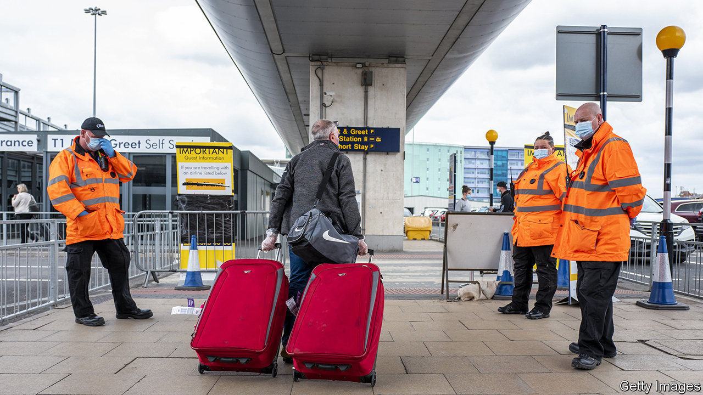

## Shutting the stable door

# Britain’s new quarantine rules are a head-scratcher

> Boris Johnson’s government closes down as Europe opens up

> Jun 11th 2020

THROUGHOUT APRIL and May, as most countries closed their borders and imposed strict limits on who could enter, Britain remained defiantly open. Now, as much of Europe starts opening up again, Britain is again going in the opposite direction. Under rules introduced on June 8th, anybody entering Britain at any port must fill in a form with their contact details and self-isolate for a fortnight. They will be allowed to take public transport from the airport, to shop for groceries and to leave the country again. Public Health England, a government agency, will phone people to ask if they are complying. Rule-breakers face a £1,000 fine.

Other European countries that imposed quarantines are either unwinding them or tailoring regulations according to the risk level in the passenger’s country of origin. Britain’s rules apply wherever people come from, including countries that have the virus under control. “If we had different rules for different countries, it may complicate matters,” says a Home Office spokesman.

Businesses are bewildered. Border officers are befuddled. Even the government’s scientists are stumped: they note that few countries’ infection rates are higher than Britain’s. Michael O’Leary, the boss of Ryanair, Europe’s largest airline, reckons that Britons know the rules are “rubbish”. That may be so, but they are also holding off booking summer holidays in large numbers whilst returning holidaymakers are also required to quarantine themselves. About six in ten Britons go on a foreign holiday in a normal year. But a YouGov poll found that just 16% of Brits are planning an international trip in the next six months.

Border officers charged with implementing the rules say they can neither understand nor enforce them. Guidance was not published until late on the Friday before they went into force, says Lucy Moreton of the ISU, the immigration officials’ union, adding that staff had been “promised time to digest the information and a brief training programme”. Officials are not checking whether the forms filled in by arriving passengers are true, “only that it’s broadly credible, so long as they have not put something completely dopey, such as Buckingham Palace”.

But the greatest confusion is within the travel industry, which must plan ahead. The government is due to review the rules every three weeks, starting on June 29th. John Holland-Kaye, who runs Heathrow, Britain’s busiest airport, thinks it is unlikely that much will change on that date. “So a lot of holiday companies have made the call that 20th July will be the opening-up date,” he says, citing Virgin Atlantic, which plans to resume operations from that date. That “is really a gamble in the absence of any information”.

Airlines, tour operators and holidaymakers want an explanation for the government’s perplexing policy. A better idea might be to ask YouGov. “I know that some newspapers are obviously opposed to it, for whatever reason,” says the Home Office spokesman. But “the polling shows 63% [of Britons] support these measures.” The government says it is following “the science”. Psephology is a science too. ■

Editor’s note: Some of our covid-19 coverage is free for readers of The Economist Today, our daily [newsletter](https://www.economist.com/https://my.economist.com/user#newsletter). For more stories and our pandemic tracker, see our [coronavirus hub](https://www.economist.com//news/2020/03/11/the-economists-coverage-of-the-coronavirus)