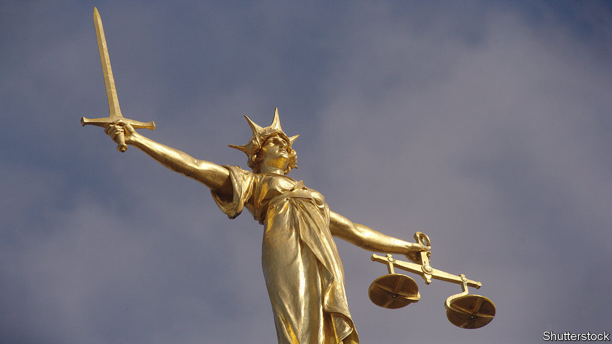

## Rough justice

# How to get jury trials back on track

> Social distancing has slashed court capacity. Radical solutions are needed

> Jun 11th 2020

UNLIKE MANY other depictions of Lady Justice, the statue that stands atop the Old Bailey, England’s most famous criminal court, does not wear a blindfold. Her “maidenly form” alone is said to guarantee her impartiality. She should, however, consider a mask. In the courtrooms below, each juror gets one as they take their seats. “This building has never been cleaner in its 100-year history,” the judge assures them.

Because of the pandemic, many hearings in England and Wales have switched from courtrooms to front rooms. The Supreme Court is entirely remote. Lawyers are now accustomed to telephone and video hearings. When the High Court heard a preliminary argument in the Duchess of Sussex’s privacy claim against the Mail on Sunday on April 24th, Meghan Markle and Prince Harry listened in from Los Angeles.

Yet there is a glaring exception to this tale of digital adaptation. Jury trials were postponed indefinitely, since few thought it suitable for jurors to convict their peers by Microsoft Teams. A handful of courts—including the Old Bailey—resumed such trials on May 18th. The courts service hopes to open most criminal courts by July.

Even optimistic estimates suggest they will be able to hear only half as many trials as usual. As well as the judge, jury and sometimes several defendants, each trial involves a phalanx of barristers and solicitors, court officials, witnesses, victims, relatives, journalists and the merely nosy. Keeping them apart is tricky. Trials that usually take up a single courtroom might now require three: one for the hearing, one for jury deliberation and one for observers to watch via video link. As the judge in the Old Bailey case adds, “we’re all going to have to be patient.”

For defendants waiting to plead their innocence or victims desperate for their day in court, patience is in short supply. Prior to the pandemic, most victims waited more than a year to see justice done; in some parts of the country, a two-year wait was the norm. Thanks in part to cost-cutting measures limiting the number of days judges can sit, criminal courts had a backlog of 37,000 cases—a queue which is now growing by about 1,000 cases a month.

Innovation is in order. One option is to shrink the size of the jury, perhaps to seven members. That is unlikely to help much, since courts would still require overspill space for observers and jury deliberations. A more radical alternative would be trial by judge alone, but lawyers and even many judges rule that out. “Justice must not only be done and be seen to be done, but feel to be done,” says Simon Davis of the Law Society, which represents solicitors. A third idea is to establish makeshift courtrooms in bigger venues. There is talk of requisitioning empty London theatres. “You can imagine some of our criminal-barrister friends loving that,” quips one observer.

The best solution may be the one most remain unwilling to countenance: online jury trials. Justice, a legal charity, has run experiments showing how they could work. In the next test, designed to overcome objections that jurors might struggle with technology or lack room at home, jurors will all log on from a church hall, with someone on hand to help with IT. A similar set-up in a sports hall would allow dozens of jurors to hear different cases simultaneously. In the end, the judiciary will need to weigh up opposing principles of justice. In-person jury trials may be the ideal, but justice delayed is justice denied. ■

Editor’s note: Some of our covid-19 coverage is free for readers of The Economist Today, our daily [newsletter](https://www.economist.com/https://my.economist.com/user#newsletter). For more stories and our pandemic tracker, see our [coronavirus hub](https://www.economist.com//news/2020/03/11/the-economists-coverage-of-the-coronavirus)