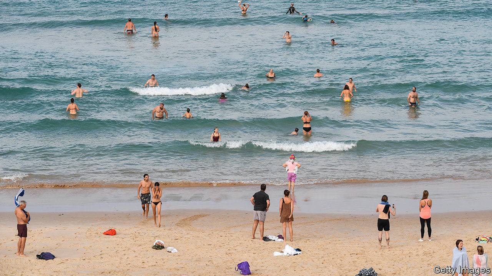

## Britain and Australia

# Why the Conservative Party adores Australia

> The explanation for rampant Ozophilia

> Jun 11th 2020

ALTHOUGH ITS members occasionally launch into “Land of Hope and Glory”, the Conservative Party lacks an official anthem. “Australia”, a song by The Kinks released in 1969, would be a good pick. It satirises the aspirations of the “ten-pound poms” who took up the offer of cut-rate passage out of stuffy post-war Britain for a new life by the beach: “No class distinction, no drug addiction… No one hesitates at life or beats around the bush in Australia.”

As Britain and Australia begin negotiations on a trade deal, the Tories are in the grip of Ozophilia. Boris Johnson, who picked up a pair of skimpy shorts and a widened vocabulary on his gap year at Geelong grammar school, holds Australia up as a model of prosperity outside the European Union. The government is creating an “Australian-style” immigration system, which will discriminate by skills and qualifications. The prime minister has even attempted to rebrand an ugly no-deal exit from the EU as an “Australian” deal.

Sir Lynton Crosby, an Australian political adviser, and his protégé Isaac Levido, have been teaching the Conservative Party how to win elections for the past decade. Tony Abbott, the former Australian prime minister, is a star of the Tory conference fringe. Alexander Downer, an erstwhile Australian high commissioner who advocates taking a tough line on Europe, is chairman of Policy Exchange, a think-tank close to Downing Street. Conservatism is developing an Australian accent. Mr Johnson has repainted the Tories as a classless, plain-speaking, macho outfit not unlike Scott Morrison’s Liberal Party.

Rich, stable and not led by Donald Trump, Australia is at present a more attractive template than America, which has long fascinated British politicians of both right and left. The Five Eyes intelligence partnership, which also includes New Zealand, Canada and America, is increasingly important. And Britain and Australia think ever more alike about the risks of doing business with China.

Often the most unyielding Brexiteers are the keenest on Australia. For them, restoring trade ties to the Commonwealth (which Britain mostly cut when it joined the European Economic Community in 1973) is one of the great opportunities created by Britain’s departure from the EU. Shortly after the Brexit vote in 2016, a poll found that Leavers gave priority to a trade deal with Australia; for Remainers, the country was not even among the top five. In “How We Invented Freedom and Why It Matters”, Daniel Hannan, a former MEP and star of the Eurosceptic circuit, describes the “Anglosphere” as a “civilisational model” in need of rescue.

Australia’s popularity among Conservatives reflects its allure to Britons in general. No other country is regarded so favourably, according to YouGov, a pollster. That is a product of Australia’s recent history as a destination for Brits to escape their rainy island. Post-war émigrés were promised a technicolour workers’ paradise of high wages, plentiful houses and sun. Until 1966 the country followed a “white Australia” policy, which appealed to some. Australia’s modern points-based immigration system is a hit with British focus groups partly because so many participants have relatives who moved there, says Jill Rutter of British Future, a think-tank specialising in migration. “Wanted Down Under”, a popular daytime television show, features would-be emigrants exploring the Australian labour market. A recent tourism ad featuring Kylie Minogue was described as “a little bit of escapism” for Brexit-weary Brits.

But Australia is decreasingly white and no longer very British—only 5% of its inhabitants were born there. Most Australian foreign-policy hands know that the future lies in the Indo-Pacific. Trade negotiations are likely to be hard-nosed and uncomfortable for British farmers. Britain’s negotiators can certainly cut their teeth on an Australian deal, says Dmitry Grozoubinski, a former Australian trade official and director of ExplainTrade, a consultancy, but the British should not imagine that any combination of deals with distant lands can substitute for EU membership. ■