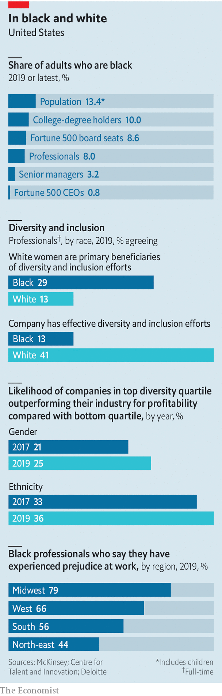

## Business and race in America

# Bosses say they want to tackle racial injustice

> American firms want to become more diverse

> Jun 11th 2020NEW YORK

“I AM BOTH impatient and disgusted.” So declares a letter on race sent on June 1st by Mary Barra, chief executive of General Motors (GM), to all of its suppliers. She is outraged by the killing of George Floyd, the latest in a long string of deaths of unarmed black Americans at the hands of the police. The response of business to the problem should be to “stop asking why and start asking what”, she wrote. Ms Barra put GM’s thousands of suppliers on notice that the firm will not tolerate racism and will stand up against injustice.

It is a sentiment that is echoing across USA Inc. Ken Frazier, Merck’s boss, declared, “This African-American man, who could be me or any other African-American man, was being treated as less than human.” Racial flare-ups are commonplace in America, but the intensity and breadth of the corporate response this time seems different. On June 8th, Arvind Krishna, IBM’s boss, sent a letter to Congress advocating changes to how policing is done, making clear that his firm will not make its facial-recognition software available for racial profiling. Darren Walker, head of the Ford Foundation, a philanthropic organisation, has spoken to two dozen CEOs recently and reports that “everyone is riveted…the murder of George Floyd has gripped the psyche of white Americans like nothing I’ve seen in my lifetime.” A huge number of firms, including The Economist, recognise they need to do more.

Jeffrey Sonnenfeld of Yale University’s School of Management observes that executives used to shy away from controversial topics like race. They are acting now because, “overwhelmingly, people across races have taken on this cause.” A poll published on June 9th by Edelman, a public-relations firm, finds that nearly two-thirds of Americans, including 57% of whites, are “very” or “extremely” concerned about systemic racism.

Are bosses to be taken seriously? There is a long history of corporate waffle and “race washing” that has deflected short-term crises but yielded little substantive change inside firms. The survey by Edelman finds big majorities of blacks and whites expressing hostility towards “performative activism”—posturing—and insisting that firms now making statements about tackling racism “need to follow it up with concrete action” to avoid being seen as exploitative.

Despite these concerns, there are signs that USA Inc is at last serious about tackling racism. Evan Sharp of Russell Reynolds, an executive-search firm, notes that statements on race are going beyond platitudes to be “more intentional and specific”. Linda Hill of Harvard Business School thinks there is “something different about this time”, perhaps because the pandemic has reminded everyone of interdependency: “We are all more empathetic.”

Good intentions of bosses aside, untangling the problem of race and corporate America requires addressing four questions. First, what is the evidence that blacks are disadvantaged in the workplace? Second, how much is business to blame rather than society as a whole? Third, do any such disadvantages impact how businesses perform? And finally, what if anything can business do to improve matters?

Finding definitive numbers on the ethnic make-up of individual firms is impossible because companies hide such data for fear of public shaming or racial-discrimination lawsuits. The federal government requires firms to reveal this data to bureaucrats but it is not made public. No firm is required to reveal pay inequities by race. Only a handful of technology firms, including Intel, voluntarily make data on pay and ethnicity open for scrutiny.

Even so, the picture painted by public data is grim (see chart). Black people make up over 13% of America’s population. However, only four current Fortune 500 CEOs are black (and none are female), and there have been only 17 in the past two decades. Less than 3% of senior corporate jobs and under 8% of all white-collar jobs are held by African-Americans. They comprise just 3% of Silicon Valley’s workforce. Black unemployment is persistently twice that of whites. And the black-white wage disparity, which extends from blue-collar workers to those holding advanced degrees, has grown over the past 20 years.

On the second question, the usual corporate position has been that racial inequity is a problem for society to solve. After all, it is the legacy of slavery and Jim Crow laws that impoverished generations of black Americans. On this view, only government can take on poverty, lousy schools and a flawed justice system. But even that argument does not excuse discrimination at America’s most respected firms. In 2000 Coca Cola was forced by a class-action lawsuit to remedy racist corporate practices. In 2018 Starbucks shut all its coffee shops in America to train workers on racial sensitivity after a national scandal arising from the ejection of black patrons from an outlet in Philadelphia. Texaco, an oil giant now part of Chevron, paid $176m to settle a racial-discrimination suit in 1996. Angela Vallot, brought in then as Texaco’s chief diversity officer, believes there has been “an awful lot of denial” about racism at work.

More troubling is evidence that some firms tolerate racism or punish those pushing for more diversity. Research published in the Harvard Business Review pointed to evidence that women and minorities are being penalised for promoting diversity within firms. There is also evidence that the few CEOs from racial minorities are disproportionately and unfairly blamed for poor performance of their firms.

A related argument offered by some for corporate inaction maintains that if there is a race problem facing American business, market forces should be able to solve it. Simon Freakley, chief executive of AlixPartners, a consultancy, rejects this argument: “It’s utterly unrealistic for anybody to bifurcate a societal problem…it’s also a business issue because business exists in society, with employers, customers, suppliers and stakeholders.” Mr Walker thinks such views are “naive and in denial about the hold of racism on our culture, including our business culture.”

Because black and white people in America typically attend different churches, live in different neighbourhoods and attend different schools, business is the main place where races mix, notes Raël Nelson James of Bridgespan, a consultancy. She points to research suggesting that three-quarters of whites have no black people in their social circle. Mr Sharp says that mixing at work “allows the opportunity to have difficult conversations on topics like race.” As 3M, a multinational with headquarters near where Mr Floyd was killed in Minneapolis, acknowledges, “businesses have a responsibility to help lead.”

The case for action becomes stronger when considering the third question about racism’s business impact. Sundiatu Dixon-Fyle and colleagues at McKinsey, a consultancy, have analysed racial and gender diversity at firms in 15 countries from 2014 to 2020. Across three separate reports, they find that the top quartile of firms measured on employee diversity outperform the bottom quartile on metrics such as operating profit margins. Ms Dixon-Fyle explains that the returns to diversity are stronger on race than on gender, and appear to be increasing over time.

It is hard to disentangle causation from correlation because of inadequate disclosure by firms, cautions Stephanie Creary of the Wharton School. Even so, diversity brings benefits. Ms Hill points to many studies suggesting that diverse teams are better at innovation, noting, “You don’t get innovation without diversity and conflict, and that means leaders need to build a capability for creative abrasion.”

Failing to act against racism inside the corporation can also harm companies in several ways. A recent paper in the American Economic Journal scrutinised ethnic prejudice at firms, and found that discriminators are willing to forgo 8% of earnings in order to avoid working with someone of a different ethnicity. This clearly works against the interests of shareholders.

There is also a growing reputational risk. The survey by Edelman found that over half of whites expect brands to take a stand on racial justice and over two-thirds of Republicans say a company’s response to the recent race protests will determine whether its brand keeps or gains trust. Paul Weiss, an American law firm, faced a backlash last year when it emerged that its new class of partners were all white. Brad Karp, its chairman, responded to the furore by transforming the firm’s management of diversity and inclusion, including introduction of artificial intelligence to detect implicit bias among managers doing performance reviews. “It’s not about money but mentorship and opportunities…the culture must be a welcoming one,” he says.

That points to the final question: what should firms do? Start with what they should not do. Bosses should not place faith in race-based quotas. “Affirmative action has not worked in corporate America,” declares Michele Meyer-Shipp of KPMG, a consultancy. She says black professionals do not want the scales tipped in their favour because “when they get a seat at the table they will not have the voice or sense of belonging.” Firms that have promoted women into the “old boys’ club” should not rest on their laurels. Ms Nelson James says that “affirmative action may have missed the mark by helping white women but not measuring the effect on the most marginalised group.” A recent study by the Centre for Talent Innovation, a think-tank, found that 29% of blacks felt that white women were the main beneficiaries of corporate-diversity efforts, and only 13% felt these schemes were effective at all.

Bosses also need to avoid the mirage of meritocracy. Ms Hill argues that few firms are true meritocracies, pointing to ample research suggesting that managers tend to trust and empower people similar to themselves. “This is how systemic racism works inside organisations,” she says.

That points to the first prescription: firms serious about advancing blacks must focus efforts on race. Ms Vallot argues that because race is difficult to talk about, diversity discussions have “watered down the topic” by including gender and other issues. A headhunter sees a box-ticking mindset undermining progress: “OK, we got a woman, so we are not un-diverse.”

Experts recommend creating a diversity strategy specifically for black employees, implementing clear and consistent standards for promotion and securing a firm commitment from the top to overcome bias among middle managers. This has to be “owned by the CEO and made a strategic priority, not hived off to outside consultants or a chief diversity officer,” insists Ms Vallot. Microsoft, Intel and Johnson & Johnson have tied executive pay to specific diversity metrics, but this is rare.

That points to the importance of metrics and measurement. Ms Vallot insists firms must have goals and targets (as distinct from legal quotas) broken down by race for attraction and promotion. If those are missed, managers must explain the reasons. Why did promising executives leave the firm? Did they have mentors? Mauricio Gutierrez, boss of NRG Energy, says his firm is studying pay equity and notes that most hiring managers require four-year or advanced degrees even though most jobs require technical skills not taught in those degree programmes. Because many talented minority applicants cannot afford such degrees, he wants to end such blanket requirements.

The toughest part is teaching old dogs new tricks. Managing newly diverse teams is harder initially than working with people from a similar background. Ms Meyer-Shipp thinks it is crucial to teach managers how to lead inclusively, or else their “affinity bias” may undermine corporate efforts. She observes that white managers are often hesitant to give black employees candid and frequent feedback. This backfires when the workers who think they are doing well suddenly get sacked. Challenged about this, the managers typically use euphemisms like “she just wasn’t exuding enough executive presence.”

Corporate America at last looks determined to take on racism in business. Josh Bolten, head of the Business Roundtable, which represents big American firms, says that there is even “widening shareholder appreciation that the corporation needs to serve something more than the immediate financial return to the shareholders.” Ms Meyer-Shipp sees a tipping point, with recent events a “wake-up call as the lack of progress on race is evident.”

The last week had echoes of tumultuous years such as 1918, 1935 and 1968, when America’s economy and its fabric were shaken, reckons Mr Walker. It may lead to a great awakening at USA Inc. “The unprecedented convergence of health, economic and social crises has happened in a way that I am left feeling hopeful about corporate America realising the potential of greater diversity.”■