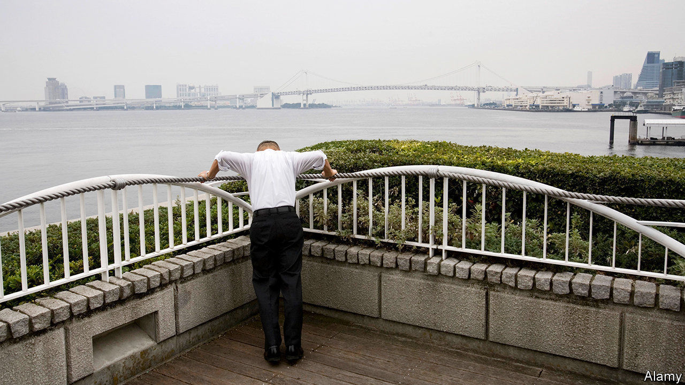

## Anger management

# Japan’s bullying bosses

> A new law seeks to curb abusive executives

> Jun 11th 2020TOKYO

AS HONDA SOICHIRO built his company from a small producer of engines to attach to bicycles into a global carmaking giant, he developed a reputation as a talented engineer and a maverick executive. He was also known to be an exacting boss, even a violent one. “When he got mad, he blindly reached for anything lying around, and started throwing whatever was in reach randomly at people,” one former executive later recalled. Such fiery tempers remain all too common among Japanese managers. A Japanese psychologist even coined a term to describe the particular abuse that the country’s supervisors pile upon some of their employees: pawahara, or power harassment.

Complaints of harassment in the workplace have been growing in recent years, hitting a record high of 82,797 in 2018, up from 32,242 a decade earlier. In 2016 the country’s labour ministry found that a third of Japanese workers had experienced power harassment in the past three years. The trend worried the government enough to spur recent passage of anti-harassment legislation. As of June 1st, Japanese firms are required to have clear policies in place and to create internal systems for reporting and verifying claims of abuse.

At the extreme end, workplace bullying can still include physical violence of the sort displayed by Honda. More typically, it manifests itself in all manner of verbal, emotional and psychological abuse. Japan’s labour ministry defines six categories of power harassment: physical attacks, mental attacks, social isolation, excessive demands, demeaning demands and privacy infringements. Suicides linked to power harassment are not uncommon. Cases cut across sectors and classes. One MP from the ruling Liberal Democratic Party resigned from the party after a recording surfaced that allegedly captured her hitting an assistant as well as calling him “baldy”.

Although bad bosses are a universal phenomenon, Japanese workplaces can be particularly conducive to the worst sort of behaviour. Hierarchies are rigid and deeply rooted. What bosses see as tough love can come across as hurtful to junior employees, especially as behavioural norms change between generations, says Inao Izumi of Cuore C Cube, the consultancy that first defined pawahara. The inflexibility of Japan’s labour market compounds the problem. “People can’t easily quit if they hate their boss and companies can’t easily fire bad bosses,” says Rochelle Kopp of Japan Intercultural Consulting.

Critics counter that the new law is both too vague and too toothless to help put-upon workers. Small and medium-sized firms do not have to comply until 2022. The law does not apply to part-time workers, who make up more than a third of the Japanese labour force. Nor does it specify punishments for harassers, leaving it up to companies to decide what action to take. “The law merely warns offenders—it’s like a yellow card,” says Kaneko Masaomi of the Workplace Harassment Research Institute. Until bad bosses have to worry about being sent off the pitch, their untoward actions are unlikely to stop.■