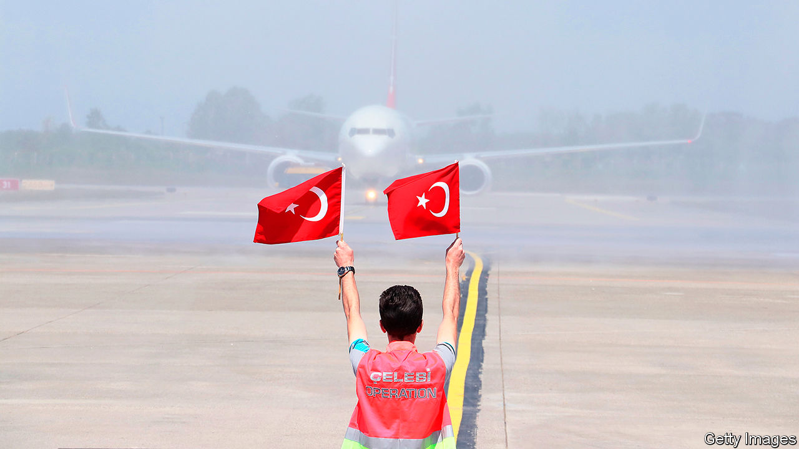

## Hard landing

# Life is tough for Turkish businesses

> But the pandemic may bring opportunity as well as woes

> Jun 13th 2020ISTANBUL

KALE GROUP, an aerospace and construction conglomerate, had been making and assembling engine parts for America’s F-35 stealth fighter jet since 2005. But when Turkey’s president, Recep Tayyip Erdogan, purchased a missile-defence system from Russia last year, the American government booted its NATO ally from the F-35 programme. Turkey’s air force has ordered 100 of the planes but has taken delivery of none. Turkish firms lost contracts worth an estimated $9bn. Kale was among those most affected. And then came covid-19.

Doing business in Turkey takes guts. In the past five years, the country has endured several episodes that have dented business confidence: dozens of big terror attacks, a violent coup attempt followed by a crackdown against dissidents, a currency crisis, diplomatic rows with Europe and America, and seven tense, divisive elections. But nothing has blindsided companies as badly as the pandemic.

A serious recession is under way. Exports have plummeted despite a weakening lira and unemployment is poised to reach record highs. A tourism industry that brings in $35bn is bracing for its worst year in decades. Kale has stayed the course, completing existing work on the F-35, supplying Turkey’s budding defence sector and producing components for civilian planes, but continues to face turbulence.

As lockdowns affected global supply chains, Kale has struggled to source materials from abroad. At home, cash-strapped customers are cancelling orders. “We’re operating at between 50% and 70% capacity,” said Zeynep Bodur Okyay, the firm’s boss, in April. The company has not cut jobs. Mr Erdogan’s government has banned companies from making lay-offs for six months.

Despite the gloom, there may be room for optimism for some firms. Multinationals had begun to rethink their reliance on China even before the pandemic struck, and are more likely to do so now. Turkey should be in a position to reap the rewards. Low labour costs, made even lower by a weak lira, proximity to European markets and a customs union with the EU, mean Turkey can strengthen its position in global supply chains, says Alicia Garcia-Herrero of Bruegel, a Brussels think-tank.

Turkish textile producers saw some evidence of this at the start of the year. Gurmen, a maker of menswear, saw orders increase by about 4-6% compared with a year ago in both January and February, when the lockdown in China forced European retailers to look for producers elsewhere. Turkey’s clothing sector as a whole saw an uptick of nearly 7% in exports over the same period compared with 2019, before a plunge of nearly 28% in March, when the pandemic struck home.

Turkish businesses will still need to attract outside investment. The instability of recent years, as well as the loss of central-bank independence and the takeover of key institutions by often under-qualified government loyalists, has led Western investors to give Turkey a wide berth. Chinese ones are cautious. To date, China has invested less in Turkey than in Venezuela. Unless it fixes its institutions, especially the central bank and judiciary, and relations with America and Europe, foreigners will stay away, leaving Turkish firms to recover from the pandemic on their own.■

Editor’s note: Some of our covid-19 coverage is free for readers of The Economist Today, our daily [newsletter](https://www.economist.com/https://my.economist.com/user#newsletter). For more stories and our pandemic tracker, see our [coronavirus hub](https://www.economist.com//news/2020/03/11/the-economists-coverage-of-the-coronavirus)

## URL

https://www.economist.com/business/2020/06/13/life-is-tough-for-turkish-businesses
