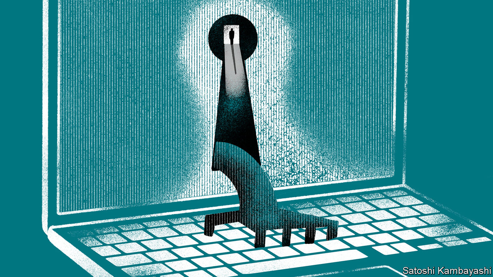

## Basin motives

# Sleuths uncover a particularly brazen case of cyber-mischief

> Targets included judges, MPs, journalists and ordinary people going through messy divorces

> Jun 11th 2020

COMPANIES SUFFER hacking attacks on a daily basis. The most recent known victim was Honda, which announced that its computers had been locked down by ransomware on June 9th. Stories about the firms suspected of doing the hacking, though, are rarer. Also on June 9th CitizenLab, part of the Munk School of Government at the University of Toronto, said that it had unearthed one of the biggest-known groups of such workaday, mercenary hackers, which it has dubbed “Dark Basin”.

This outfit has targeted thousands of people at hundreds of organisations all over the world, carrying out what Norton LifeLock, a cyber-security firm that worked with CitizenLab, describes as “financial, political and industrial espionage”. Its targets have included company bosses, judges, journalists, members of various parliaments, government officials and ordinary people in the midst of a divorce in America, Mexico and elsewhere.

Most of the attacks involved “phishing” attempts, in which hackers try to trick targets into handing over usernames and passwords. Emails that appear to come from friends or colleagues contain links that, when clicked on, reveal convincing replicas of legitimate sites such as social networks or email providers. Anyone attempting to log in would be handing their username and password to the attackers. Some victims were bombarded almost daily with carefully crafted emails whose details suggested the hackers knew quite a bit about them. Others were followed in the real world at the same time they were being stalked online.

Attributing hacks to a specific actor is tricky. But a combination of technical breadcrumbs, linguistic cues, public boasting by the hackers themselves and the fact that the attacks happened during the Indian working day, led CitizenLab to point the finger at a company based in New Delhi, BellTroX InfoTech Services. The firm purports to offer everything from medical-transcription services to “penetration testing”, a legitimate form of hacking in which experts are contracted by a company looking to test its electronic defences.

BellTroX’s boss, Sumit Gupta, has been in trouble before. Along with several American private investigators, he was indicted on a separate set of hacking charges in California in 2015. Soon after CitizenLab’s report was released, BellTroX’s website disappeared. (Requests for comment went unanswered, though Mr Gupta has told Reuters, a news agency, that he provided nothing more than “technical support”.)

While CitizenLab is willing to point the finger at the suspected hackers, it is less sure about who did the hiring. Some of the targets were involved in a campaign called “ExxonKnew”, which alleges that ExxonMobil, an oil firm, spent decades deliberately playing down the severity of climate change. (In 2019 ExxonMobil won a court case in New York on the matter.) However, CitizenLab did not accuse the firm of commissioning the attacks and an ExxonMobil spokesman denied the firm had knowledge of, or was involved in, the hacks.

Another group of targets appear to have been journalists covering Wirecard, a German payments-processing firm embroiled in an accounting scandal (on June 5th police raided its offices in Munich). Attacks seem also to have been made against hedge funds with a short position in Wirecard’s stock. Once again, the report does not allege that Wirecard commissioned the attacks. (Wirecard says it has not been in contact with a hacker group from India.)

John Scott Railton, one of the report’s authors, says that the brazen nature of the hacking suggests those responsible were not worried about legal consequences. Hacking-for-hire holds appeal for anyone aiming to play dirty, he says, and may have become a standard tool for private investigators. “These kinds of services allow their clients to cause trouble from a distance, in a different jurisdiction, with minimal friction and not much chance of getting caught.” Businesses—and anyone caught up in a bad-tempered divorce—beware.■