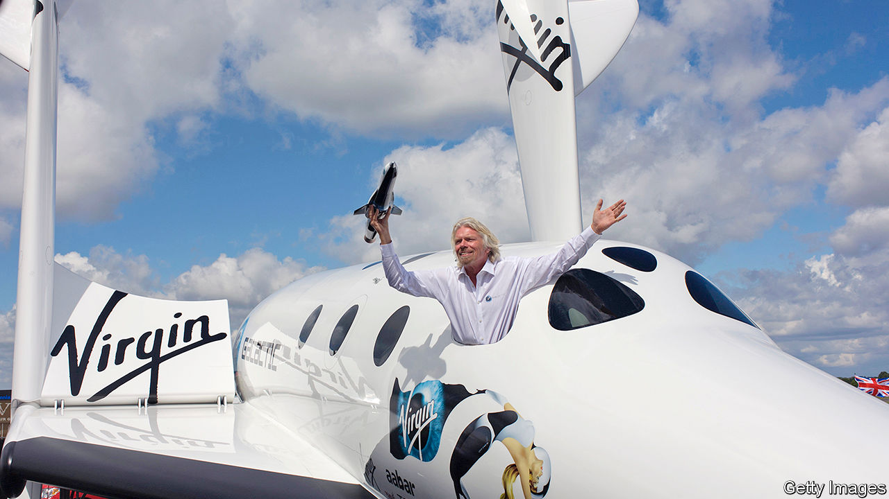

## Still smiling, captain?

# Virgin looks for help

> Richard Branson’s business empire faces pandemic disruption

> Jun 11th 2020

NO OTHER BUSINESS figure holds a candle to Sir Richard Branson when it comes to public-relations stunts. Not all of the British entrepreneur’s capers go off without a hitch, however: he was once rescued by an RAF helicopter when his speedboat capsized while attempting a record-breaking Atlantic crossing. His record in business with his Virgin-branded empire is also studded with successes and failures, among the latter being Virgin Cola, Virgin Brides (an attempt to disrupt the wedding industry) and Virgin Cars (a short-lived online retailer). Through thick and thin the bearded tycoon has hustled on, armed with a high-profile brand and a cheesy perma-grin. At the end of 2019 his empire was estimated to be worth over £4bn ($5.1bn)

That, though, was before covid-19. The Virgin group was heavily exposed to virus-induced shutdowns: among its businesses are two airlines, hotels, gyms and a cruise line. (Other interests include banking, mobile-phone and broadband networks and space tourism.) In March Sir Richard—who owns Virgin outright—said its travel, leisure and wellness businesses faced “a massive battle to survive and save jobs”.

His carefully crafted image as the corporate world’s lovable outsider has taken a hit. Critics cried hypocrisy when Virgin Atlantic (VA), a long-haul airline, asked the British government for a bail-out; Sir Richard had said a decade earlier, when arch-rival BA posted a record loss, that weak firms should be allowed to die. They also noted that a rescue for a tax exile might be a bit rich. Sir Richard and the group’s parent company are both domiciled in the tax- and disclosure-light British Virgin Islands. (Virgin says he moved there for lifestyle reasons, not tax, and that the main operating companies pay tax in Britain.)

The government’s rejection of a bail-out has forced managers to come up with a plan to shore up VA. The shareholders (Virgin, with 51%, and Delta, an American airline, with 49%) will defer taking fees, such as royalties; private investors are being courted for loans; the airline is hoping to renegotiate aircraft leases. It is cutting 3,150 jobs and closing hubs at Gatwick and Newark, New Jersey; and it is back in talks over a government loan, or a guarantee that would tempt credit-card firms to release frozen booking payments. A spokesman says VA “remains in a stable position”.

Virgin is also looking to revive Virgin Australia, the country’s second-largest airline until it slid into administration in April, rendering Virgin’s 10% stake worthless. Two private-equity firms are sniffing around. Final bids are due by June 22nd. Virgin may co-invest in a recapitalisation. Neither airline was in rude health even before covid-19. VA lost £26m in 2018, the last year for which it has filed accounts. It has hired a restructuring firm to work on options, including a contingency plan for a “pre-packaged” bankruptcy.

A business that hopes to operate at a higher altitude may act as saviour: Sir Richard’s space-tourism venture, Virgin Galactic, which was floated in New York last year. In recent weeks a Branson-controlled BVI firm, Vieco 10, has sold 37.5m Galactic shares, raising $560m but cutting the tycoon’s stake from over 50% to around 30%.

The proceeds will be used across the Virgin group to cushion the blow from the pandemic. They exceed the $360m in extra liquidity that Virgin’s managers, led by Josh Bayliss, reckon will be needed over the next year to ensure that all the businesses can keep trading. But that estimate has already been raised once, and the group acknowledges that more will be needed for 2021-22. Moreover, Sir Richard may be loth to cut his stake in Galactic further. The business, currently valued at $3.4bn, is still widely seen as promising, despite being beset by delays. Some 600 would-be space travellers have paid $80m in deposits.

Covid could have come at a better time for Virgin. If it had struck just after the sale of Virgin America, another airline, to Alaska Air Group in 2016, the group would have been flush with the proceeds of over £800m. Instead, it came “deep in the investment cycle”, Mr Bayliss says. Virgin does not tend to sit on gains from sales for long, thanks to its owner’s restless desire to keep trying new things.

Some of these nascent businesses looked bright before covid but are now beleaguered. The first ship in the Virgin Voyages cruise line, a joint venture with Bain Capital, sits off the Florida coast, diverted there while en route to a launch event in New York when the virus struck. The price tag for that vessel and three more being built is €3bn ($3.4bn). Virgin says the fleet has sufficient funding and it now hopes to launch in October.

The newish hotels business, with properties opened or planned in several American cities, has also been clobbered. Of the three already up and running, only Chicago is currently taking bookings. Some of Virgin’s older businesses are feeling acute pain, too. Virgin Active, which operates 238 gyms in eight countries, was shuttered in March. Sites are reopening, but the need for social distancing will limit their appeal.

Despite these tribulations, Mr Bayliss is confident Virgin can weather the storm. There are no plans to change the business model, which is essentially to run Virgin as a family office for Sir Richard, with two main parts: Virgin Group Holdings, which builds businesses, brings in partners and then partially or wholly divests; and a licensing business, which extracts royalty fees from Virgin-branded firms, often long after Sir Richard has sold out. Some 35 businesses around the world pay to use its brand; Virgin owns equity in under half of them. Royalty income for 2018 was £94.3m, a third higher than four years earlier.

The future, Mr Bayliss argues, lies in “inverting” the old Virgin way, which put holding stakes above brand income. Royalties, he says, provide “steady, recurring liquidity, like an annuity”, whereas the returns from investing only in assets can be “lumpier”. “The value of the brand is greater and more enduring than the value of the investment capital on its own,” he says.

How valuable that brand will be once the crisis abates remains to be seen. Between now and then, a prized asset or two may have to be sold. It would not be the first time. Sir Richard has a history of sacrificing businesses to keep the empire afloat. In 1992, after a vicious fight with BA, he was forced to offload his beloved Virgin Records—the label behind bands from the Sex Pistols to Simple Minds. He later admitted to weeping when the sale closed. ■

Editor’s note: Some of our covid-19 coverage is free for readers of The Economist Today, our daily [newsletter](https://www.economist.com/https://my.economist.com/user#newsletter). For more stories and our pandemic tracker, see our [coronavirus hub](https://www.economist.com//news/2020/03/11/the-economists-coverage-of-the-coronavirus)

## URL

https://www.economist.com/business/2020/06/11/virgin-looks-for-help
