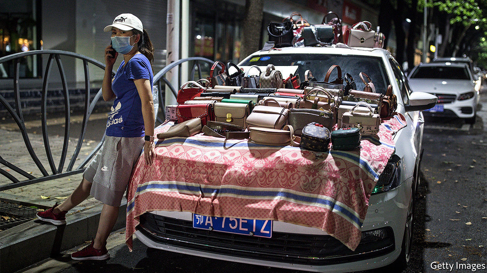

## Back peddling

# China once banned street vendors. Now it welcomes them

> Some cities, however, are not so sure

> Jun 11th 2020SUZHOU

IN A COUNTRY of high-tech factories and giant state-owned firms, you might not expect street hawkers to attract much attention. But in China these days, people like Shui Jin, an old lady pedalling a wooden cart laden with apricots and cherries through the narrow lanes of Suzhou, an eastern city, are in the spotlight. Both of her daughters-in-law recently lost their jobs, among the tens of millions in China hurt by the coronavirus slump. Her family needs the money she can scrape together. Whether the country needs her on the streets has become a matter for debate.

For years, municipal officials pushed out hawkers, trying to tidy up the colourful hubbub that once characterised China’s cities. In the name of “civilising” urban life, they wanted to see steamed dumplings and plastic toys sold inside shopping malls, not from the back of carts. On June 1st Li Keqiang, the prime minister, seemed to signal a change, declaring that street vendors were vital to the economy. “Only when the people are in good shape can the nation be in good shape,” he said.

That generated much buzz about the revival of China’s “street-stall economy”, as it has been called. At least 27 provinces and cities said they would welcome hawkers. Chengdu, a bustling city in Sichuan province in the south-west, was seen as a shining example. Firms there started setting up street stalls in March, creating more than 100,000 jobs, the local government says. China certainly needs to boost employment. Between 60m and 100m people—perhaps as many as 20% of non-farm workers—were out of work in April, according to Ernan Cui of Gavekal, a research firm.

In small towns, officials are excited about the street-stall idea. For instance, Zhangye, a poor western town, says it will create spaces for 4,120 hawkers in its markets. But for Ms Shui, the fruit vendor in Suzhou, change has not been radical. Last year the officers who enforce urban rules would often seize her cart and fine her. Now they just tell her to move on.

Officials in China’s richest cities are afraid that encouraging street vendors will lead to a mess. “It is not for Beijing,” declared the capital city’s main newspaper. Shanghai has made it clear that it will not allow vendors to set up stalls willy-nilly. Licences must be obtained and, for those selling food, hygienic standards met.

Can the stalls, such as they are, really help the economy? Some investors see a business opportunity. The price of shares in Wuling Motors, which makes a new van that can double as a mobile kiosk, has doubled since Mr Li’s comments. Other firms that might benefit, including Yindu Kitchen, which makes portable cooking equipment, also saw their shares surge.

The direct impact on job creation, alas, is unlikely to be so spectacular. The demise of street stalls in recent years is only partially the result of government restrictions. It also reflects the rise of e-commerce platforms, where products are often both better and cheaper. Whether online or on the street, the main concern for vendors now is weak demand. On one historic street in Suzhou, a 62-year-old woman walks back and forth with flashing glow-sticks for sale. With few tourists, there are few buyers. She has cut her asking price from ten yuan ($1.40) to five.

But the street stalls do dovetail with a separate policy, launched last year, to develop China’s night-time economy. Suzhou and Shanghai, among other cities, have recently opened glitzy outdoor night markets. Though far more orderly and corporate than the hawkers’ free-for-all of old, they are lively. And they help the government to deliver an important message. Officials cautiously avoid proclaiming that covid-19 has been beaten in China. But the reinvigoration of street life looks like a declaration of victory.

Late one recent evening in Suzhou, thousands of people flocked to its official night market. Most were not wearing face masks, a sight unthinkable just a month ago. “I was cooped up at home for a long time,” says Cao Yunqiang, 19, visiting from Henan province, further inland. “Things aren’t fully back to normal, but it’s the right time to come out and have some fun.” ■

Editor’s note: Some of our covid-19 coverage is free for readers of The Economist Today, our daily [newsletter](https://www.economist.com/https://my.economist.com/user#newsletter). For more stories and our pandemic tracker, see our [coronavirus hub](https://www.economist.com//news/2020/03/11/the-economists-coverage-of-the-coronavirus)