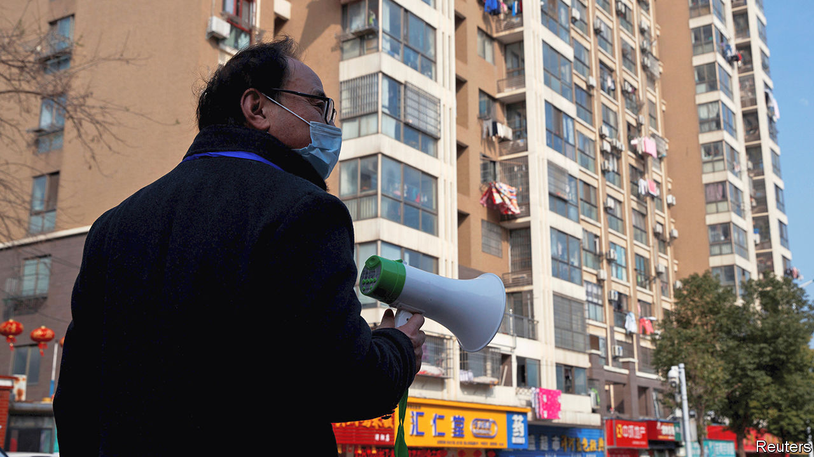

## On every street

# China’s Communist Party worries about its grassroots weakness

> It wants to extend its presence deeper into neighbourhoods

> Jun 11th 2020BEIJING

MANY CHINESE are familiar with a poem by Mao Zedong called “Farewell to the god of plague”. It was written in 1958 to celebrate the country’s victory over snail fever, a disease that blighted the lives of many millions of people in China (and still afflicts thousands). Today that poem is recalled by officials in their fight against covid-19, because this, too, has involved mobilising citizens on a massive scale, and also to great effect. Life is gradually returning to normal, but the pandemic’s impact on the way urban society is organised at the grassroots may be long-lasting. Features of the Mao era are enjoying a revival.

Since China launched its economic reforms in 1978, two years after Mao’s death, life in urban neighbourhoods has been transformed. Housing, once almost entirely owned by the state, has been privatised. Many long-established communities have been scattered as bulldozers have moved in. Gated compounds have sprung up, providing homes for a new middle class. Migrants from the countryside have flooded in, occupying run-down buildings that have yet to be flattened by developers. Amid this flux, the party has struggled to maintain its once ever-watchful presence. Its mobilisation efforts during the pandemic, however, have strengthened its resolve to do so, and taught it that it can.

Lockdown in the neighbourhoods, now all but lifted in most cities, was not a matter simply of telling residents to stay at home. It involved deploying armies of people to act as guards, health monitors, helpers for the infirm and procurers of supplies. Central to these efforts were two organisations: residents’ committees and neighbourhood party committees (their memberships are often the same). The “two committees”, as they are often called, had their heyday in the Mao era as enforcers of the party’s will. Since then they have become less visible, focusing mainly on registering new residents, administering local clubs, distributing welfare payments and providing proof-of-address and other useful documents.

But during the height of the lockdown, between late January and mid-March, these committees played a prominent role. Their staff stood guard at entrances to housing compounds in China’s more than 100,000 neighbourhoods, policing who could leave or enter. They supervised self-isolators, sometimes using webcams and alarms. They organised deliveries of food and other essentials for residents and transmitted the government’s latest instructions via WeChat.

But with each neighbourhood having only a handful of permanent staff to monitor and help hundreds of people, manpower was far from adequate. So the party called in reinforcements, including party members, local officials and volunteers. In many neighbourhoods “temporary party committees” were created to oversee these efforts, headed by officials from higher levels of the urban bureaucracy. The new committees established numerous other bodies: temporary party branches for each neighbourhood “grid” (an area often comprising a single residential compound) and party cells for each building.

The party now trumpets this mobilisation as evidence of its strength and that of China’s political system. But it is clear from official documents and reports in the party-controlled media that the party also sees many weaknesses in its grassroots network. It was often the temporary committees that got the job done. The neighbourhoods’ existing structures not only lacked sufficient staff, but also clout.

This has long been a worry. In the 1990s, when many state-owned enterprises (which had once owned much of urban China’s housing) closed down, so too did the firms’ party branches. Alongside the neighbourhood party committees, these had played a vital role in maintaining the party’s grip. Most of the new private firms that began to spring up did not have party organisations embedded within them. Neither did the homeowners’ associations that formed in the middle-class blocks of flats. These associations interact mainly with the property-management companies that look after common areas in their compounds, rather than with the old residents’ committees (which are supposed to be democratically elected, but mostly are installed by higher-up government).

The pandemic has prompted debate about how to give the neighbourhood committees more muscle. State media quoted one scholar as saying that the party must “thread” them together with landlords’ associations and property-management firms. In recent years the party has been laying the groundwork for this by forming cells within these groups. The central city of Hefei wants at least half of those sitting on landlords’ committees to be party members, according to Legal Daily. State media often use the term “red property-management” to refer to firms that use their party cells to interact with property owners and try to keep them happy.

That is an important aim. Resolving local disputes before they erupt into street protests is one of the main tasks of the neighbourhood committees. Many such disputes involve property, including shoddy service by property-management firms. The police use the committees to watch for trouble. In recent years they have installed officers as deputy chiefs of many of them. This has helped the police to nip problems in the bud, the authorities claim.

One idea is to promote the creation of “big party committees” in neighbourhoods. These would have a clearer mandate to wield authority over other party branches at the same level, including those in firms. Experiments with this have been praised in the party’s press. “A solo has become a chorus,” as one local government put it. Mao would be proud. ■

Editor’s note: Some of our covid-19 coverage is free for readers of The Economist Today, our daily [newsletter](https://www.economist.com/https://my.economist.com/user#newsletter). For more stories and our pandemic tracker, see our [coronavirus hub](https://www.economist.com//news/2020/03/11/the-economists-coverage-of-the-coronavirus)