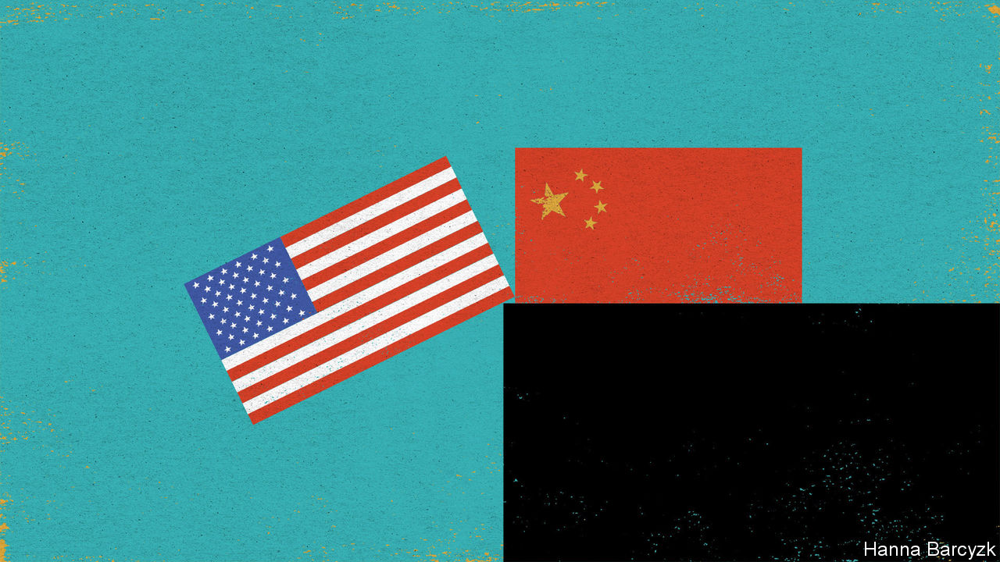

## Chaguan

# Elites in Beijing see America in decline, hastened by Trump

> But they are not sure whether it would suit China for Trump to be re-elected

> Jun 11th 2020

WHOM WOULD China prefer as America’s next president? That is a hard question, without an uplifting answer. In elite circles in Beijing, both President Donald Trump and his rival, Joe Biden, a former vice-president, are spoken of with distrust and condescension. Rather unusually, both candidates are known quantities. Each man has spent many hours with President Xi Jinping. During the first term of the Obama administration, when Mr Xi was heir-apparent to the leadership of China with the formal rank of vice-president, Mr Biden, as his opposite number, was tasked with taking his measure. Visiting China in 2011, Mr Biden hailed their numerous meetings in various countries and their “mutual respect”. Mr Trump has gone further, calling Mr Xi his “very, very good friend”. Few in Beijing are fooled. Mr Trump and Mr Biden may share a capacity for talking (and talking) in pursuit of a deal. But Mr Xi’s grim, security-first worldview leaves little room for foreign friendships, let alone with garrulous Americans.

Chinese disdain combines the political with the personal. In the unmarked villas, private dining rooms and scholarly retreats where—when it suits them—well-connected Chinese sometimes offer opinions to foreigners, Mr Trump is called ignorant, erratic and tiresome, but not without his uses. He is praised for an apparent indifference to ideology. He is complimented for his reluctance to condemn Chinese repression in such places as Xinjiang. People familiar with the thinking of Chinese generals assert, approvingly, that Mr Trump dislikes military adventures abroad.

Chinese leaders initially mistook Mr Trump for a pragmatic tycoon, a type they have met before. Now he is called a narcissist who cares only about his own interests, starting with his re-election. That cynicism informs China’s response to the trade war unleashed by Mr Trump, with wary but bipartisan support from members of Congress and some American business lobbies. Plenty of American businessfolk have swallowed qualms about Mr Trump’s tactics. They were glad to see him press China over its unfair market rules and industrial policies that promote local champions at the expense of foreign firms. Detecting that Mr Trump was more interested in China’s money than in making China change its ways, officials in Beijing agreed on a “phase one” trade deal built around purchases of American commodities. China has kept that deal alive, with state companies buying shiploads of soyabeans and other goods even as the two governments trade angry words about each other’s handling of covid-19, among other issues. China has yet to fulfil its threat to name American firms as “unreliable entities” ripe for punitive treatment, even after the Trump administration said it would put sanctions on China for imposing a national-security law on Hong Kong. Mr Trump’s supporters would doubtless call China’s caution a tribute to their president’s tariff-happy toughness. Maybe. But China is also buying itself time. Satisfying Mr Trump has effectively parked America’s bipartisan demands for structural reforms. That does not make Chinese elites relaxed, though. They fret that Mr Trump has been “kidnapped” by the truly ideological China hawks who surround him.

As for Mr Biden, in Beijing he is called a member of the former ruling establishment that saw economic interdependence with China as a source of stability, not danger. Mr Biden was a player in Obama-era campaigns to seek China’s help in tackling climate change and other global challenges. Yet, in China, there is strikingly little nostalgia for those days. Some grumble that such engagement rested on a mistaken American belief that China would converge politically with the West as it grew richer. Others recall how American politicians bragged that democracies had a creative edge that autocratic China would always lack. That is certainly a favourite Biden line, as in 2013 when he told Chinese students applying for visas at America’s embassy in Beijing that “innovation can only occur when you can breathe free.” The view in China is that its best scientists and tech firms are busy disproving such boasts, tipping America into a crisis of confidence and anti-China hysteria.

Just as bipartisan opinion in Washington has coalesced around alarm at China’s rise, an elite consensus has emerged in the Chinese capital. Especially in this summer of pandemic and street protests, America is called a nation in decline: a rich country too divided, selfish and racist to keep its citizens safe. Chinese elites see Mr Trump as a symptom and an agent of that decline. State media long refrained from direct attacks on Mr Trump. Not now. The Global Times, a nationalist tabloid, this month reported that Chinese netizens mockingly call him Chuan Jianguo, or “Build-up-the-country Trump”. Their joke, that he is a double-agent wrecking America to make China strong, prompts lines like “Comrade Chuan Jianguo, don’t blow your cover!” Does such scorn mean that China wants Mr Trump re-elected? There, elites are divided. At root, their debates turn on two questions: is American decline irreversible, and would its acceleration suit China just now?

In national-security circles, many see advantages to four more years of turbulence, with Mr Trump weakening democracy at home and repelling allies in Asia and beyond. In contrast, elites focused on the economy fear the premature collapse of a global trading order that has profited China mightily. That prods some to hanker for Mr Biden. Such people think of him as a moderate who might slow economic decoupling, giving China time to diversify and become more self-reliant. Still another camp holds that America’s next government, of whichever party, will be filled with officials bent on keeping China down, but that Mr Biden’s team will be more competent, and thus more dangerous. Many Biden-sceptics in China note, with alarm, how the Democrat has taken to chiding Mr Trump for being soft on Chinese human-rights abuses. All camps are united by a bleakly defensive mood. Whoever becomes America’s next president, China does not expect to be friends.■

## URL

https://www.economist.com/china/2020/06/11/elites-in-beijing-see-america-in-decline-hastened-by-trump
