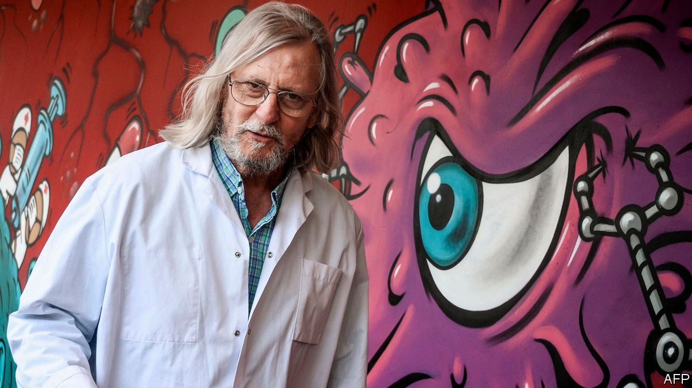

## Raoultmania

# A French doctor finds fame promoting malaria pills for covid-19

> Populists embrace Didier Raoult; studies suggest he is wrong

> Jun 11th 2020MARSEILLE

IN LATE MARCH, outside a brand-new medical institute on a busy boulevard in Marseille, a single-file queue snaked along the pavement. Amid a national shortage of covid-19 tests, local residents had heard that the city’s Institut Hospitalier Universitaire, linked to the main public hospital, was offering to test anybody with even mild symptoms. Word had also spread that the institute’s director, Didier Raoult, was successfully treating patients there with hydroxychloroquine, used to treat malaria, along with an antibiotic. Today, Mr Raoult says coolly that covid-19 has “almost totally disappeared” from Marseille.

A contrarian microbiologist with long druid-like silver hair, Mr Raoult has become a cult figure in France’s second-biggest city. A fan tattooed an image of the professor on his arm. A former patient drove a publicity van emblazoned with the doctor’s face around the city. L’Olympique de Marseille, the local football club, displayed a banner declaring “Marseille and the world behind Prof. Raoult!!!”

On one level, Marseille’s new hero reflects a natural yearning for hope at a time of anguish, and for clarity in the face of scientific uncertainty. Mr Raoult has treated nearly 4,000 patients. His most recent study put those who tested positive for covid-19 on the two-drug cocktail. It reported no deaths among those aged under 74, and said 98.7% were “cured”.

Yet the controversy over Mr Raoult’s treatment also exposes deep fractures in French society. The capital’s elite ridicules the professor—“a charlatan who thinks he is God”, sniffed a philosopher. The Paris medical establishment pours scorn on his results. They are not randomised clinical trials but hospital-based observational studies, lacking a control group. He represents none of the Paris-based French health bodies. As if to confirm his capricious nature, note his critics, Mr Raoult walked out of President Emmanuel Macron’s scientific advisory council.

Populists, meanwhile, have claimed him as one of theirs, a sort of gilet jaune in a white coat. He is “to medicine what we are to politics”, declared Jordan Bardella, deputy leader of the National Rally (formerly the National Front). The professor has a serious research record, winning a top prize in part for his discovery of the first giant virus. But Mr Raoult’s cocky, consensus-defying self-promotion—he calls himself “a star of infectious diseases”—makes him a poster boy for those drawn to showmanship. Donald Trump and Jair Bolsonaro are fans of his antimalarial drug.

Mindful of this following, Mr Macron flew to Marseille during lockdown to listen to the professor. Three large randomised controlled trials, in Britain, America and Spain, found no benefit from hydroxychloroquine in treating covid-19. The French government, meanwhile, has zigzagged on authorising clinical trials. The Marseillais, however, are undeterred. A poll shows that only 39% of the French have a positive image of Mr Raoult, but in the region around Marseille he scores 60%. ■

Editor’s note: Some of our covid-19 coverage is free for readers of The Economist Today, our daily [newsletter](https://www.economist.com/https://my.economist.com/user#newsletter). For more stories and our pandemic tracker, see our [coronavirus hub](https://www.economist.com//news/2020/03/11/the-economists-coverage-of-the-coronavirus)