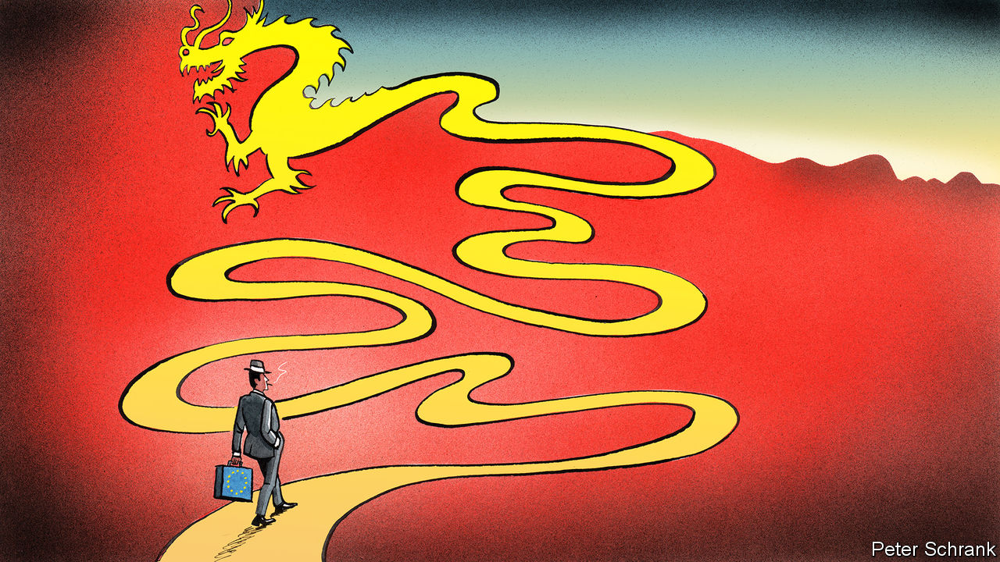

## Charlemagne

# Europe’s “Sinatra doctrine” on China

> The EU wants to go its own way

> Jun 11th 2020

CLICHÉS ABOUND when discussing China’s relations with Europe. It is easy for someone to slip in Napoleon’s view on the country’s sleeping habits, or Zhou Enlai’s take on the historiography of the French revolution. Full marks for effort, then, to Josep Borrell, the EU’s foreign-policy chief, who turned to a less frequently cited source of inspiration to explain the bloc’s policy on China: “We have to be like Frank Sinatra, no? ‘My way’.”

When it comes to China, the primary concern of the EU and its members is to avoid being sucked into a superpower struggle between America and its geopolitical rival. For that, the EU has to develop its own independent position on China, argues Mr Borrell. Many European foreign-policy grandees agree on this basic point. The tricky part is deciding what this position should actually be. A summit this September in Leipzig was supposed to be a demonstration of the EU’s unified direction, with the EU’s 27 leaders banding together across from China’s president, Xi Jinping. Instead, it was ditched at the start of this month. Officially, coronavirus was the reason. But insiders blame other factors: a desire to avoid a difficult stand-off over Hong Kong, and the fact that, on the EU side, a shared view on China is hard to come by.

At the moment, there is unity only in confusion. Countries are split, both internally and externally. Some have no policies on China whatsoever. Others have a position, but a schizophrenic one, with blasé foreign ministries pulling in one direction, while sceptical intelligence agencies heave in the other. (One diplomat offered a clear-eyed appraisal of his government’s strategy on China: “Nonsense”.) Germany has the closest ties with China, which bought €96bn of German exports in 2019, nearly half the EU’s total. But the country struggles to conceive a relationship that goes beyond economics, argues Ulrich Speck from the German Marshall Fund, a think-tank. For France, China is a chance to bulk up the EU into a true geopolitical actor (magnifying French power in the process). A “17+1” group of small countries from central, eastern and southern Europe meets Chinese officials in the hope of receiving Chinese investment. The odd hawk, such as Sweden, which was the lone voice demanding sanctions against China over its recent attempts to control Hong Kong, further complicates the picture. Cobbling these opinions into a unified vision is difficult.

So far, the EU has solved this problem by treating China as a geopolitical chimera. In 2019 the European Commission labelled China a “systemic rival”—diplomat-speak for an authoritarian brute, with little time for Western norms—as well as a partner on some topics and a competitor on others. Such a frame was “to a degree a cop-out from the start,” says Janka Oertel of the European Council on Foreign Relations, a think-tank. It is hard for a country to be an existential challenge one day and a partner the next. The EU has to decide which tendency is dominant, sooner than it had imagined.

Some areas of agreement exist. A realisation that China will not play fair in business is now more or less universal. European businesses complain that China, rather than opening up its markets, is now “one economy, two systems”, with European companies unable to compete with domestic rivals unfairly boosted by the Chinese government. “Europe is open, China is not,” sums up one senior EU diplomat.

Brussels is trying to be tougher in response. A proposal to let the commission block takeovers of European businesses by companies that receive unfair support from foreign governments will be put forward this month. At the start of the last decade, the suggestion that Eurocrats might cast an eye over foreign investment would have led to claims of a dirigiste French plot from the bloc’s zealous free-traders. Now the Dutch, usually the most buccaneering when it comes to trade, cast themselves as proud godparents of the policy, having previously proposed a similar one.

Chinese attempts to drive a wedge between EU countries have failed. A small China-friendly country, such as Greece, is useful in a body that moves by unanimity in foreign policy. But the quid pro quo of such dealings—lashings of Chinese investment—has often failed to materialise, grumble members of the “17+1” group. Direct investment from China into the EU was €12bn ($13.5bn) in 2019. The EU spends almost five times this figure just on subsidising its farmers. Buying friends on such a rich continent is not cheap.

External pressure may solidify the bloc, rather than split it. A brewing cold war between America and China justifies the EU’s own Sinatra doctrine. (It is not Sinatra’s first foray into global politics: Mikhail Gorbachev’s spokesman used a similar analogy when the Soviet Union promised to stop interfering in eastern Europe.) Such autonomy is the very purpose of the EU, whose goal is to allow countries not to be “a Chinese or American colony”, argues Enrico Letta, a former prime minister of Italy. In one sense, such talk is overblown. America, for all its current flaws, is a democracy whose concerns about China are shared by Europeans. Independence does not mean equidistance between the two powers, caution diplomats. At the same time, they argue, the EU is determined to avoid being trapped in a united Western front against China, or forced to pick a side in a conflict in which the EU wants no part.

Dodging that choice marks the beginning of a policy, not its completion. Independence raises more questions than it answers. Will the EU let Chinese companies such as Huawei, a telecoms giant that is barred from America, build crucial infrastructure? What would the EU do if China invades Taiwan? Stuck between an isolationist America and an authoritarian China, the EU casts itself as the last bastion of the liberal order. Yet it has not drawn a line at China’s tightening chokehold on Hong Kong. Nor, even, at China’s internment camps for Uighur Muslims. “What does it take to really rattle Europeans?” asks Ms Oertel. It is a question the EU will have to answer if it goes its own way. ■

## URL

https://www.economist.com/europe/2020/06/11/europes-sinatra-doctrine-on-china
