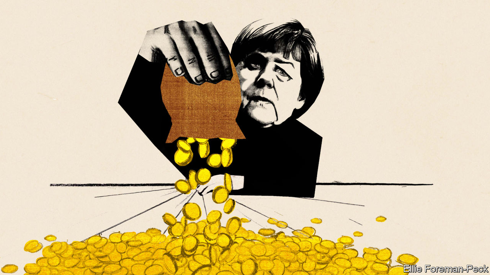

## Hey, big spenders

# Germany opens the money tap

> The pandemic has converted it to the joys of deficit spending. This may not last

> Jun 11th 2020BERLIN

Editor’s note: Some of our covid-19 coverage is free for readers of The Economist Today, our daily [newsletter](https://www.economist.com/https://my.economist.com/user#newsletter). For more stories and our pandemic tracker, see our [coronavirus hub](https://www.economist.com//news/2020/03/11/the-economists-coverage-of-the-coronavirus)

EVERY THURSDAY at 5pm three dozen of Germany’s most prominent economists brush their hair, clear their throats and Zoom into the finance ministry for 90 minutes of debate on whatever is on its officials’ minds. The sessions, which emerged from an informal discussion about the covid-19 crisis in March, have inspired several policy measures. (Olaf Scholz, the finance minister and vice-chancellor, is sometimes in the chair.) They also show how far Germany has moved from its caricature as a deficit-obsessed tightwad.

On June 3rd the coalition announced a stimulus package worth at least €130bn ($148bn). This follows a €123bn supplementary budget passed in March. Fresh borrowing could reach 6% of GDP this year. Meanwhile, Germany has agreed with France that the EU should issue €500bn in common debt to fund investments in member states hard hit by covid-19. Outsiders who have long despaired of German rigidity find themselves in the strange position of being surprised on the upside.

In 2008 German politicians warned of “crass Keynesianism”, before grudgingly passing a stimulus. This time the response has been quicker, bigger and better designed. Benefit rises and cuts to value-added tax aim to boost consumption, and €50bn has been set aside for investment, much of it green-tinged. Politicians have ignored (as they did not in 2009) the lobbying of Germany’s mighty auto industry for subsidies for people to buy cars, other than the electric sort. In 2010-12 the euro zone, at Germany’s behest, inscribed austerity into bail-outs and even national constitutions, like Germany’s (currently suspended) “debt brake”, which limits borrowing. Now Germany is signing up for big, multi-year transfers. Strikingly, this triumph of discretionary pump-priming over rule-following is fine with voters: 73% back “taking on large amounts of debt”. What happened?

The catalyst, of course, is the virus. Germany faces a deep recession: manufacturing and exports are in a hole, and 7.3m workers are on Kurzarbeitergeld (furlough pay), compared with 1.5m at the peak in 2009. At the European level it is easier to mobilise support for countries struck by a pandemic than for (perceived) overspenders. And the revival in support for the government, which six months ago seemed to have run out of steam, creates space to act.

Yet the groundwork had already been laid. Economic thinking in Germany has undergone a dramatic shift in recent years, says Jens Südekum, a professor at Heinrich Heine University Düsseldorf. Older economists schooled in rule-based “ordoliberalism” have partly yielded to a younger set, often educated abroad, with a grounding in empirical economics and views that sit squarely in the international mainstream. Between 2010 and 2015 the share of German economists who told a survey that fiscal policy could help stabilise economies doubled. And as commentators, the new wave have shaped lively debates on matters like Germany’s “black zero” (ie, no deficit) rule.

The pragmatism of the new generation earns them a hearing among policymakers, says Christian Odendahl, an economist at the Centre for European Reform. Under Mr Scholz and his chief economist, Jakob von Weizsäcker, the finance ministry has become a salon of sorts; the weekly Zoom calls cap constant email back-and-forths. This atmosphere is cultivated by officials like Wolfgang Schmidt, an old ally from Mr Scholz’s home town of Hamburg, and Jörg Kukies, a former Goldman Sachs banker. Mr Kukies helped assemble the Franco-German plan, inspired in part by an old think-tank document on American federalism he urged Mr Scholz to read.

However buzzing the scene around Mr Scholz, the last word remains with his boss, Chancellor Angela Merkel. Mr Scholz’s lieutenants claim for him great powers of persuasion in his long talks with the chancellor. Yet at home and abroad Mrs Merkel’s authority has also waned as her chancellorship, which will expire after next year’s election, winds down. This leaves space for others to make a mark.

Will the changes last? Not necessarily. Mr Scholz sits inside the Social Democratic Party (SPD) but like Mrs Merkel’s Christian Democrats (CDU) he argues that Germany can afford its largesse because it paid down debt in years of plenty. In this austere telling, disputed by many economists, the current splurge is a vindication of fiscal rectitude, rather than its negation. “It’s not a U-turn, it’s an extraordinary situation that needs a comparable response,” says Lars Feld, an economics professor at the University of Freiburg. Lukas Haffert at the University of Zurich notes that this year’s experience makes it harder for critics of the debt brake to argue that it impedes deficit spending in crises. And the patience of the CDU’s conservative wing will have its limits. An early test will be over the pace of debt reduction. “Consolidating too early would be a disaster,” says Mr Südekum.

The European argument is a little different. Mr Scholz has taken to grand talk of Hamiltonian moments, fiscal union and handing tax powers to the EU. The fact that Germany’s spending will only widen the gulf with its partners—the Bundesbank forecasts a 6% fall in GDP this year, far gentler than France and Italy—strengthens the case for big intra-EU transfers. German exporters also need European custom. True, when Europe’s leaders begin debating the fund on June 19th, it is Mrs Merkel rather than Mr Scholz who will be negotiating.

But the clock is ticking on her chancellorship. Mr Scholz will probably secure the SPD’s nomination to campaign to succeed her next year. If so, he will not offer his CDU rival an open goal by promising to ignore the old budget rules. But he may be emboldened to push the debate beyond traditional fiscal concerns, such as Germany’s investment gap, its worryingly large share of low-paid jobs and its role in Europe. If nothing else, that would mark a change. ■

## URL

https://www.economist.com/europe/2020/06/11/germany-opens-the-money-tap
