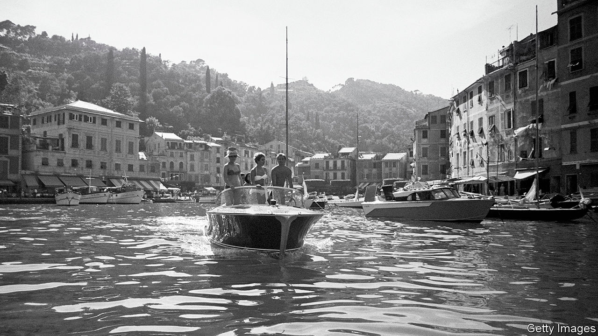

## The not-so-dolce vita

# Italy struggles to reopen for tourism

> Restaurants offer no-touch menus, but tourists remain elusive

> Jun 11th 2020PORTOFINO

GAETANO MUSSINI, the boss of a waterfront boat-hire business, surveys the few hundred people, many of them expensively dressed, ambling in the sun or lounging at tables outside Portofino’s bars and restaurants. “It feels as if we’ve gone back in time, to the 1960s,” he says.

Rarely since then can Portofino, an elegant resort on the Italian riviera, have been as sparsely peopled on a Saturday afternoon: when the very rich moved on to more exotic locations, the day-trippers moved in. Portofino may now be reliving its dolce vita years, but it is doing so with hand gel and surgical masks at the ready. “Stand here” signs are sprayed on the quayside at socially distanced intervals near where the ferries dock. And at the Caffè Excelsior patrons are handed a QR code so they can study the menu on their smartphones without having to handle a paper one.

Directly and indirectly, tourism contributes around 13% to Italy’s GDP. In Liguria, the region in which Portofino is located, it accounts for 14-15%, says Giovanni Berrino, the regional tourism councillor. During lockdown, he estimates, local hotels lost 95% of their normal turnover. But they still have the prime summer months ahead, and much will depend on how many holiday-makers can be lured to the region between now and mid-September. Mr Berrino believes tourists eager to maintain social distancing may be keener to holiday in the countryside than to crowd onto beaches. “We are lucky to have mountains and forests too,” he says.

The central government hopes to bribe Italians into taking “staycations” with a discount of up to €500 ($568) off their hotel bills. Aldo Werdin, the local head of the hoteliers’ association, says his members wanted a system like the one that lets tourists from outside the EU claim back the VAT on their purchases. It was to have been for everyone. But Italy’s left-populist government decided to limit it to Italian residents with household incomes of under €40,000 a year. Like many of its recovery measures, it seems unnecessarily complicated. If endorsed by parliament, 80% of the discount will come from the hoteliers, who will be able to deduct it from their tax bills. The tourists will get the remaining 20% as a personal tax credit. “It’s better than nothing,” sighs Mr Berrino. “But I can’t see it moving big numbers.” The key question, he says, is whether Italy can lure back foreign tourists who, in Liguria last year, contributed half of the sector’s turnover.

“See that stretch of quayside over there?” asks Mr Mussini in Portofino. “That’s for the private yachts.” It is empty. A few are expected later in June. But not one cruise ship has yet reserved a berth this summer. A few French tourists have appeared in Portofino since Italy opened its borders on June 3rd. But Germans will not be able to come to Italy easily by car until the Swiss and Austrians open their frontiers, on June 15th and 16th respectively. Any Britons now face 14 days’ quarantine on their return. It seems unlikely that many American or east Asian tourists can be tempted to Italy before next year.

That will deal a crushing blow to its many self-employed tourist guides who, on June 9th, demonstrated in several cities. They received two government payments of €600 each for March and April, but many were excluded from a third in May. They assume they will not work again before next March. They are seeking state support until then. But so are a lot of others. ■

Editor’s note: Some of our covid-19 coverage is free for readers of The Economist Today, our daily [newsletter](https://www.economist.com/https://my.economist.com/user#newsletter). For more stories and our pandemic tracker, see our [coronavirus hub](https://www.economist.com//news/2020/03/11/the-economists-coverage-of-the-coronavirus)