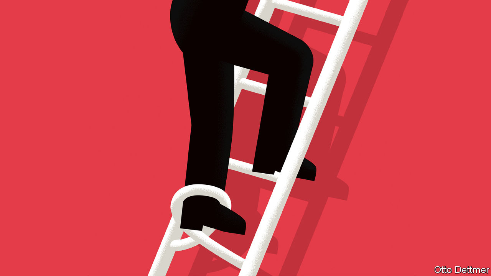

## Free exchange

# Economic research documents black Americans’ struggle for equality

> History shows that progress towards equality is followed by a racist backlash

> Jun 11th 2020

THE DEATH of George Floyd at the hands of the Minneapolis police has focused minds around the world on America’s glaring, stubborn racial inequalities. The income of the median black household is less than 60% of the white one. The median white American has a net worth about ten times that of the typical black American—a gap that has not budged since 1990. Injustice began with the original sin of slavery. But as a growing body of scholarship reveals, injustice has endured because racism and discrimination have, too. Over the course of America’s history, dearly won progress towards equality has been followed by a racist backlash.

The cycle of progress and regression began as soon as slavery ended. As the civil war drew to a close, many northern Republicans envisioned a reconstruction of the South, which raised black southerners to a position of equality with other Americans. In 1867 Congress ordered southern states to form new governments, and the occupying federal army protected newly freed (male) slaves’ right to vote, leading to a sharp increase in the number of black elected officials. Representation made a big difference to the lives of black Americans. Research by Trevon Logan of Ohio State University finds that each new black politician raised per-head tax revenue at the county level by 20 cents, for instance, money that then tended to be spent on education or land redistribution. Black officials delivered real benefits for constituents. In places with more of them, land tenancy was more common than exploitative sharecropping, and literacy rates among black people were higher.

Reconstruction proved less radical and enduring than its most ardent supporters had hoped, though. Resistance by white southerners, often violent, eroded the northern commitment to reform. Military intervention across the South ended by 1877, and restrictions on black rights quickly followed. Suresh Naidu of Columbia University finds that the introduction of poll taxes and literacy tests intended to lower black voting reduced turnout and shifted vote share towards the Democratic Party—then the party of white supremacy in the South. Suppression of black political power was followed by less redistribution and investment in black education. Using data from the censuses of 1870 and 1880, Mr Naidu estimates that the migration of black workers induced by disenfranchisement, and the resulting shifts in local economies, implies that the loss of the vote may have reduced income per black worker by 19%.

Southern whites limited the post-bellum economic prospects of black Americans in other ways as well. Lisa Cook of Michigan State University has studied the effects of outbreaks of racist violence, such as riots and lynchings, between 1870 and 1940. She concludes that the state’s tolerance of that violence led to a substantial decline in the relative economic performance of black Americans—including, importantly, inventive activity. Violent outbreaks reduced the number of patents filed by black inventors by 1% per year, resulting in 1,100 missing patents: a blow to both America’s productivity and the economic status of black workers.

Many black Americans left in search of opportunity. Over the 20th century a Great Migration unfolded, in which millions of black families left the South for northern cities. Movement began in earnest during the first world war, when northern manufacturers’ demand for labour soared and the flow of immigrants from Europe was interrupted. Employers began to recruit in the South. Some black workers followed family members up north. Analysing the period from 1910 to 1930, William Collins of Vanderbilt University and Marianne Wanamaker of the University of Tennessee estimate that real earnings of black men rose from 44% to 47% of those of white men as a consequence. By 1930, the share was five percentage points higher than it otherwise would have been.

The promise of migration was shattered by white residents’ hostility to new arrivals, however. The Great Migration prompted discriminatory policies and waves of racial violence in northern cities. It also induced white households to migrate. Allison Shertzer and Randall Walsh of the University of Pittsburgh estimate that each new black arrival in a northern neighbourhood was followed by the departure of 1.9 white residents in the 1910s and 3.4 white residents in the 1920s. About half of the rise in segregation in northern cities in the 1920s can be explained by this white flight, they suggest. The pattern continued after the second world war, finds Leah Boustan of Princeton University. Between the 1940s and the 1970s, she reckons, after controlling for other factors, 2.7 white residents left northern city centres for every new black arrival.

The response to black migration set the stage for many of today’s lingering inequalities. As white households left, cities’ tax bases shrank, and so did public investment. Waves of urban rioting in the 1960s—a response, in part, to discrimination, and to the neglect of increasingly black cities—further weakened the economies of city centres and led to big rises in spending on policing. In 1940 black children growing up in the north did much better than those in the South, says Ellora Derenoncourt of Princeton University. That advantage has disappeared today. And a quarter of the gap in intergenerational-income mobility between blacks and whites in northern cities can be explained by the white response to black migration, she reckons.

A large and growing literature links the still-yawning racial gaps in income, employment and wealth to the segregated communities, racial violence and unequal investment that have been a feature of American society for so long. The past, unfortunately, is not even past. Black communities still face obstacles when casting ballots, differential treatment from the police, and unequal access to high-quality public goods, like education. To make real progress towards racial equality in America, it is not just police behaviour that needs to change. The cycle of inequality and poor outcomes needs to be broken, and decades of damage remedied. ■