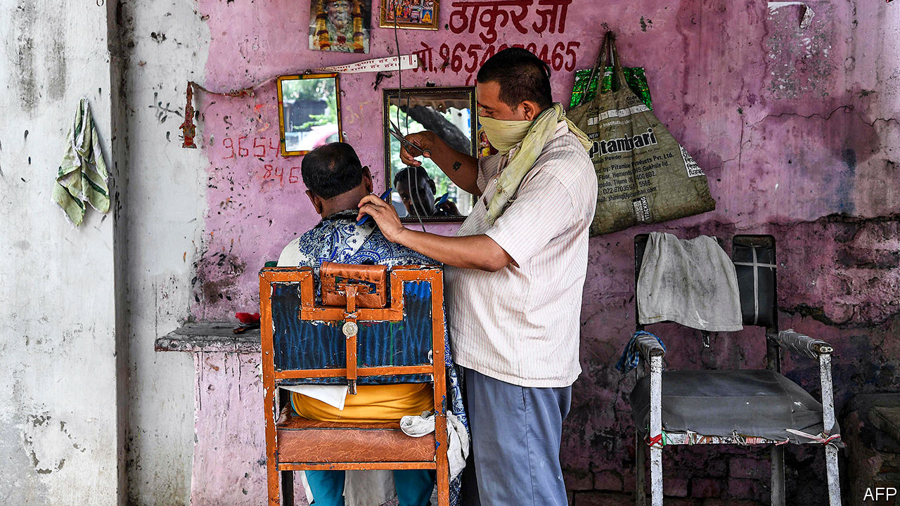
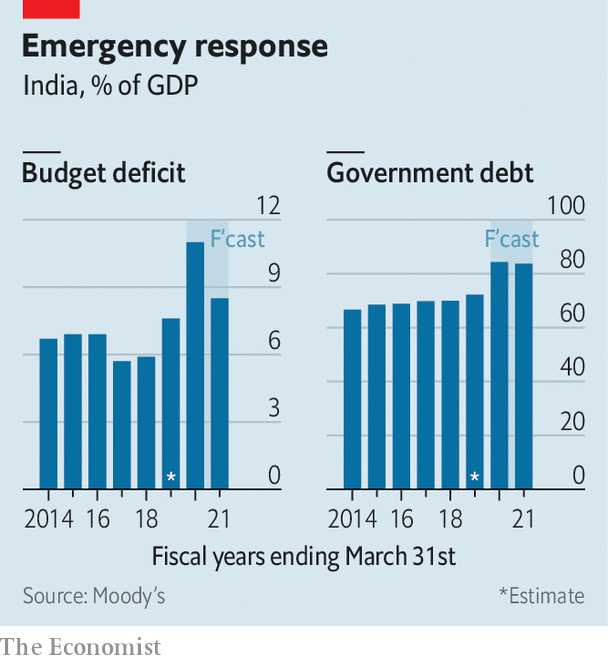

## Moody moment

# India avoids junk status

> Rating agencies seem more optimistic than Indian commentators

> Jun 11th 2020

LARGE AND leaky, India’s lockdown became “localised” this week. In the parts of the country hit hardest by covid-19, restrictions remain. Elsewhere, they have been largely relaxed. People can visit places of worship, but cannot touch idols. They can go outside to shopping malls, but not the gaming arcades or cinemas inside. In Punjab, mall-goers can buy clothes but cannot try them on first.

The lockdown, which began on March 25th, has failed to stop the virus—the caseload continues to grow alarmingly. But it has succeeded in halting the economy. The number of people in work fell to 282m in April, compared with an average of over 400m last year, reckons the Centre for Monitoring Indian Economy (CMIE), a research firm, which asks people if they were employed that day (unlike the official data, which ask if people were employed at any time that week). India’s carmakers did not make a single sale to retailers in April. A gauge of services activity based on a survey of purchasing managers fell to 5.4, the lowest ever recorded for either services or manufacturing anywhere, according to IHS Markit, which conducts the surveys in over 40 countries.

Employment, car sales and services improved in May: a step back from the “abyss”, as CMIE put it. But GDP will still shrink by 4% in the year ending March 2021, according to Moody’s, a rating agency. It was no surprise, then, that it cut India’s credit rating on June 1st for the first time since 1998. The government’s debt, Moody’s pointed out, is 30 percentage points higher than in a typical economy with the same rating. That vulnerability was once offset by unusually fast growth. But even before the pandemic, momentum was slipping. Growth fell from 8.3% in the year ending March 2017 to 4.2% in the last fiscal year. The crisis, Moody’s said, merely “amplified” vulnerabilities stemming from the government’s inability to clean up a troubled banking system, improve poor infrastructure or revise rules that constrict the markets for labour, land and products.

The cut brought Moody’s rating down to the lowest tier of investment grade, the same as Fitch and S&P. It also had knock-on effects. Because the sovereign rating puts a cap on the country’s corporate credit scores, Moody’s also swiftly lowered the rating on 37 Indian companies. These included many of the country’s most successful private firms, such as Reliance Industries, Tata Consultancy Services and HDFC Bank.

Any further downgrade into “junk” status would be humiliating for the government. It will therefore be relieved that its hastily assembled response to the economic crisis, a mix of financial relief, fiscal restraint and liberalising reform, seems at least to have convinced S&P to hold fire. Despite India’s economic turmoil, the agency reaffirmed its rating this week and said that it did not expect to change it soon.

S&P noted that the government had been “relatively conservative” in its spending measures this year, relying heavily on credit guarantees, not direct expenditures. It has also taken the “rare step” of combining relief efforts with longer-term reform, notes Andrew Wood, S&P’s lead analyst. Most notably, several states under the control of the Bharatiya Janata Party led by Narendra Modi, the prime minister, have eased labour laws, allowing firms with more than 100 workers to make lay-offs without the state’s permission. The reform has been advertised as temporary. But if it works, it may persist and spread to other states, argues Capital Economics, a consultancy. That could encourage investment and growth in the long term.

The rating agencies have not always been highly regarded in India. In 2017 Arvind Subramanian, then India’s chief economic adviser, accused them of “poor standards” that flattered China and underrated India. But, if anything, global rating firms are now more optimistic about India than some well-informed Indians. Moody’s forecast of -4% growth (and S&P’s of -5%) seem positively rosy compared with that of -12.5% (without further stimulus) from Pronab Sen, a former chief statistician. Mr Subramanian thinks true growth this year could be as low as -8%, although the official data may not reflect that.

To the agencies, and every other analyst of the country, India has always been a paradox. Its economy is large but its people are poor. Its institutions are strong enough to warrant an investment-grade rating, but its policymaking is not. Its public debt is high, its foreign debt modest. To these long-standing paradoxes, some observers add another. India, they say, is like a Monet painting. Up close, it’s a big old mess. But from afar it still has the power to beguile. ■

Editor’s note: Some of our covid-19 coverage is free for readers of The Economist Today, our daily [newsletter](https://www.economist.com/https://my.economist.com/user#newsletter). For more stories and our pandemic tracker, see our [coronavirus hub](https://www.economist.com//news/2020/03/11/the-economists-coverage-of-the-coronavirus)