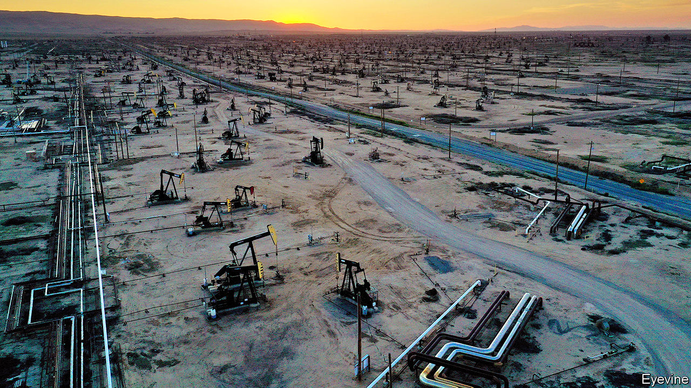
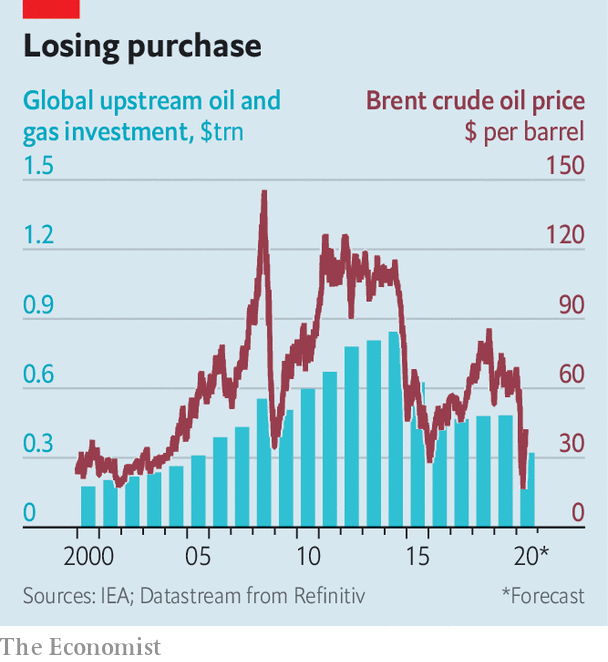
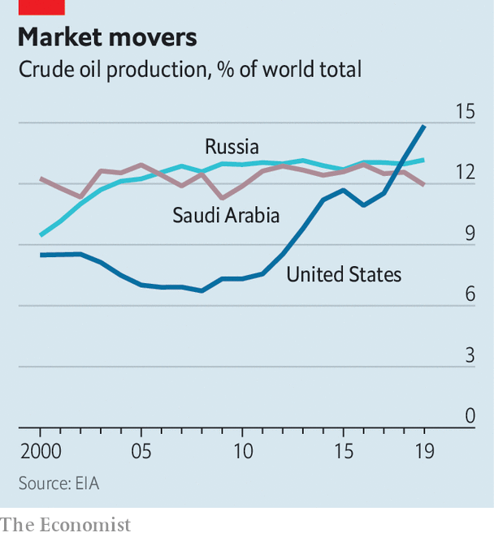

## After the fall

# Investment in oil supply has collapsed. It may not roar back

> Plunging investment, a battered cartel and a new fight over oil supply

> Jun 13th 2020NEW YORK

IN APRIL, WITH the world in lockdown from covid-19 and oil demand sinking faster than at any time in history, oil producers from Dhahran to the Delaware basin made the only possible choice: cut supply, fast. American output fell by about 2m barrels a day between March and May. The Organisation of the Petroleum Exporting Countries (OPEC) and its allies agreed to reduce supply by a record 9.7m barrels a day in May and June. The cuts helped propel the price of a barrel of Brent crude from less than $17 in mid-April to $42 on June 5th.

On June 6th, with demand still fragile, the OPEC alliance extended the cuts by a month. It is one thing to see supply drop when the oil market is engulfed by crisis. The more interesting question is how quickly supply will climb as normality returns. Production will respond, of course, as demand rises for jet fuel, petrol and diesel. If prices remain over $40, some shale firms and petrostates may boost output this summer. In the longer term, though, supply faces other constraints.

Global investment in future supply has collapsed. The International Energy Agency (IEA), an intergovernmental forecaster, estimates that upstream investment this year will fall to its lowest since 2005 (see chart). Goldman Sachs, a bank, expects production outside OPEC to stagnate in the 2020s, due not to geology or even demand, but lack of investment. Bernstein, a research firm, thinks that non-OPEC supply, which accounts for about 60% of global output, may peak in 2025, and then only at around last year’s level.

That would mark a dramatic shift. Because oil reserves are depleted continuously, producers have usually operated under the tenet of drill or die. An analyst once asked Lee Raymond, then the chief executive of Exxon, what kept him up at night. “Reserve replacement,” he responded.

The obsession with booking reserves, not surprisingly, supported the growth of supply. In the mid-2000s, as some fretted that the world might run out of oil, both listed and state-backed firms scoured the world for projects. Over the past decade, fracking has unleashed supply across America’s heartland, transforming the country into the world’s largest oil producer (see chart). Big projects in Norway and off the coast of Brazil, where oil lies beneath a thick layer of salt below the sea floor, helped boost supply, too.

Investment began falling, though, even before the pandemic. A crash in prices from 2014 to 2016 had sapped appetite for big, risky projects. Even after prices climbed in 2017 poor returns made investors less interested in reserve replacement than cash flow. Companies have squeezed suppliers and found ways to pump more oil from existing fields. ExxonMobil and Chevron are among the giants to invest in America’s shale basins, where output is relatively easy to ramp up and down.

Oil producers can now credibly say they are able to wring more value from their capital budgets. Still, the decline in investment was steep enough to stir debate over future supply. Upstream spending on oil and gas last year was 43% below that in 2014, according to the IEA. Bernstein examined the 50 biggest listed energy companies outside OPEC and the former Soviet Union. In 2019 they reinvested an average of 64% of their operating cash flow. The long-term average was 87%.

The pandemic has exacerbated matters. Producers have shut in wells, delayed projects and slashed investment further. Rystad Energy, a data firm, estimates that of the 3m barrels a day that were shut in last month, mainly in America and Canada, 10-15% will never restart. The IEA predicts that investment in supply will be 33% lower this year than in 2019 and 62% lower than the high in 2014. There is less fat to trim than there was five years ago, the IEA reckons. That means declining investment may have a greater impact on supply.

Some companies, such as ExxonMobil, remain focused on growth. But it is not clear when a broader surge in capital spending will come. Returns for many firms have fallen below the cost of capital, points out Neil Beveridge of Bernstein. Investors are unlikely to favour a return to rapid expansion; the energy sector’s performance has been poor, the rebound in demand is uncertain and greener regulation may be in the offing. In a sign of the times, JPMorgan Chase, America’s biggest bank, demoted Mr Raymond from his role as its board’s lead independent director in May, under pressure from climate activists. Michele Della Vigna of Goldman Sachs argues that the historic cycle of high prices, investment and supply may be breaking.

As for American shale, analysts are feverishly watching rig counts, pipeline data and shut-ins for signs of a surge in supply. Shin Kim of S&P Global Platts, a data firm, expects it to tick up briefly this summer, as prices recover. But there is consensus that growth in the 2020s will be muted compared with the boom. Shale output is vast and wells’ production declines are steep. Improvements to productivity have slowed. Investors can find better returns elsewhere.

This bodes well for OPEC and its allies, which have been battered in the past decade. In 2014-16 it waged a failed price war to wipe out American frackers. Since then the cartel and its partners, led by Russia, have propped up oil prices enough to sustain shale, but not enough to support many members’ domestic budgets. In March Saudi Arabia urged Russia to slash output; Russia refused, loth to let Americans free-ride on OPEC-supported prices. The ensuing price war was spectacularly ill-timed, as it coincided with the biggest drop in oil demand on record.

The desire to chasten American frackers remains, though. OPEC controls about 70% of the world’s oil reserves, more than its 40% market share would suggest, points out Martijn Rats of Morgan Stanley, a bank. If the world’s appetite for oil shrinks due to changing habits, cleaner technology or greener regulations, countries with vast reserves risk having to leave oil below ground. “OPEC will defend its market share more firmly in the future,” predicts Mr Rats. Even better, then, if state-owned firms can depend on their rivals’ paltry investment to limit supply for them. ■

Sign up to our fortnightly climate-change newsletter [here](https://www.economist.com//theclimateissue/)

## URL

https://www.economist.com/finance-and-economics/2020/06/13/investment-in-oil-supply-has-collapsed-it-may-not-roar-back
