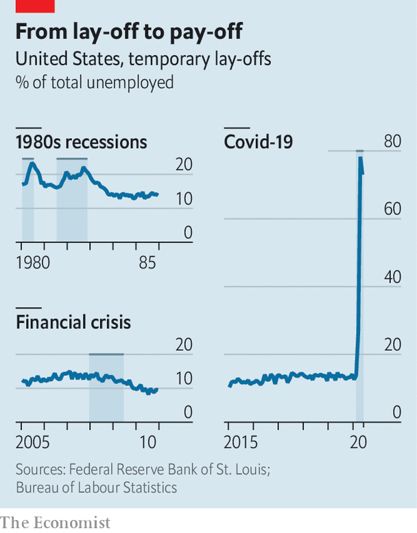

## Acute or chronic?

# What the early 1980s implies for unemployment today

> A past recession may prove a useful guide to the recovery

> Jun 11th 2020

ALTHOUGH AMERICA’S unemployment rate shocked almost everyone by falling in May, 20m workers remain out of a job because of the coronavirus pandemic. The official unemployment rate is 13.3%, though that rises to about 16% if you count people who say they are employed but absent from work. Many commentators worry that a large chunk of the unemployed will have no job to go back to, even as lockdowns ease and stimulus payments land in bank accounts. In a podcast hosted by Joe Biden, the presumptive Democratic nominee for president, Andrew Yang, a former rival, said that “I’m privy to the thinking of many major company CEOs, and they are telling people confidentially that they are not going to hire back a lot of the people that they’ve furloughed or let go.” Will Mr Yang be proved right?

The question matters because it affects the strength of the recovery. You can return to an old job right away, but finding a new one usually takes time. People resuming their old jobs are also likely to be more productive, because they know the ropes, which allows them to earn higher wages, at least at first. Research suggests that those eventually recalled by their employer see no loss in pay—but those who are permanently sacked see a loss of monthly earnings of up to 12% in their next job. Unemployment fell much more quickly after the recession that ended in 1982 than after the financial crisis in 2007-09, in part because a higher share of people who lost their jobs were laid off only temporarily (see chart).

The experience of the early 1980s could be a useful guide to the recovery from the pandemic. That recession too was the result of a policy that sacrificed short-term economic growth in order to defeat an enemy. (Rather than lockdowns imposed to crush a virus, though, interest rates had been raised to crush inflation.) If bosses think that government policies that restrain activity are temporary, reckon analysts at Goldman Sachs, a bank, they may decide to minimise permanent lay-offs, which are disruptive for their businesses. In May roughly three-quarters of laid-off workers reckoned they would eventually be recalled. Evidence from notices issued by large firms in advance of large lay-offs paints a similar picture.

As Mr Yang suggested on the podcast, workers may be mistaken in their belief that their plight is temporary. Yet the evidence suggests some are already being called back. The rise in employment in May of 2.5m—the largest month-on-month increase ever, by far—is unlikely to have been the result of lots of workers finding new positions. Job search takes time, after all. It is also hard to square the huge rise in employment with the much smaller pick-up in job postings on recruitment websites, suggesting that many bosses simply recalled ex-workers instead of advertising afresh. The number of temporarily unemployed people also fell by 2.7m in May—though some may have become permanently jobless, or may have moved out of the labour force altogether.

Recovery is still a long way off. The unemployment rate is well above the peak reached after the financial crisis. Employment for some groups, such as ethnic minorities, has risen by less than for others. And it seems a fair bet that the pandemic will destroy many jobs. As some lockdowns ended, employment in food services and drinking establishments accounted for more than half the overall rise in May. But a post-pandemic economy will probably involve less demand for services that require close person-to-person contact than in pre-virus days. Moreover, many economists expect bankruptcies to rise as companies, facing low revenues, exhaust their cash piles. Still, after weeks of dreadful economic news, the jobs market may at least have turned a corner. ■

## URL

https://www.economist.com/finance-and-economics/2020/06/11/what-the-early-1980s-implies-for-unemployment-today
