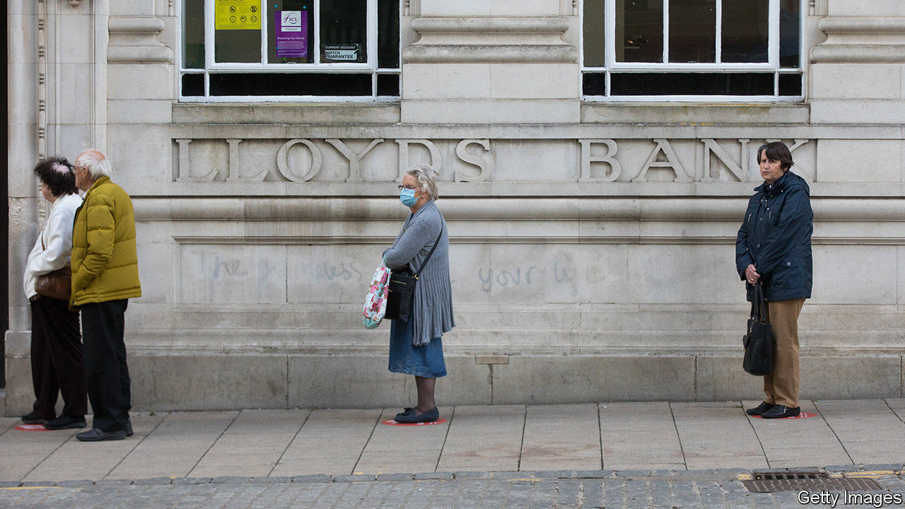

## Pandemic pendulum

# Why are bank bosses sounding more optimistic about loan losses?

> They were hyper-prudent in April. Now the worst-case scenario might be off the cards

> Jun 11th 2020

GAUGING HOW badly the coronavirus has damaged the economy is tricky. Pessimists diagnose a far worse recession than that which followed the financial crisis. Optimists predict a sharp recovery, pointing to robust banks and housing markets.

One way to form a view is to look at banks’ loan-loss provisions—the buffers they set aside to cover losses from loans they reckon might soon default. By that standard it seems as if the patient is recovering much faster than first thought possible. On June 9th James Gorman, who runs Morgan Stanley, America’s sixth-largest bank, hinted that its loan-loss charges for the second quarter would be lower than in the first, because “the worst is behind us”. Gordon Smith, co-president of JPMorgan Chase, the largest bank, said that delinquency rates were “meaningfully better” than expected. Even some of Europe’s bankers seem less gloomy.

That is a stark change from just a few weeks ago. In mid-April, as they reported their first-quarter results, America’s top four lenders unveiled $24.1bn in provisions for credit losses, a jump of $18.7bn compared with the first quarter of 2019. JPMorgan increased its provision by nearly $6.9bn, hitting in one quarter the level it had reached in six during the financial crisis. Europe’s lenders also booked bad news.

Why the mood swing? To predict losses, most banks enter economic forecasts into models. The prospects for 2020 are hardly rosy, but it seems at least that economies are no longer in free fall. Employment rose in America in May. Factories in Asia have reopened. The lifting of lockdowns in the West has not yet caused a second wave of infections. Uncertainty forced banks to be hyper-prudent in April. Now the worst-case scenario seems off the cards.

Relief may be premature, though. Central-bank and government action has bought borrowers time. Cheap state-backed loans are keeping firms and households afloat. No one knows how many borrowers will find themselves overburdened with debt when normal payment terms resume later in the year. That is especially true of consumer borrowers, up to a fifth of whom have asked for payment holidays.

If unemployment persists and companies go bust, as many economists expect, many more loans will sour. Roberto Frazzitta of Bain, a consultancy, predicts that 2021 will see a surge of non-performing loans as big as that in the financial crisis, if not bigger. This will be compounded by accounting: as customers’ balance-sheets worsen, the probability of default will rise, and regulators will demand that this be reflected in loss provisions, even if loans are still performing. Some losses will eventually be absorbed by government guarantees. But the European Banking Association still expects losses to eat up to 3.8 percentage points of European banks’ core tier-one capital ratio (the average buffer for banks in the region is 14.8%).

Higher provisions could have three consequences, on both sides of the Atlantic. It may lead investors to question banks’ ability to pay dividends (Europe’s have suspended them, but America’s still dole them out). It may prompt banks to refine their standard loss-prediction models by using more alternative data, says Ian Shipley of Oliver Wyman, a consultancy. And it may lead to calls for weaker lenders to consolidate, in order to improve their resilience. That would be a hard pill to swallow, but could prove a handy cure. ■