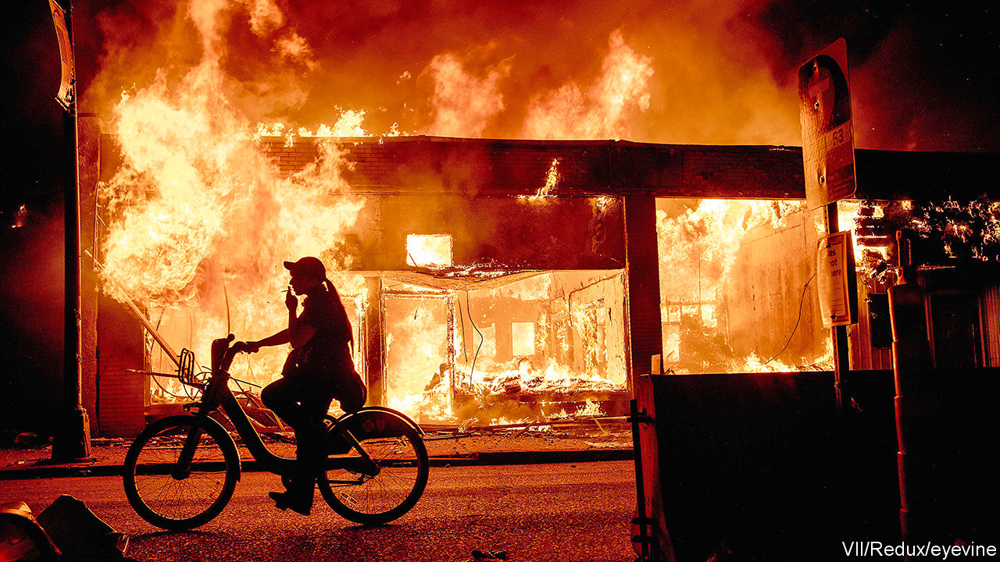

## We love to see you burn

# Autocrats gleefully decry America’s racial turmoil

> Similar protests in China, Russia or Iran would be ruthlessly crushed

> Jun 11th 2020HONG KONG

ANTI-AMERICAN AUTOCRATS are enjoying the spectacle. All around the world, America is being derided for its brutal police and ill-treatment of minorities. For regimes with much worse records, what could be sweeter?

For China the timing was delicious. On May 28th its parliament rubber-stamped a proposal to impose a draconian security law on Hong Kong. America denounced this infringement of Hong Kongers’ freedoms. Mike Pompeo, the secretary of state, met Chinese democrats. The editor of Global Times, a party-controlled tabloid, sneered that Mr Pompeo should “stand with the angry people of Minneapolis, just like you did with people of Hong Kong”. China’s top spokeswoman tweeted: “I can’t breathe.”

Chinese state media loudly lament America’s bias against blacks. They say little about Chinese bias against them, let alone the internment of perhaps 1m Muslims in Xinjiang for such crimes as praying and having big beards. Torched shops and club-wielding cops in America fill Chinese screens. Anyone in mainland China who dared to mark the anniversary on June 4th of the slaughter of pro-democracy protesters near Tiananmen Square risked arrest.

Russian state mouthpieces have adopted a similar tone. “The key values of the Free World are shattering under the blows of police batons and burning in the flames of looted shops,” went a voice-over on Russia’s main TV channel. To pump up the tension it showed the closing scene of a film, “Brother-2”, in which a Russian hero, flying back from America, listens to a rock song, “Goodbye America”. To the movie it added real news footage of American cars on fire and a police van ramming a crowd.

Russia’s propaganda, like China’s, tries to persuade viewers that America is irredeemably racist and that mass protests mean anarchy. Dmitry Kiselev, Russia’s propagandist-in-chief, drew parallels with Ukrainian protesters who rose against a Kremlin-backed government in 2014. “Here is a woman urinating on top of an overturned police vehicle,” he intoned against a backdrop of American street chaos. “When the state abandons its law enforcers, it is a bad symptom.”

Iran’s leaders have piled in, too. “A cop kneeling on a black man’s neck and letting him choke to death...is the nature of the American government. They have done the same to such countries as Iraq, Afghanistan and Syria,” said Ayatollah Ali Khamenei, the country’s supreme leader.

Yet autocrats’ propaganda is not always persuasive. Russians know Mr Putin wants to distract attention from his lawless security services and unfathomably rich cronies. And democracies adapt better to popular complaints. America is prosecuting the cop who killed Mr Floyd and rethinking police tactics. Hong Kongers know that none of the police who beat up pro-democracy demonstrators last year will be punished. An official report into the protests was a whitewash.