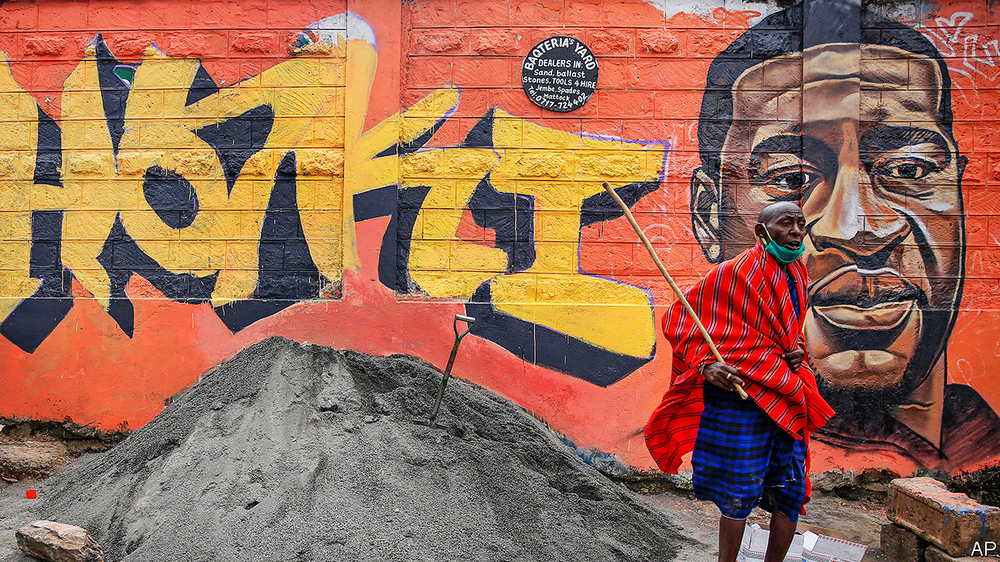
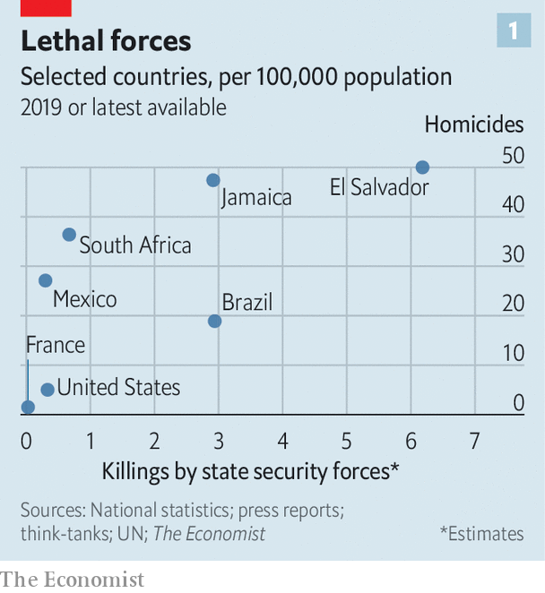
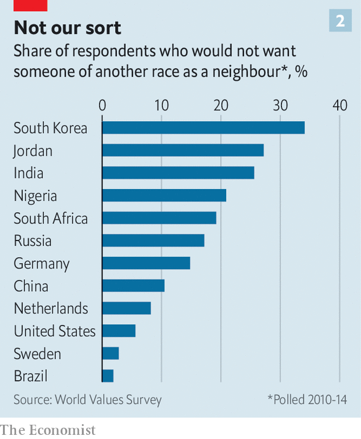

## So other people would be also free

# The killing of George Floyd has sparked global soul-searching

> Protests have broken out in dozens of countries

> Jun 11th 2020AMSTERDAM, JOHANNESBURG, MELKSHAM, MEXICO CITY, PARIS AND SÃO PAULO

LOCAL POLICE arrested Giovanni López, a 30-year-old Mexican bricklayer, in Ixtlahuacán de los Membrillos, a town near Guadalajara, on May 4th. Why they detained him is unclear. The next morning his family found him dead in a nearby hospital, with bruises on his head and a bullet in his ankle. His name did not go viral; no politician lamented his death.

Christian López, who filmed his brother’s arrest, stayed silent at first. He would later claim that messengers acting on behalf of the local mayor threatened to kill his family if the footage went public. But then came the killing of George Floyd in Minneapolis, and the anti-police, anti-racism backlash that has swept the world. “I saw it and thought, this is the same thing that happened to my brother,” he says. On June 1st he went to the press.

The chief prosecutor in the state of Jalisco, where the death occurred, faced a barrage of questions. On June 4th a march in Guadalajara, marking a month since Giovanni’s death, turned violent. Calls demanding #Justiciaparagiovanni increased. The three officers connected with Giovanni’s death were arrested. The mayor’s role is under investigation. Protests have since spread to Tijuana and the state of Veracruz against two local pre-Floyd police killings, of Oliver López (no relation) in March and Carlos Andrés Navarro in May.

Mr Floyd’s death has provoked protests around the world. Why his death set off a global movement whereas countless other unjust killings did not is hard to say. Mr Floyd was American, of course, and the world pays more attention to the United States than to Mexico or any other country. His death was filmed in excruciating detail. It happened at a time when billions of people were cooped up and frustrated at home, thanks to covid-19. Lockdowns have surely made the global mood more combustible.

But the important points are that police brutality is rife in many countries and minorities fear discrimination everywhere. That is why Mr Floyd’s fate resonated. Just as women on every continent found common cause in the #MeToo movement, despite the range of their experiences, so protesters around the world have united around the cry that black lives matter.

At their simplest the protests mark people’s antipathy towards cops who beat or kill those whom they vowed to protect. Protests have spread throughout Mexico, where nine in ten homicides go unpunished and many police moonlight for the other side. The country’s most notorious unsolved crime, the disappearance and presumed murder in 2014 of 43 student teachers in the town of Ayotzinapa, is thought to have been orchestrated by police paid by drug gangs.

Some of the global anger is directed at the United States. Protests have erupted outside American embassies from Spain to South Africa. Nana Akufo-Addo, Ghana’s president, tweeted that: “Black people, the world over, are shocked and distraught.” President Cyril Ramaphosa of South Africa said: “The killing of George Floyd has opened up deep wounds for us all.”

Many protesters would agree. But many also seethe that their leaders condemn police abuse in Minnesota while allowing or even encouraging it at home. America’s police kill more people than those of any other rich democracy, but cops in some developing countries are much more lethal (see chart 1). So plenty of the protests around the world are about local abuses as well.

On June 8th in Mathare, a poor part of Nairobi, about 200 Kenyans marched against police atrocities. Since a covid-19 curfew was introduced in Kenya’s capital on March 27th police have killed 15 people, according to the country’s Independent Police Oversight Authority. “[T]he poor people of this country have come together to say no to police killings...and also stand in solidarity with the global protest against police excesses,” Juliet Wanjera, a member of the Mathare Social Justice Centre, an NGO, has told journalists.

Since 2012 there have been more than 40,000 complaints against the South African Police Service for alleged crimes including rape and murder, with just 531 convictions. Security forces have killed at least 11 people during South Africa’s lockdown, in place since March 27th, and more than 200,000 have been arrested. Mr Ramaphosa has said merely that authorities have been guilty of “over-enthusiasm”.

That will not wash with many South Africans. The killing on April 10th of Collins Khosa, a 40-year-old man from Alexandra, a township in Johannesburg, by soldiers, has prompted particular outrage. According to his family, Mr Khosa was targeted for drinking a beer even though he was on his own property. (Buying alcohol was illegal in April and May, as per lockdown regulations, but drinking it was not.)

Some analysts worry that police abuse in America may make it easier for others to follow suit. “It will certainly be very easy for leaders in Africa, those with their own dictatorial tendencies, to justify future behaviour by referencing the actions of the US administration in the last few weeks,” argues Idayat Hassan of the Centre for Democracy and Development, a think-tank in Abuja, Nigeria. Police brutality in developing countries rarely prompts a global reaction. The killing by Zimbabwean security forces of 17 protesters in January 2019 did not lead to mass protests elsewhere.

In the state of Rio de Janeiro (population 6.3m), police killed 1,810 people last year, nearly twice as many as in the United States (population 328m). Police say most of the dead are gunmen from favelas, informal settlements that are often controlled by criminals. But watchdogs point to a rise in extrajudicial killings, including massacres of more than ten people, fuelled by warlike police operations, sometimes with snipers in helicopters. Images of smiling children killed by police all too often appear on people’s televisions. They include eight-year-old Agatha, shot by a stray bullet last September while riding in a van with her mother, and 14-year-old João Pedro, killed in a botched police raid last month.

Brazilians in more than ten cities took to the streets on June 7th to mourn their deaths and to protest against the government of Jair Bolsonaro, a populist who campaigned on promises to give immunity to police who kill. He said last year that a bill to this effect would cause criminals to “die in the streets like cockroaches”. Congress rejected the measure, but Brazil’s trigger-happy police are rarely prosecuted. Still, on June 5th a Supreme Court judge banned most police operations in favelas for the remainder of the pandemic.

Of the 6,220 people killed by Brazil’s police in 2018, three out of four were black. In Indonesia, #BlackLivesMatter has found new relevance as #PapuanLivesMatter. Indonesia runs half of the island of New Guinea, and controls it almost as if it were an occupying power. Papuans—whose skin is darker than that of other Indonesians—face bleak economic prospects and violence at the hands of security forces.

In 2019 a Papuan student dormitory in Surabaya in eastern Java was besieged by a mob claiming its inhabitants had thrown the national flag into a gutter. Some taunted them as “monkeys”. Rather than dispersing the mob, riot police stormed the dorm with tear-gas and arrested 43 Papuans. That and similar actions in other cities were the catalyst last summer for huge demonstrations by young Indonesians in support of Papuans. In recent days calls have grown for Indonesians to denounce the discrimination that Papuans suffer.

Even where police brutality is rarer, attention has turned to domestic racism. In Melksham, a small town in England, 120 people gathered on June 7th to protest against it. Some 97% of the town’s inhabitants are white. It has not seen a major protest since woollen-mill workers rioted in 1802. “White privilege doesn’t mean your life hasn’t been hard,” Botan Williams, the event’s 15-year-old organiser, told the crowd, “it just means your skin colour isn’t one of the things making it harder.”

Throughout Britain demonstrators have echoed their American counterparts, chanting “hands up, don’t shoot” at (unarmed) police. Placards named black victims of British police violence: Mark Duggan, Rashan Charles and Edson Da Costa. Black people are just 3% of the population in England and Wales but 12% of prisoners. Black men are stopped and searched at nine times the rate of white men.

Similarly in Australia Aboriginals and Torres Strait islanders are just over 3% of the overall population but 29% of those in prison. An indigenous female Australian is more likely to be behind bars than a non-indigenous male. Scott Morrison, the conservative prime minister, says: “There is no need to import things happening in other countries here to Australia” because “Australia is a fair country...[it] is not the United States.” Protesters were unconvinced. Indigenous Australians are poorer and less healthy—and have less access to housing, land, education and social workers—than other Australians.

The first demonstration in France since Mr Floyd’s death brought 20,000 people carrying “Black Lives Matter” banners to the main Paris courthouse on June 2nd. It centred on a French controversy: the death in 2016 of Adama Traoré, a 24-year-old who was pinned to the ground by police officers during his arrest. A medical report released on the morning of the demonstration suggested that he was asphyxiated. The Floyd protests carry particular resonance in the banlieues, high-rise estates where friction between the police and residents, many of them of immigrant origin, frames daily life. This distrust can erupt into confrontation, violence and, occasionally, death. There were 19 deaths in France during police operations last year.

France is the first European country where the protests have changed policy. Earlier this year, after a motorbike courier died of asphyxiation during his arrest in Paris, President Emmanuel Macron asked Christophe Castaner, his interior minister, to come up with ways to “improve police ethics”. On June 8th those proposals were hastily put together. Mr Castaner acknowledged racism within the police force, and said that choke holds would be banned. France would take a “zero tolerance” approach to racism, he declared.

Before the protests, New Zealand was mulling whether to equip more of its usually unarmed police with guns. Evaluation of a six-month trial was to have been completed by the end of June. But on June 9th the head of police said he had received over 4,000 letters in a week, and that the plan would be permanently scrapped.

Some Europeans have deplored American racism while failing to see the parallels in their own countries. Europe’s biggest Black Lives Matter rallies were in Germany. Signs in English were far more prominent than German ones. In Spain, too, demonstrators mostly condemned American racism, with only cursory mentions of Europe’s treatment of African migrants. There were few mentions of Europe’s widespread religious discrimination against Muslims.

Europeans are sometimes complacent about racism. Granted, European police shoot far fewer people than American police do. But this is largely because they are less likely to be shot at. Last year 48 police were killed—most of them shot—in the line of duty in America; in Britain one was.

Measuring prejudice is hard. Racist attitudes have been socially unacceptable nearly everywhere for decades, so many who harbour them will not admit it to pollsters. But some do. And according to a recent international World Values Survey, more Germans and Dutch say they would not want “people of another race” as neighbours than Americans (see chart 2).

Ethnic profiling by police is illegal in most countries, but common. Members of minorities (especially young men) are routinely frisked and asked for identification when out in public. In private, many police admit to taking account of race when deciding whom to stop, noting that some groups, for a variety of reasons, commit more crimes than others. Such profiling makes life much harder for those who happen to belong to those groups, the vast majority of whom are law-abiding.

Many people do not care. Brazilians knew what to expect when they elected Mr Bolsonaro. Two-thirds of Germans think racial profiling is an acceptable tool of policing, according to a poll in 2017 by YouGov. “The worst thing about it,” says Sony Kapoor, an Indian-born Briton who lives in Norway, “is the smugness of Europeans who think they don’t harbour the same sort of racism as Americans.” ■