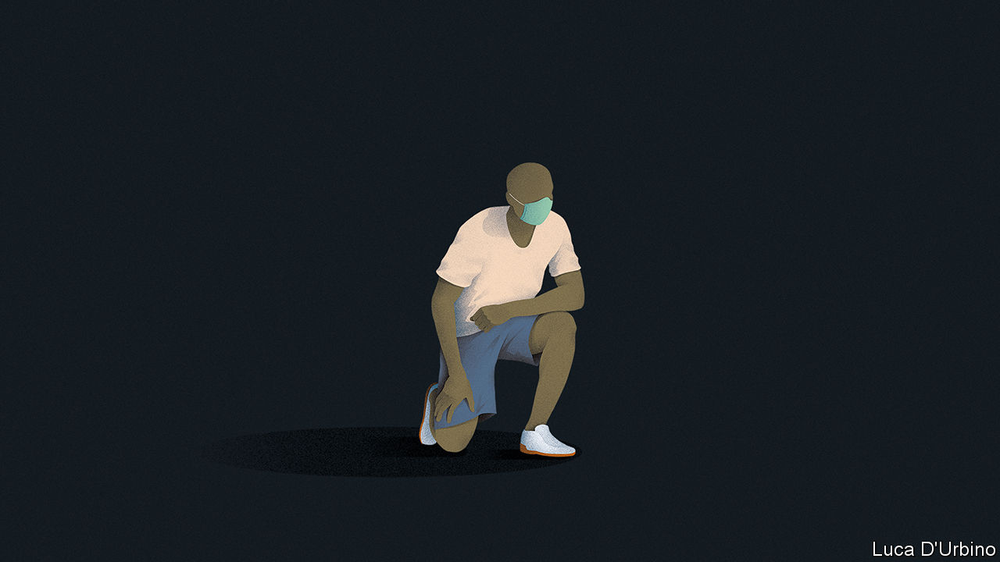

## Race and social change

# The power of protest and the legacy of George Floyd

> Don’t waste a rich chance for social reform

> Jun 11th 2020

GEORGE FLOYD was not famous. He was killed not in the capital of the United States, but on a street corner in its 46th-largest city. Yet in death he has suddenly become the keystone of a movement that has seized all of America. Still more remarkably, he has inspired protests abroad, from Brazil to Indonesia, and France to Australia. His legacy is the rich promise of social reform. It is too precious to waste.

The focus is rightly on America (see [article](https://www.economist.com//united-states/2020/06/11/americas-protests-turn-jubilant)). The protests there, in big cities and tiny towns far from the coasts, may be the most widespread in the country’s long history of marching. After an outburst of rage following Mr Floyd’s death, the demonstrations have, as we hoped last week, been overwhelmingly peaceful. They have drawn in ordinary Americans of all races. That has confounded those who, like President Donald Trump, thought they could be exploited to forge an electoral strategy based on the threat of anarchy. What began as a protest against police violence against African-Americans has led to an examination of racism in all its forms.

The marches outside America are harder to define (see [article](https://www.economist.com//international/2020/06/11/the-killing-of-george-floyd-has-sparked-global-soul-searching)). In Mexico and South Africa the target is mainly police violence. In Brazil, where three-quarters of the 6,220 people killed by police in 2018 were black, race is a factor too. Australians are talking about the treatment of aboriginals. Some Europeans, used to condemning America over race, are realising that they have a problem closer to home. Angela Merkel has asked Germans to take the chance to “sweep outside their own front doors”. Several countries are agonising over public monuments (see [leader](https://www.economist.com//leaders/2020/06/11/how-to-handle-racists-statues)).

It is hard to know why the spark caught today and not before. Nobody marched in Paris in 2014 after Eric Garner was filmed being choked to death by officers on Staten Island—then again, hardly anyone marched in New York, either. Perhaps the sheer ubiquity of social media means that enough people have this time been confronted with the evidence of their own eyes. The pandemic has surely played a part, by cooping people up and creating a shared experience, even as it has nonetheless singled out racial minorities for infection and hardship (see [Lexington](https://www.economist.com//united-states/2020/06/11/how-pennsylvanias-governor-is-battling-the-pandemic)).

The scale of the protests has something to do with Mr Trump, too. When Mr Garner was killed, America had a president who could bring together the nation at moments of racial tension, and a Justice Department that baby-sat recalcitrant police departments. Today they have a man who sets out to sow division.

But most fundamentally, and most happily, the protest reflects a rising rejection of racism itself. The share of Americans who see racial discrimination in their country as a big problem has risen from 51% in January 2015 to 76% now. A YouGov poll last week found that 52% of Britons think British society is fairly or very racist, a big rise from similar polls in the past. In 2018, 77% of the French thought France needed to fight racism, up from 59% in 2002. Pew Research found last year that in most countries healthy majorities welcome racial diversity.

America is both a country and an idea. When the two do not match, non-Americans notice more than when an injustice is perpetrated in, say, Mexico or Russia. And wrapped up in that idea of America is a conviction that progress is possible.

It is already happening, in three ways. It starts with policing, where some states and cities have already banned chokeholds and where Democratic politicians seem ready to take on the police unions. On June 8th Democrats in the House of Representatives put forward a bill that would, among other things, make it easier to prosecute police and limit the transfer of armour and weapons from the Pentagon to police departments. Congressional Republicans, who might have been expected to back the police, are working on a reform of their own. Although the general call for “defunding” risks a backlash, the details of redirecting part of the police budget to arms of local government, such as housing or mental health, may make sense.

There is also a recognition that broader change is needed from local and federal government. The median household net wealth of African-Americans is $18,000, a tenth of the wealth of white Americans. The ratio has not changed since 1990 (see [Free exchange](https://www.economist.com//finance-and-economics/2020/06/11/economic-research-documents-black-americans-struggle-for-equality)). An important cause of this is that many African-Americans are stuck in the racially monolithic neighbourhoods where their grandparents were allowed to settle at a safe distance from whites. Houses in these places are very cheap.

This separation helps explain why inequality endures in schooling, policing and health. The government has a role in reducing it. Federal spending worth $22.6bn already goes on housing vouchers. Schemes to give poor Americans a choice over where they live have Republican and Democratic backing in Congress. With better schools and less crime, segregated districts become gentrified, leaving them more racially mixed.

Business is waking up to the fact that it has a part, too, and not just in America (see [article](https://www.economist.com//business/2020/06/11/bosses-say-they-want-to-tackle-racial-injustice)). The place where people mix most is at work. However, just four Fortune 500 firms have black chief executives and only 3% of senior American managers are black. No wonder anxious CEOs have been queuing up to pledge that they will do better.

Firms have an incentive to change. Research suggests that racial diversity is linked to higher profit margins and that the effect is growing—though it is hard to be certain which comes first, diversity or performance. It has also become clear that a vocal share of employees and customers will shun companies that do not deal with racism. Platitudinous mission statements are unlikely to provide much protection. A first step is to monitor diversity at all levels of recruitment and promotion, as do Goldman Sachs and Intel—hardly known for being sentimental.

Large-scale social change is hard. Protest movements have a habit of antagonising the moderate supporters they need to succeed. Countries where the impulse for change is not harnessed to specific reforms will find that it dissipates. Yet anyone who thinks racism is too difficult to tackle might recall that just six years before George Floyd was born, interracial marriage was still illegal in 16 American states. Today about 90% of Americans support it. When enough citizens march against an injustice, they can prevail. That is the power of protest. ■