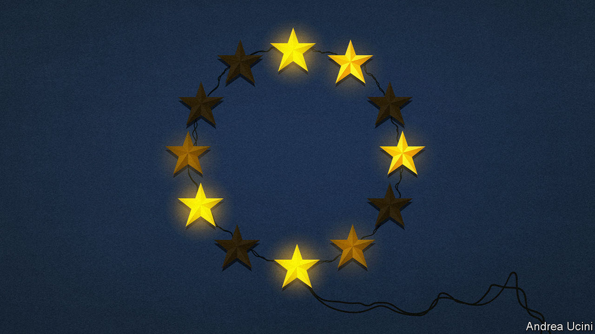
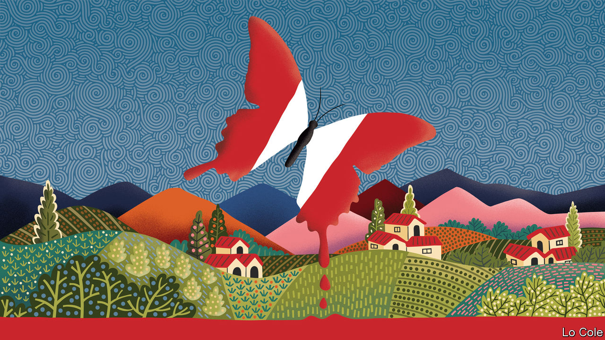
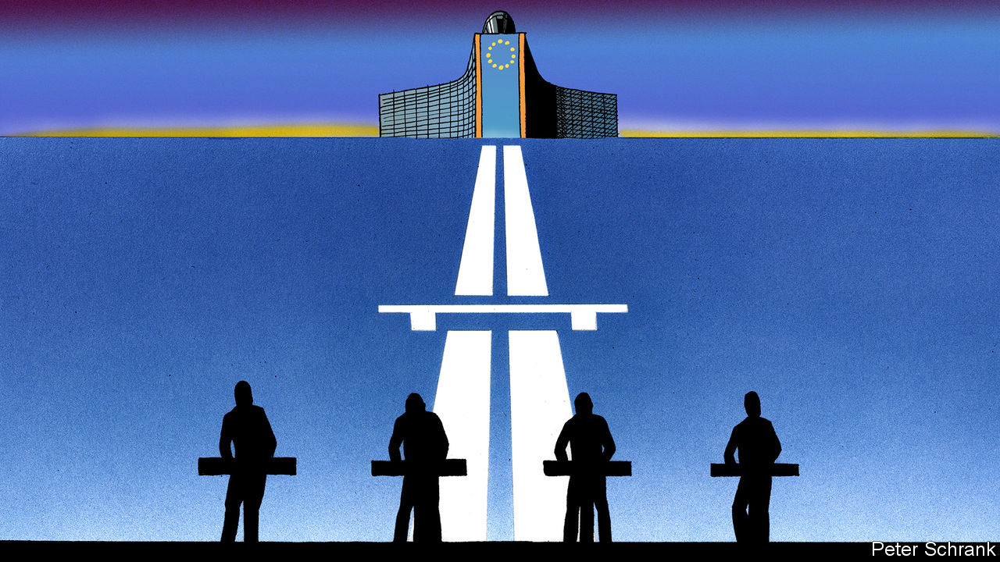

## The European Union, the Thames, Peru, the classics, Kraftwerk

# Letters to the editor

> A selection of correspondence

> Jun 11th 2020

There is nothing new about differences in national views about the purpose of the European Union, but the pandemic has indeed highlighted these (“[On the blink](https://www.economist.com//leaders/2020/05/14/the-european-union-is-having-a-bad-crisis)”, May 16th). At the same time, this crisis has underlined just how interconnected Europe is in many ways and this is vital to our ability to recover from the huge hit that our economy is taking.

There may well be ambiguity about what Europe stands for at the political level, but among businesses there is broad consensus. European business chambers and their 20m firms want a Europe that is based on a fully functioning single market. This is crucial to Europe’s prosperity, solidarity and influence in the world. Restrictions introduced at internal EU borders in response to covid-19 impede the movement of goods, services and workers and undermine supply and value chains. These measures were considered necessary in flattening the epidemic’s curve, but they must continue to be rolled back if we are also to flatten the curve of the economic crisis.

Now is not the time to overthink the EU or reflect on possible reforms. We must focus on the basics of tackling the virus and helping our business community survive and rebuild. Feedback from our members suggests that 3m businesses across the EU are in jeopardy and with that around 10m jobs.

The Recovery Fund, part of a front-loaded new EU budget, is a positive development. But our businesses require more and immediate help in overcoming acute financial liquidity challenges and need a fully restored single market without delay.

CHRISTOPH LEITLPresidentEurochambresBrussels

I doubt that bigger transfers from northern European countries to southern ones and debt mutualisation will “avert catastrophe” as you claim. On the contrary, these transfers will continue to discourage Italy, France and other southerners from carrying out overdue reforms, leading to catastrophe in the not-too-distant future instead of averting it. Italy and others should be made to abandon the euro, thereby saving the EU.

You quoted Konrad Adenauer’s saying that “German problems can only be solved under a European roof”. But Ludwig Erhard, Germany’s minister of the economy and architect of the Wirtschaftswunder, said in 1957 that it is impossible to move Sicily to the Ruhr without causing economic difficulties. For too many years we have been confronted with the problems Erhard predicted in widely different economies bound together by monetary union.

GERALD SCHERIAUVienna

“[A good kind of bubble](https://www.economist.com//finance-and-economics/2020/05/14/could-travel-bubbles-offer-a-route-to-economic-recovery)” (May 16th) mapped out travel bubbles linking places where the pandemic has been quashed. This idea should go beyond the coronavirus. Even enthusiasts for individual liberty should now see that health is a public good as well as a private good. In contrast with other single EU policies, which have a political and sentimental price, there would be no emotional losers from a united EU medical-care policy with well-policed borders. Such a bubble of wellness might tempt in outsiders like Iceland, Switzerland and Norway. And on a cold winter’s day, even an ardent English nationalist might long to stroll safely on a Spanish beach rather than shiver in Brighton.

PETER WHITEGlencullen, Ireland

It is not only roads that are seeing an increase in a different type of user during Britain’s lockdown (“[The great land grab](https://www.economist.com//britain/2020/05/23/walkers-and-cyclists-are-using-the-covid-19-crisis-to-swipe-road-space)”, May 23rd). Swimmers, kayakers, stand-up paddle boarders and people messing about in a variety of self-powered craft have taken over the Thames, at least between Hampton Court and Teddington Lock. And I doubt they will want to give it back either.

In normal times on a sunny holiday hundreds of pleasure boats, as well as a few noisy party boats, might chug up and down, a possible hazard for a swimmer or unpowered boat. They have almost entirely vanished and the river is more tranquil and pleasant because of it. I’m sure wildlife has benefited too. I’ve seen more ducklings, goslings and cootlings than usual. A stately, if bedraggled-looking heron observes our swims. I’ve even spotted a harbour seal.

The water feels cleaner, the surface has lost its rainbow sheen of oil and there is less rubbish. I know we will have to share the river with powered boats again soon, but I hope it doesn’t push away the many new river users who are enjoying one of the unexpected joys of lockdown.

SIMON GRIFFITHSFounder and publisherOutdoor SwimmerLondon

Regarding [Bello’s ](https://www.economist.com//the-americas/2020/05/16/looking-back-on-perus-shining-path)column (May 16th) on Peru’s vicious terrorist movement, Shining Path, it should be pointed out that the figures for the number of those killed and displaced in the conflict that come from the Truth and Reconciliation Commission were determined using a very debatable method. It lacks all seriousness to use them for calculating the final number of deaths. It is also excessive to call Alberto Fujimori a dictator. Mr Fujimori was a typical Latin American authoritarian president, in the same vein as Hugo Chávez, Rafael Correa, or Evo Morales. Moreover, it is no surprise that 75% of the victims were Quechua Indians, given that the Andes was the main theatre of terrorist operations.

I don’t see any kind of collective trauma in 99% of Peruvians. Instead, those of us who suffered Shining Path are more worried about Peruvians under the age of 30 forgetting about terrorism. Older people get on with their lives, though they will never forget the dreadful bath of blood.

ALDO MARIÁTEGUILima

As a teacher and researcher in classics, I care profoundly about the subject’s purpose ([Johnson](https://www.economist.com//books-and-arts/2020/04/30/the-real-reason-to-study-the-classics), May 2nd). Too many of my colleagues rely on the guff that it teaches grammatical rigour or fall back onto vague assertions about the origins of Western civilisation. Although it is good to have a knowledge of ancient societies, the study of classics or indeed any ancient peoples offers one important transferable skill. When studying any ancient civilisation, one quickly brushes up against the reality that 99.9% of the information one would like to have is already lost. This forces any student or researcher to reflect hard on what data can be used. We must carefully analyse and argue over every scrap, while avoiding the temptation to come to conclusions that the data do not justify. In an age where we are faced with a glut of data, knowing what they can or cannot be used to say is vital.

ROBERT MACHADOCambridge, Cambridgeshire

[Charlemagne’s ](https://www.economist.com//europe/2020/05/16/the-enduring-influence-of-kraftwerk)recognition of Kraftwerk’s contribution to modern European identity was electrifying (May 16th). As for choosing one of their tunes as a new anthem for the European Union, “Trans-Europe Express” is the obvious choice for my Interrail generation. But I guess in this era of restrictions, we will have to make do with “Computer Love”.

JOHAN NORBERGStockholm