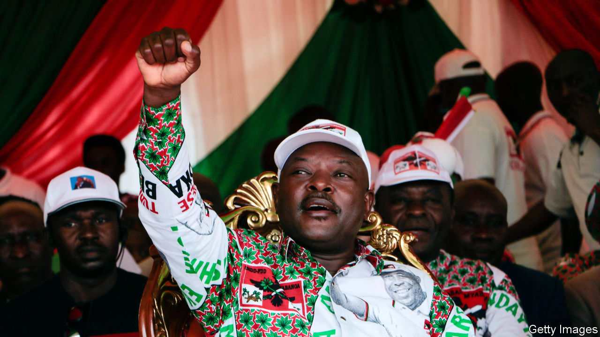

## “The Champion of Patriotism”

# Burundi’s outgoing president dies, possibly of covid-19

> Few will mourn Pierre Nkurunziza, whose regime murdered and tortured opponents

> Jun 11th 2020

IN FOOTBALL, WROTE Jean-Paul Sartre, everything is complicated by the presence of the other team. Pierre Nkurunziza had ways of simplifying things. Burundi’s president, who died on June 8th, would travel with his football team, Hallelujah FC. At matches opponents would shy away from tackles. Some who did not were arrested—a terrifying experience in Mr Nkurunziza’s police state.

The despot’s foul play was apparent off the pitch, too. He became president in 2005, at the end of a civil war, ushering in hope that the country of 11m people could, like neighbouring Rwanda, enjoy some stability. But in 2015, at the end of his term limit, Mr Nkurunziza refused to go. His obstinacy set off tit-for-tat violence, assassinations, a failed coup and the displacement of 400,000 people.

“People hate him,” says a journalist in the country. “During his reign so many people died.” Mr Nkurunziza’s regime murdered and tortured opponents. Corruption and punitive taxes have further impoverished Burundians, 72% of whom live on less than the equivalent of $1.90 per day.

The president agreed not to run for a fourth term in elections in May. Instead he agreed to a new job title: Paramount Leader, Champion of Patriotism and Leadership Core. The vote was rigged in favour of Évariste Ndayishimiye, who is not scheduled to take office until August. Pascal Nyabenda, the speaker of the national assembly and Mr Nkurunziza’s first choice as successor, should fill in as interim president.

Mr Nkurunziza had wanted to run the country from behind the scenes. Now possible rivalry between an interim president and the president-elect could create instability. Then there is the regional picture. Rwanda, Burundi and Uganda have long waged proxy wars in eastern Congo. A power vacuum in Burundi presents a chance for further meddling in its affairs.

The president’s death may, though, allow the country to face up to another pressing issue. He ignored covid-19 and turfed out experts from the World Health Organisation, saying that God would protect Burundi. This may have been his downfall. The government says he died of a heart attack, but local sources whisper that he succumbed to covid-19. His wife was reportedly in Kenya for treatment. His death gives Burundi a chance to tackle the pandemic—and, perhaps, of a bit less foul play. ■

## URL

https://www.economist.com/middle-east-and-africa/2020/06/11/burundis-outgoing-president-dies-possibly-of-covid-19
