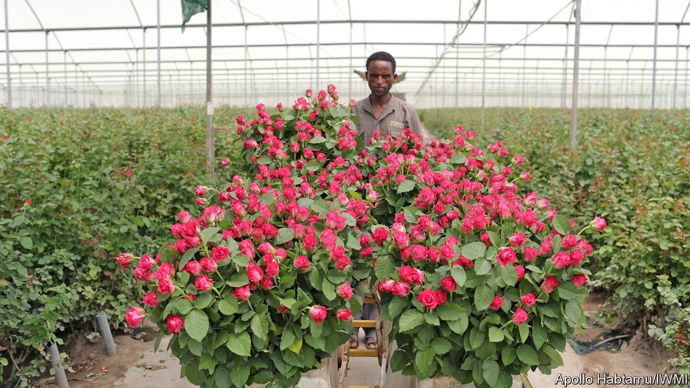
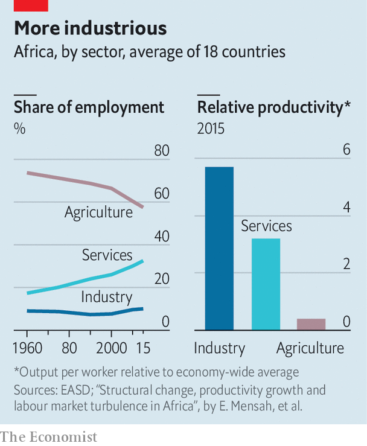

## Production lions

# How manufacturing might take off in Africa

> It won’t be the same as it was in East Asia

> Jun 11th 2020HAWASSA

THE FATHER of development economics and the father of African nationalism did not take long to fall out. Arthur Lewis had made his name studying industrial revolutions. Kwame Nkrumah, Ghana’s first prime minister, had made his resisting British rule. On independence in 1957 Nkrumah invited Lewis to be his adviser.

It seemed a wise pick. Lewis was astute, respected, and trusted in anti-colonial circles. Later, he would win a Nobel prize for economics (the first black person to do so). In a landmark paper, he argued that in developing economies people were poor because they were in the wrong jobs: move them from subsistence farms into factories and commercial farms and the economy would grow.

But how to make it happen? Nkrumah wanted to throw money at factories. “I am a politician,” he explained, “and must gamble on the future.” Lewis urged balance. “If agriculture is stagnant,” he once wrote, “industry cannot grow.” He lasted only 15 months in the job. Meanwhile, it was the countries of East Asia, not Africa, that industrialised and grew rich.

The question of how to make African economies more productive is gaining new urgency amid a pandemic that is disrupting supply chains. Shortages of drugs and medical equipment are fuelling calls for the local production of essential goods. Tito Mboweni, South Africa’s finance minister, wants to “set up manufacturing to make what we need and stop relying on imports from China”. Uganda is trying to discourage imports. Ghana also says it is making import substitution a priority.

Yet a transformation of sorts had already begun well before covid-19. The proportion of Africans working on farms fell from 66% in 2000 to just under 58% in 2015. Most of these people flowed into informal services or petty manufacturing, such as taxis or roadside carpentry, where they earn more than farmers. They do not represent the industrial revolution of which policymakers dream. Yet beneath that broad trend lies a myriad of stories. Nigeria is slowly shaking off its dependence on oil exports. Rwanda hosts conferences and upmarket tourists. Lesotho, one of the few countries to have moved successfully into manufacturing, ships out its apparel along South African roads.

In Ethiopia Bonsa Buta spends his days in a tiny cubicle, a picture of the Virgin Mary stuck to the wall, entombed in a mountain of teff. The 86-year-old trader has been dealing in the grain since the days of Emperor Haile Selassie. The market has changed “incomparably”, he says. Ethiopians use injera, a spongy teff pancake, as plate, cutlery and tasty carbohydrate. Now many buy it ready-made rather than baking it at home. Making or selling injera employs more than 100,000 people.

Across Africa, goods once made at home are now being bought and sold. Rural Africans spend only 40% of their work hours on their farms, and the rest on side-businesses such as transport or trade. They buy nearly half the food they eat, as well as concrete blocks and tin sheets for their homes.

Commercialisation is most evident in the towns and cities. Appetite is growing for processed foods, meat, dairy foods and vegetables. “These kids are looking to try new things,” says Monica Musonda, a Zambian businesswoman who has launched an instant-noodle company. In Ghana, a self-anointed “Koko King” has turned millet porridge into a convenience food for harried commuters. Another entrepreneur has built a multinational drinks company by bottling traditional herbal bitters.

Expanding markets create economies of scale. Many of Africa’s manufacturers began life as trading firms, switching from imports to local production. The same logic is pulling foreign companies to the continent. Consultants at McKinsey estimate that Chinese firms handled 12% of Africa’s industrial production in 2017, employing several million people. Only a few were eyeing exports to the West. Instead, 93% of their revenues came from local and regional sales. Tian Tang, a Chinese business in Uganda, was founded by a trader importing suitcases; it now makes steel, plywood and mattresses. Another outfit chasing untapped demand is Roha, an American firm. In Ethiopia it built a factory making glass bottles for local brewers.

African growth is already being driven by internal consumption and investment, argues Carlos Lopes of the University of Cape Town. The expansion of regional trade would reinforce that dynamic, especially in industry. Manufactured goods make up only 19% of African countries’ exports to the rest of the world, but 43% of what they sell to each other.

Yet Africa will not get rich by producing only for itself. The countries south of the Sahara have less combined purchasing power than Germany. To find larger markets, firms must export to the world. As they learn to compete globally, they also become more productive.

Some argue that the key to East Asia’s early growth was an activist state, high investment and a relentless focus on manufactured exports. Africa has never come close to replicating it. An early wave of import substitution was derailed by a debt crisis. In the 1980s the state lost interest in industrial policy. Factories closed as the IMF and World Bank pressed governments to open their markets to foreign competition.

Unlike Africa, East Asia has little wealth buried beneath its soil, so it relied on sweat instead. At first, low wages gave it a competitive edge. Although Africa has millions of poor people, many African countries are unable to follow the Asian model because their labour costs are too high, according to researchers at the Centre for Global Development, a think-tank. However, wages in Asia have risen a lot in recent years. Since transport costs have fallen, many tasks can now be done thousands of miles apart. Garment firms in Africa stitch shirts from imported fabrics and buttons; carmakers piece together kits of parts. That makes it easier to get a foot on the industrial ladder, but harder to climb beyond the first rung.

So African countries are scouting out a new path. “The scope for classic labour-intensive, export-oriented industrialisation is narrower now,” says Yaw Ansu, who advises the minister of finance in Ghana. “But countries like us can compensate by basing our model on adding value to our agriculture and natural resources.” One example is Blue Skies, a company near Accra. Its workers dice fruit sold in European shops.

Another example is horticulture. In normal times, more than 400 tonnes of cut flowers are flown out of Nairobi every day, on average. In Ziway, an Ethiopian town, kilometre-long greenhouses sprawl like aircraft hangars beside the dust and donkey carts. Roses grow for transport to the Netherlands. Covid-19 has thrown many of these firms into crisis. But when travel and trade bounce back, so will opportunities.

This is not classic manufacturing, but it is not subsistence farming either. Economists at UNU-WIDER, a research institute, talk of these as “industries without smokestacks”. They include tourism and call centres. Africa’s diversity means there will be many routes to success.

Six years ago Roger Lee decided to open a new factory. As the boss of TAL Apparel, a clothing firm in Hong Kong, he already ran operations from China to Indonesia. In Ethiopia he found a supportive government, duty-free access to American markets and wages that were a tenth of what he paid in China. So he rented a shed at a new industrial park in Hawassa.

If Asian-style manufacturing is to take off anywhere in Africa, it might be in Ethiopia, which has some of the lowest wages in the world. Clothing firms like TAL employed 27,000 people in Hawassa before the covid crisis. One Asian factory-owner says the city reminds him of a Bangladeshi port when his uncles opened shop there three decades ago.

Yet Hawassa is an experiment, and much could still go wrong. Ethnic riots have caused shutdowns. Workers rarely meet production targets. Most are young women from the countryside. “They don’t have the mindset for working in a factory,” sighs a manager. Bosses show “no mercy”, says one 19-year-old, rushing from her shift to night class at a local college. It is hard to get time off for sickness or to sit an exam. Workers’ pay does not stretch far and rents are high, so they sleep four to a room.

The low wages that pull in investors also push workers away. In its first year of operation, attrition rates at the industrial park were roughly 100%. Chris Blattman of the University of Chicago and Stefan Dercon of the University of Oxford tracked new hires in Ethiopian factories and commercial farms. A third quit within three months, and 77% within a year.

The Ethiopian experience points to the paradoxes at the heart of Africa’s transformation. While economists worry about jobless millions, factory bosses struggle to find pliant labour. Workers arrive late and quit at harvest time. Contracts are hard to enforce. Markets gum up.

None of this would surprise a visitor from 18th-century Lancashire or 1990s Guangdong. In societies set to agrarian rhythms, the transition to industrial capitalism is a profound social rupture. It carries new notions of law, time and discipline, and creates new kinds of people: commercial farmers, docile workers, methodical managers. It means loss as well as gain. It should be no surprise when many people are indifferent or hostile to change.

The same hesitation is found in some African leaders, long cushioned by aid and oil money. “The urgency for economic transformation is not making them lose any sleep,” says Abebe Shimeles of the African Economic Research Consortium. Yet demographic destiny is pushing the continent towards a reckoning. Some 15m-20m young Africans are entering the workforce each year. Without good jobs, many may take their grievances to the streets.

Some economists such as Dani Rodrik at Harvard University argue that automation, competition and shifting demand are closing the door to countries wanting to copy Asia’s miracle. Yet not everyone needs a factory job. Many Africans will move from subsistence farms to commercial ones, or from living alongside a game reserve to guiding tourists around one. Economic transformation, of a distinctively African kind, is a prize worth chasing. ■

## URL

https://www.economist.com/middle-east-and-africa/2020/06/11/how-manufacturing-might-take-off-in-africa
