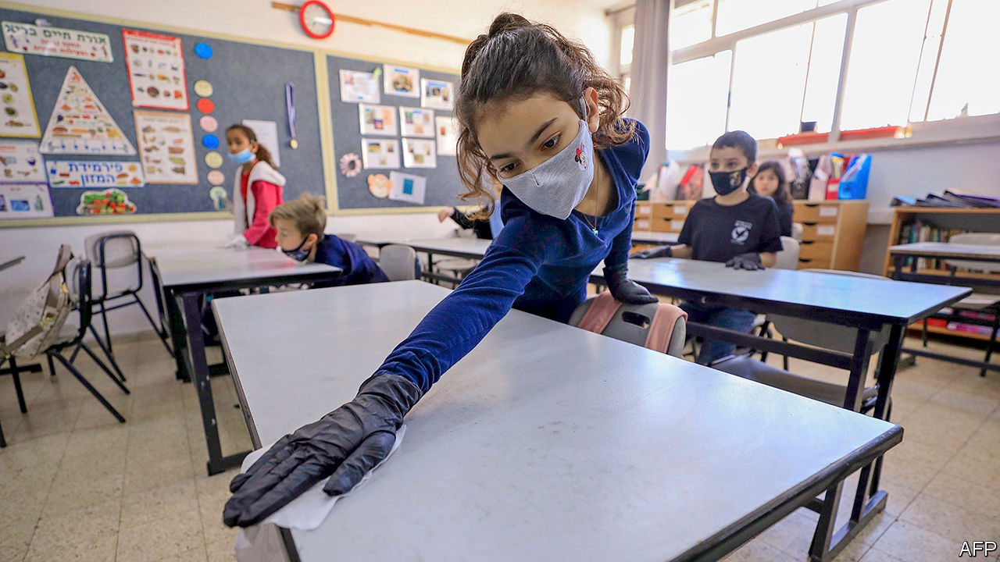
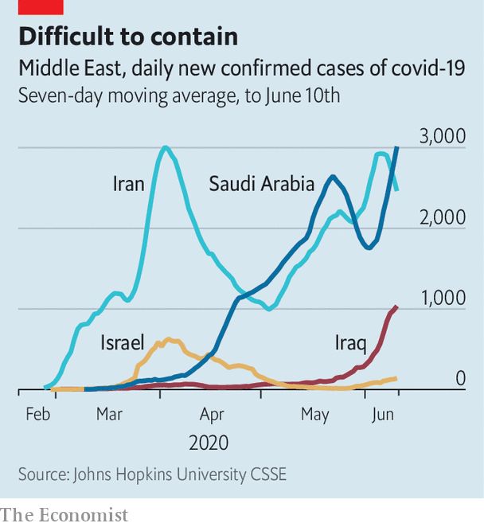

## An unwanted guest returns

# The Middle East is fighting a second wave of covid-19

> Countries that thought they beat the coronavirus discover they have not

> Jun 13th 2020BEIRUT

ACROSS THE Middle East months of closures are giving way to an almost carefree normal. Bars and restaurants in Tel Aviv are packed, with barely a nod to social distancing. Shisha cafés in Jordan’s capital, Amman, among the first businesses shut in March because of their perceived health risks, are full of patrons puffing away. Mask-wearing in Beirut has noticeably dropped since the government imposed a $33 fine for going barefaced. From Tehran to Tunis, many people seem to have declared the covid-19 pandemic finished.

But the pandemic is not finished with them. Several countries have seen, if not yet a second wave, at least a worrying resurgence of cases. Infections and deaths have jumped in Iran, where authorities thought they had tamed one of the world’s worst outbreaks. Schools have become a vector for infection in Israel. In Saudi Arabia, where the first wave never broke, doctors report an unexpected surge in hospitalisations and deaths. However, governments are reluctant to shut down again just as their economies are sputtering back to life. Stopping a second wave may be harder than it was dealing with the first.

Iran was one of the first countries battered by covid-19. New cases peaked in April at around 3,000 a day (see chart). The president, Hassan Rouhani, resisted a full lockdown, fearing the damage it would do to an economy reeling from years of American sanctions. Even his government’s disorderly response helped tame the outbreak, though, and by May cases had dropped enough for restrictions to be largely lifted.

New infections are now back to their April peak. Some of this is due to better testing: after a slow start, the health ministry says it has checked more than 1m people for the virus. But the death toll is also rising, which suggests that the epidemic is indeed getting worse. Average deaths this month, now around 70 a day, are 40% higher than their lows in May. The government blames the increase on large gatherings such as weddings. Doctors say intercity travel is helping the virus spread between provinces. Again, though, Mr Rouhani says Iran cannot afford to shut down; universities reopened earlier this month.

Israel took a different tack. It halted international travel in early March and confined citizens to their homes for weeks. By late May, with fewer than 20 new cases a day and almost no deaths, the government felt it could declare victory. Since children seem less affected by the virus, schools were among the first places to reopen. Some pupils went back as early as May 3rd, with caps on class size and other protective measures (see picture).

Classes were short-lived. Daily cases have grown six-fold from their nadir last month, in part because of infections linked to schools, including more than 100 from a single one in Jerusalem. At least 300 students and teachers have tested positive; thousands of people are in quarantine because of possible exposure. More than 100 schools have been shut, and even where they have not, some parents are keeping their children at home. The health ministry believes it can isolate the new outbreaks, but laboratories are overwhelmed; some patients wait days for test results.

Lockdowns were even more onerous in the Gulf, where places such as Dubai and Saudi Arabia imposed 24-hour curfews for weeks at a time. This did not stop the virus. It continued to spread among the migrant workers who are most of the population in most Gulf states. Still, death tolls have been low: migrants tend to be young, and wealthy governments pay for covid-19 treatment. Life began to resume after the Eid al-Fitr holiday last month.

Since then the epidemic in Saudi Arabia has worsened. On May 20th, just before it entered lockdown during Eid, the kingdom logged ten deaths. By June 9th that had almost quadrupled, to 37. Some hospitals are filling up; the number of patients in intensive-care units has more than tripled. Three doctors died recently, the first reported fatalities among medical staff. The Red Sea city of Jeddah is back under curfew. The authorities have opened a new 500-bed field hospital in its convention centre.

Like their rivals in Iran, the Saudis blame the increased spread on locals ignoring social-distancing rules. Yet they hope to avoid another nationwide lockdown and may even go ahead with next month’s haj, the annual pilgrimage to Mecca, albeit with fewer pilgrims than normal.

None of this was supposed to happen so quickly. Dubai wants to reopen its airport next month for tourists and business travellers. Lebanon, desperate for hard currency, plans to do the same. Jordan hopes to promote domestic tourism this summer. Concerns over public health drove most Arab countries into lockdown this spring. Few think they can afford to do it again. ■