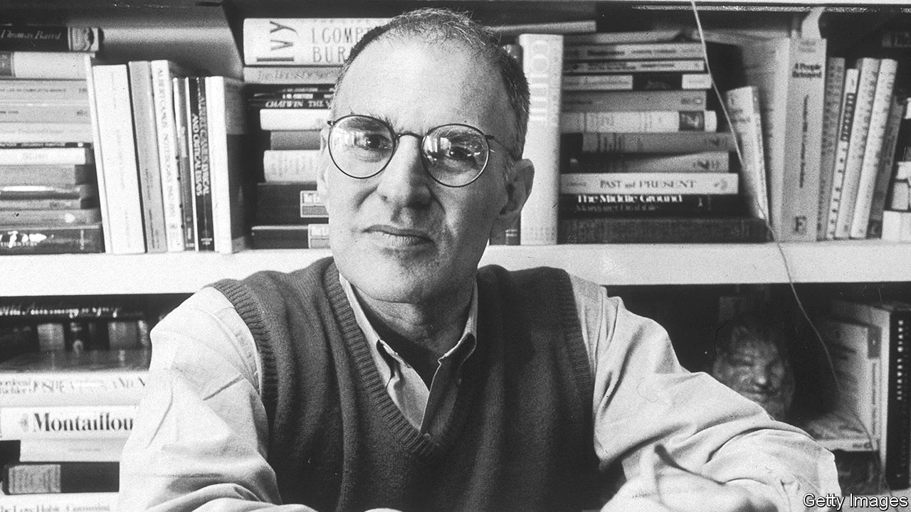

## Shout loud, save lives

# Larry Kramer died on May 27th

> The outspoken prophet of America’s AIDS epidemic was 84

> Jun 13th 2020

SUDDENLY, his face could change. From seeming calm, the brown eyes benevolent and almost shy, it twisted into a furious grimace. Out of the grimace came one scream: “PLAGUE!”

That stopped their stupidity, as the volunteers he had organised squabbled with each other. That focused minds. And he had plenty to yell about. The AIDS epidemic that had struck America in 1981 was being largely ignored, while thousands of gay men died. The right-wing Reagan government would not touch a “gay disease”. Medical research was unfunded and half-hearted. Yet millions of people, not only gays, were at risk. It was pressure from the organisations he founded, especially ACT UP in 1987, that caused HIV/AIDS to be treated like the emergency it was. Research was speeded up exponentially, and government took notice. The ruckus he caused made many people loathe him. But it saved lives.

The disaster of the 1980s was both general and personal. Too many of his friends in Greenwich Village were dead, or dying. They were tired all the time, with swollen lymph glands. They would wake up in swimming pools of sweat. The death-sign was the purple lesions of Kaposi’s sarcoma on their feet or on their faces. No one knew what caused this: promiscuity, poppers, back rooms, the baths, anal sex, semen, shit, saliva, sweat, blood, voodoo, drugs…They were all in the dark. The only clear thing was that their lives were killing them. All it seemed to take was one wrong fuck. No one knew how to treat it, either: chemotherapy, interferons, experimentals, were all useless. He was as scared as anyone. He expected, hoped, to be saved. But it seemed that gay men were being left to save themselves. He had to rally them.

In March 1983, in an article in the New York Native, a gay paper, he laid out the numbers as they were then. Already there were 1,112 cases of this new disease, and 418 deaths. In one month, mid-January to mid-February, 73 deaths. Some 86% of serious cases died within three years. And 72.4% of all such cases were in gay or bisexual men. “If this article doesn’t scare the shit out of you,” he cried, “we’re in real trouble. If this article doesn’t rouse you to anger, fury, rage, and action, gay men have no future on this earth.”

Many called this fearmongering. He thought it long past time. This community of gays, these people he so loved, were leaderless. They also had no one to represent them in the corridors of power. He would speak for them, and be their Moses. In 1981 he had started the Gay Men’s Health Crisis to draw attention to the plague. It was successful in some ways, but too mild for him. Instead of campaigning it became a band of carers, who bought shopping for the sick and walked their dogs. He was the only screamer. Certainly he too could be calm, and kind, even sweet, but this was war: rather than Moses now, he had to be Cassandra. After two years he left, prepared to be a loner if that was what it took. He had earned enough, as a film-production executive in the 1960s and 1970s (“Lawrence of Arabia”, “Women in Love”), to devote himself to agitation. His first act was his article in the New York Native.

Within a few years he had founded ACT UP to do what was needed: study, plan, protest and cause mayhem. Hundreds joined it, many of them sick already. Members disrupted mass at St Patrick’s cathedral and scattered the ashes of AIDS victims on the White House lawn. They invaded the New York Stock Exchange to urge traders to sell Burroughs-Wellcome shares because the pharma company was over-pricing AZT, the first drug to offer hope. They shut down the Food and Drug Administration’s offices because it approved new drugs too slowly. ACT UP combined drama with targeted research; it was militant and infuriating, but it probed in the right places. He led the way. In 1988 his open letter in the San Francisco Examiner to Anthony Fauci, director of the National Institute of Allergy and Infectious Diseases, calling him a murderer and a liar, set Dr Fauci thinking. After that, research picked up. By 1996, good progress then, an effective treatment appeared.

Foot-dragging health institutes and greedy pharma companies were not all he had to challenge. A large swathe of the gay community still refused to believe that their way of life encouraged the virus. Yet even before AIDS struck, he had been excoriating the world he belonged to. The culture of Proust, Tchaikovsky, Plato and Michelangelo, so creative and extraordinary, had become mindlessly physical. The welcome sexual liberation of the 1960s had gone too far. He caught the wave not long after he left Yale, completed his army service and hit New York: the relentless cruising, the bathhouse trysts, the party-orgies on Fire Island, parades of gorgeous gym-buffed bodies, pressure to perform and perform, as if his whole identity lay only in his cock. He satirised that world mercilessly in “Faggots” in 1978, a riot of buttocks and erections in which he, as middle-aged Fred Lemish, was astounded, horny, and lost.

So much unguarded sex had now been proved to make men sick. As important, it also made love impossible. Frenzied brief couplings did not bring the stability and mutual affection he had always longed for. He found these eventually in David Webster, whom he had first met in the late 1970s and married, when at last he could, in 2013. “The normal heart”, as W.H. Auden wrote, “craves…to be loved alone”. His own play about his AIDS struggles, “The Normal Heart” of 1985, included those words. He hoped the play would make people think, and read the flyer he handed out to everyone as they left the theatre. He hoped it would make them cry.

His campaigns never ended. After all, HIV/AIDS was still rampant in the world, and its treatment still hampered by ignorance. Many gays still resisted his argument for monogamy, and were outraged by his accusations. So, by his own lights, he had failed. A good leader should not make so many enemies.

One enemy, though, he had evaded. He did not have AIDS himself. He had HIV, contracted, he thought, from an encounter in 1980, but it never developed further. He was lucky; though frail, he could keep going. To ward off infections, he wore large turquoise rings and several turquoise bracelets. But the really effective way to keep plagues off, he had learned, was just to stand up and yell. ■