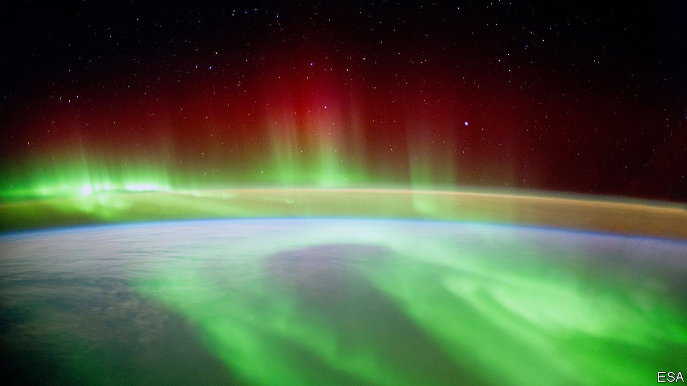

## Planetary monitoring

# A plan to turn the atmosphere into one, enormous sensor

> It will watch for storms, earthquakes, volcanos—and missile launches

> Jun 11th 2020

WHEN AN EARTHQUAKE rocked Nepal in 2015, geophysicists were surprised to find that they could see its reflection in the ionosphere, a layer of the atmosphere beyond about 75km above Earth’s surface. Ground-based instruments saw changes in the density of free electrons in this electrically charged zone. These rippled outward from the point in the ionosphere directly above the earthquake’s epicentre.

Similar effects have been observed with other phenomena, both natural (hurricanes, volcanoes and the passage of meteors) and artificial (blasting associated with mining operations). All of these things cause electrical changes in the sky that can be detected hundreds of kilometres away.

Such observations have led David Lewis, a programme manager at America’s military-research organisation DARPA (the Defence Advanced Research Projects Agency), to wonder just how much information can be wrung out of the atmosphere in this way. That has led him to set up a new DARPA programme called AtmoSense—short for “Atmosphere as a Sensor”. This is now sorting through bids from hopeful academic institutions, and companies large and small, to put together a system to do the wringing.

The ionosphere’s reaction to happenings on the ground is simple in principle but complex in practice. Events like earthquakes produce disturbances in the lower atmosphere. These can take the form of sound waves, shock waves or slower-moving phenomena called atmospheric gravity waves. Such oscillations generally spread out in all directions, including upward towards the ionosphere.

Before they get there, these waves are travelling through electrically neutral gas. This makes them hard to track remotely since there are no electrical effects, such as radio emissions, for detectors to exploit. That changes, though, when they arrive. The movements of high-altitude charged particles (electrons and the electrically charged atoms, called ions, that give the ionosphere its name) in response to passing waves can be picked up in several ways. One is from their effect on GPS satellite-signal reception (which is how the Nepalese earthquake was detected). Another is by the use of ionosondes, a special type of radar that bounces radio waves off this layer of the atmosphere. The third is to use radio waves to stimulate the ionosphere, so that it glows. This is akin to creating an artificial aurora, and makes ionospheric motions visible. Observing ionospheric waves in these ways may answer questions about what sets those waves in motion. But that means gathering lots of data, in order to understand what is going on.

One of AtmoSense’s first goals will be to locate and study phenomena at or close to Earth’s surface—storms, earthquakes, volcanic eruptions, mining operations and “mountain waves”, which are winds associated with mountain ranges. The aim is to see if atmospheric sensing can outperform existing methods: seismographs for earthquakes, Doppler weather radar for storms and so on.

After that, the project will go on to try to gather data beyond the capabilities of current sensors. Radar, for example, can track the positions of storms, but AtmoSense may be able to indicate as well how much energy a storm is releasing, and thus determine whether it is weakening or strengthening. Seismology may be enhanced, too. According to Colonel Lewis, “there might be precursors to earthquakes that are not picked up on the ground. There might be all sorts of information.” That holds out the tantalising prospect of being able to issue earthquake warnings.

The armed forces, who are paying for the project, are particularly interested in gaining insight into activities like missile launches and underground nuclear tests. These should certainly be within the system’s grasp when it is fully developed. But it might also be possible to pick up lesser events, too.

If a meteor’s shock waves can be tracked across the ionosphere, for example, how about those of a hypersonic missile? Or an aircraft? Previous work suggests that events as small as a tonne of explosives going off can be detected. With the right sensors and filters it may be possible to track tinier disturbances still. Colonel Lewis will be looking into new ways of doing this, as well as trying to upgrade the old ones. Among the new methods under consideration are instruments carried by high-altitude drones and balloons, both of which can linger in the upper atmosphere for days at a time.

The first 27 months of the programme will be dedicated to understanding the science behind ripples in both the ionosphere and the electrically neutral atmosphere below it, and then building computer simulations of what is going on. These will be tested to see if they can replicate accurately effects seen in the past.

Once the team have a better understanding of the basic science, they will proceed to the second stage: field trials. This will involve three tests at three-month intervals in which researchers attempt to locate pertinent events, such as storm cells, mining operations and earthquakes. If that works, the project will then move on to matters of military interest by spying on missile launches, tracking aircraft and even watching underground bunkers being dug. The result, if all goes well, may be the world’s first true panopticon. ■