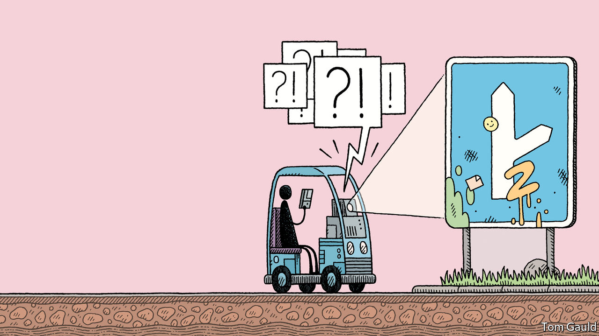

## Automobiles

# Driverless cars show the limits of today’s AI

> They, and many other such systems, still struggle to handle the unexpected

> Jun 11th 2020

IN MARCH Starsky Robotics, a self-driving lorry firm based in San Francisco, closed down. Stefan Seltz-Axmacher, its founder, gave several reasons for its failure. Investors’ interest was already cooling, owing to a run of poorly performing tech-sector IPOs and a recession in the trucking business. His firm’s focus on safety, he wrote, did not go down well with impatient funders, who preferred to see a steady stream of whizzy new features. But the biggest problem was that the technology was simply not up to the job. “Supervised machine learning doesn’t live up to the hype. It isn’t actual artificial intelligence akin to c-3PO [a humanoid robot from the “Star Wars” films]. It’s a sophisticated pattern-matching tool.”

Policing social media, detecting fraud and defeating humans at ancient games are all very well. But building a vehicle that can drive itself on ordinary roads is—along with getting computers to conduct plausible conversations—one of the grand ambitions of modern AI. Some imagined driverless cars could do away with the need for car ownership by letting people summon robotaxis at will. They believe they would be safer, too. Computers never tire, and their attention never wanders. According to the WHO, over a million people a year die in car accidents caused by fallible human drivers. Advocates hoped to cut those numbers drastically.

And they would do it soon. In 2015 Elon Musk, the boss of Tesla, an electric-car maker, predicted the arrival of “complete autonomy” by 2018. Cruise, a self-driving firm acquired by General Motors in 2016, had planned to launch self-driving taxis in San Francisco by 2019. Chris Urmson, then the boss of Waymo, a Google subsidiary widely seen as the market leader, said in 2015 that he hoped his son, then 11 years old, would never need a driving licence.

But progress has lagged. In 2018 a self-driving car being tested by Uber, a ride-hailing service, became the first to kill a pedestrian when it hit a woman pushing a bicycle across a road in Arizona. Users of Tesla’s “Autopilot” software must, despite its name, keep their hands on the wheel and their eyes on the road (several who seem to have failed to do so have been killed in crashes). The few firms that carry passengers, such as Waymo in America and WeRide in China, are geographically limited and rely on human safety drivers. Mr Urmson, who has since left Waymo, now thinks that adoption will be slower and more gradual.

Self-driving cars work in the same way as other applications of machine learning. Computers crunch huge piles of data to extract general rules about how driving works. The more data, at least in theory, the better the systems perform. Tesla’s cars continuously beam data back to headquarters, where it is used to refine the software. On top of the millions of real-world miles logged by its cars, Waymo claims to have generated well over a billion miles-worth of data using ersatz driving in virtual environments.

The problem, says Rodney Brooks, an Australian roboticist who has long been sceptical of grand self-driving promises, is deep-learning approaches are fundamentally statistical, linking inputs to outputs in ways specified by their training data. That leaves them unable to cope with what engineers call “edge cases”—unusual circumstances that are not common in those training data. Driving is full of such oddities. Some are dramatic: an escaped horse in the road, say, or a light aircraft making an emergency landing on a highway (as happened in Canada in April). Most are trivial, such as a man running out in a chicken suit. Human drivers usually deal with them without thinking. But machines struggle.

One study, for instance, found that computer-vision systems were thrown when snow partly obscured lane markings. Another found that a handful of stickers could cause a car to misidentify a “stop” sign as one showing a speed limit of 45mph. Even unobscured objects can baffle computers when seen in unusual orientations: in one paper a motorbike was classified as a parachute or a bobsled. Fixing such issues has proved extremely difficult, says Mr Seltz-Axmacher. “A lot of people thought that filling in the last 10% would be harder than the first 90%”, he says. “But not that it would be ten thousand times harder.”

Mary “Missy” Cummings, the director of Duke University’s Humans and Autonomy Laboratory, says that humans are better able to cope with such oddities because they can use “top-down” reasoning about the way the world works to guide them in situations where “bottom-up” signals from their senses are ambiguous or incomplete. AI systems mostly lack that capacity and are, in a sense, working with only half a brain. Though they are competent in their comfort zone, even trivial changes can be problematic. In the absence of the capacity to reason and generalise, computers are imprisoned by the same data that make them work in the first place. “These systems are fundamentally brittle,” says Dr Cummings.

This narrow intelligence is visible in areas beyond just self-driving cars. Google’s “Translate” system usually does a decent job at translating between languages. But in 2018 researchers noticed that, when asked to translate 18 repetitions of the word “dog” into Yoruba (a language spoken in parts of Nigeria and Benin) and then back into English, it came up with the following: “Doomsday Clock is at three minutes to twelve. We are experiencing characters and dramatic developments in the world, which indicate that we are increasingly approaching the end times and Jesus’ return.”

Gary Marcus, a professor of psychology at New York University, says that, besides its comedy value, the mistranslation highlights how Google’s system does not understand the basic structure of language. Concepts like verbs or nouns are alien, let alone the notion that nouns refer to physical objects in a real world. Instead, it has constructed statistical rules linking strings of letters in one language with strings of letters in another, without any understanding of the concepts to which those letters refer. Language processing, he says, is therefore still baffled by the sorts of questions a toddler would find trivial.

How much those limitations matter varies from field to field. An automated system does not have to be better than a professional human translator to be useful, after all (Google’s system has since been tweaked). But it does set an upper bound on how useful chatbots or personal assistants are likely to become. And for safety-critical applications like self-driving cars, says Dr Cummings, AI’s limitations are potentially show-stopping.

Researchers are beginning to ponder what to do about the problem. In a conference talk in December Yoshua Bengio, one of AI’s elder statesmen, devoted his keynote address to it. Current machine-learning systems, said Dr Bengio, “learn in a very narrow way, they need much more data to learn a new task than [humans], they need humans to provide high-level concepts through labels, and they still make really stupid mistakes”.

Different researchers have different ideas about how to try to improve things. One idea is to widen the scope, rather than the volume, of what machines are taught. Christopher Manning, of Stanford University’s AI Lab, points out that biological brains learn from far richer data-sets than machines. Artificial language models are trained solely on large quantities of text or speech. But a baby, he says, can rely on sounds, tone of voice or tracking what its parents are looking at, as well as a rich physical environment to help it anchor abstract concepts in the real world. This shades into an old idea in AI research called “embodied cognition”, which holds that if minds are to understand the world properly, they need to be fully embodied in it, not confined to an abstracted existence as pulses of electricity in a data-centre.

Biology offers other ideas, too. Dr Brooks argues that the current generation of AI researchers “fetishise” models that begin as blank slates, with no hand-crafted hints built in by their creators. But “all animals are born with structure in their brains,” he says. “That’s where you get instincts from.”

Dr Marcus, for his part, thinks machine-learning techniques should be combined with older, “symbolic AI” approaches. These emphasise formal logic, hierarchical categories and top-down reasoning, and were most popular in the 1980s. Now, with machine-learning approaches in the ascendancy, they are a backwater.

But others argue for persisting with existing approaches. Last year Richard Sutton, an AI researcher at the University of Alberta and DeepMind, published an essay called “The Bitter Lesson”, arguing that the history of AI shows that attempts to build human understanding into computers rarely work. Instead most of the field’s progress has come courtesy of Moore’s law, and the ability to bring ever more brute computational force to bear on a problem. The “bitter lesson” is that “the actual contents of [human] minds are tremendously, irredeemably complex…They are not what should be built in [to machines].”

Away from the research labs, expectations around driverless cars are cooling. Some Chinese firms are experimenting with building digital guide rails into urban infrastructure, in an attempt to lighten the cognitive burden on the cars themselves. Incumbent carmakers, meanwhile, now prefer to talk about “driver-assistance” tools such as automatic lane-keeping or parking systems, rather than full-blown autonomous cars. A new wave of startups has deliberately smaller ambitions, hoping to build cars that drive around small, limited areas such as airports or retirement villages, or vehicles which trundle slowly along pavements, delivering packages under remote human supervision. “There’s a scientific reason we’re not going to get to full self-driving with our current technology,” says Dr Cummings. “This less ambitious stuff—I think that’s much more realistic.” ■