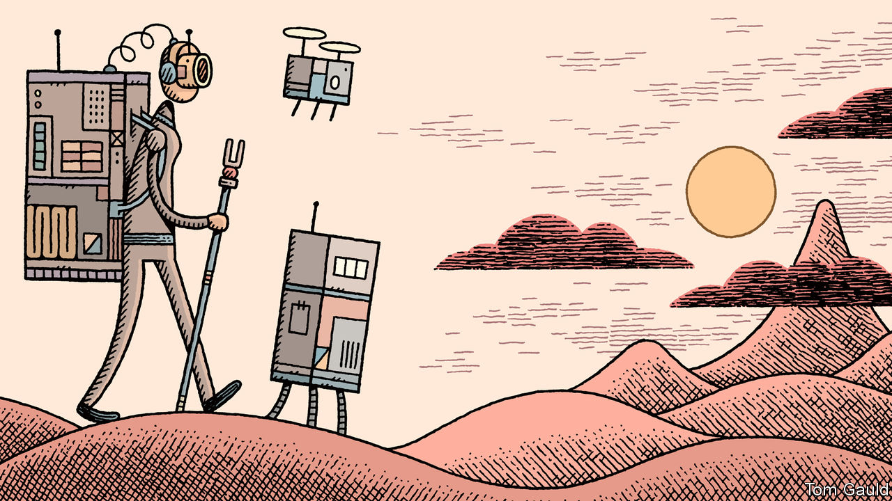

## The future

# Humans will add to AI’s limitations

> It will slow progress even more, but another AI winter is unlikely

> Jun 11th 2020

IN 1958 A psychologist and computer-science researcher named Frank Rosenblatt gave a public demonstration of his Perceptron, the distant ancestor of modern machine-learning algorithms. The Perceptron had been developed on a 9-tonne IBM 704, a mainframe computer with less power than a modern television remote control. Its party trick was its ability to learn, without any direct programming, to recognise cards printed on the left from those printed on the right.

America’s navy, which funded the work, hoped the Perceptron would be “the embryo of an electronic computer that…will be able to walk, talk, see, write, reproduce itself and become conscious of its own existence”. The machine would be able to “recognise people and call out their names” and “instantly translate speech in one language to speech or writing in another”.

A sure way to fail is to set expectations too high. In 1969 a widely read book by Marvin Minsky and Seymour Papert, two AI researchers, described how, in contrast to the grand promises, the Perceptron was constitutionally incapable of performing certain elementary tasks. Research into neural networks languished for a decade.

The history of AI is of periodic bouts of overexcitement interspersed with “AI winters”, in which limits become apparent, enthusiasm drains away and funding is slashed. In 1973 the British government abandoned nearly all AI research, citing the field’s failure to meet its “grandiose objectives”. After Minsky and Papert’s book, the focus of AI research turned to “symbolic” approaches that focused on formal logic and rigid, top-down reasoning. Once again, early progress caused much excitement before the unmet promises piled high enough to cause another backlash in the 1980s. Funding cuts closed research projects. American officials dismissed efforts at AI as little more than “clever programming”.

The current bout of enthusiasm has been the biggest yet. Some researchers therefore worry that, as the limits of modern AI become apparent, a correspondingly big bust is coming. In 2018 Filip Piekniewski, an AI researcher at Accel Robotics, a shop-automation startup, likened the excitement around deep learning to a stockmarket just before the bubble bursts. It is impossible to tell precisely when a crash will happen, wrote Dr Piekniewski, but it is “almost certain that it will at some point.”

Perhaps. But disillusionment, if it comes, could arise not just from the growing realisation of modern AI’s technical limitations, but from how they interact with its strengths. Although this report has focused on areas in which AI falls short, there are good reasons for the excitement surrounding it. The ability to spot patterns in tranches of data, sometimes with superhuman accuracy, has a thousand uses. Governments and businesses are rushing to adopt it, in ways that will directly affect ordinary people.

In authoritarian countries those people will have little choice about what is done to them by AI. China already offers a blueprint for AI-enhanced control, most clearly in the police state it has built, with the help of facial recognition, in Xinjiang. In democracies, though, ordinary people—or their representatives—will have some say. They are unlikely to be uncritically welcoming.

On February 5th, for instance, a Dutch court ruled that syRI, an AI-powered system designed to detect tax and social-benefit fraud, was unlawful. The system was designed to inhale reams of data from various government departments and spot odd-looking patterns within them that might reveal mischief. The court held that the Dutch government had failed to balance its obligation to crack down on fraud with its obligation to protect the privacy of its citizens. The campaigners who had brought the case pointed out that the Netherlands is hardly the only place using AI in such ways. Britain and Australia are running similar systems. Researchers hoping to apply AI to covid-19 might reflect on a poll which suggested that around half of Americans would refuse to install a location-tracking contact-tracing app on their phones.

As people become familiar with AI’s peculiar mix of power and fragility they may be reluctant to trust it with important decisions. A study in 2019 from the New York University School of Law and the AI Now Institute examined predictive-policing algorithms. These tell police forces where best to deploy their officers, based on trends from historical crime data. The researchers found 13 jurisdictions, including Chicago and New Orleans, whose police have a history of racist behaviour, were investigating the technology. Training algorithms on racially biased data, say the researchers, risks reinforcing those same biases, this time backed by the potent techno-mystique of “artificial intelligence”. Even in China, there is disquiet: one recent poll found 74% of respondents unhappy about the growing use of facial-recognition for identification.

AI researchers are starting to grapple with these sorts of problems. Two years ago, Google published a set of “AI principles”, saying systems should be “socially beneficial”, “avoid creating or reinforcing unfair bias”, and “be built and tested for safety”. Microsoft and Facebook, have made similar promises. The field of “AI safety”, which wrestles with these questions, is nascent but growing. AI’s incubation among the internet giants means investigations into its broader effects have lagged behind questions about the bottom line. “So much of the development in machine learning has been around ads and social media,” says one executive. “So the focus has been…on accuracy and less on ethics or consequences.”

Indeed, social media is an example of an anti-AI backlash that is already under way. Dismayed by the conspiracy theories and misinformation promoted by algorithms that prioritise “engagement” over all else, countries are passing laws to force firms to blunt their worst impacts. AI is creating jobs, not destroying them: Facebook employs over 15,000 human content moderators to police its algorithms, twice the number it had in 2017.

Brad Smith, the president of Microsoft, has said that instead of asking what AI can do, humans need to think about what it should do. The technological limits of naive, fallible AI, in other words, will lead humans to impose additional political and social limits upon it. Clever algorithms will have to fit into a world that is full of humans, and, in theory at least, run by them. Artificial intelligence is both powerful and limited. As that realisation spreads, some of the dreams of high summer will fade in the autumnal chill. ■