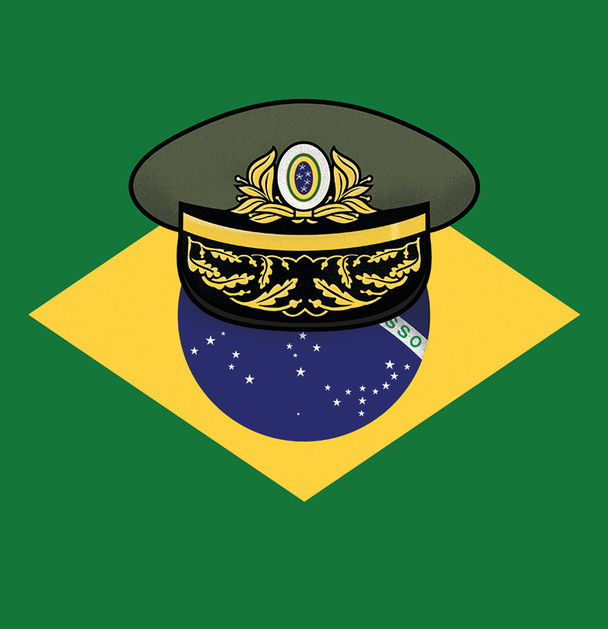

## Bello

# Does Jair Bolsonaro threaten Brazilian democracy?

> And would the army support him if he tried something rash?

> Jun 11th 2020

MOST WEEKENDS since covid-19 hit Brazil, supporters of President Jair Bolsonaro have rallied in Brasília and São Paulo. They demand the reopening of a partially locked-down economy, the shutting down of the Supreme Court and Congress and a return to the military rule of 1964-85. A few are armed. In the capital Mr Bolsonaro often joins them, dispensing hugs and handshakes in defiance of health regulations. Neither he nor they wear face masks.

Since Mr Bolsonaro, a former army captain with far-right views, took office in January 2019 many Brazilians have been sanguine about the threat he poses to democracy. Some argue that the country’s institutions are strong enough to restrain him. True, the president has stuffed his government with military officers. But they have been seen as a moderating influence. And the demonstrations are small.

Tensions have risen in the past few weeks. Mr Bolsonaro has become more intimidating, saying of Congress, “The time of villainy is over, now it’s the people in power,” and of the court, “It’s over, for fuck’s sake.” Some of the military ministers, starting with Vice-President Hamilton Mourão, a retired general, have issued veiled threats against the court, Congress and the media.

In a WhatsApp message leaked last month, Celso de Mello, the senior justice of the court, wrote: “We must resist the destruction of the democratic order to avoid what happened in the Weimar Republic,” which was overthrown by Hitler. “Brazilian democracy is under serious threat,” agrees Oscar Vilhena Vieira, the dean of the law school at the Fundação Getulio Vargas (FGV), a university. “The president is not just trying to create an institutional conflict, [but also] trying to stimulate violent groups.”

A backbench congressman for 28 years, Mr Bolsonaro has never shown much respect for democracy. He has now become more confrontational for two reasons. First, the Supreme Court has launched investigations that involve him. One is into his sacking of the federal police commander, to protect one of his sons from prosecution, say his critics. Another is into supporters (including another two of his sons) suspected of orchestrating slurs and threats towards the court’s justices.

The second reason is that Mr Bolsonaro shows little ability to govern. The pandemic has dramatised that. His refusal to support lockdowns and social distancing has contributed to covid-19’s severe toll in Brazil, with nearly 40,000 deaths, the world’s third-highest number. He is losing popular support, although he retains a core of around 30% of voters.

It is a sign of his weakness that he increasingly relies on the army. Ten of his 22 ministers are now military men and 3,000 others are in government jobs. “De facto we have a military regime,” says a former officer. That carries risks for the armed forces as well as for democracy. Mr Bolsonaro has exacerbated the army’s internal division and politicisation, which began earlier. Its discipline and hierarchy are fraying. Many junior officers voice their support for Mr Bolsonaro on social media. Four generals with jobs in the presidential palace, two on active service, have more power than the army commander, their nominal superior.

The army also runs a grave risk to its reputation. It is now in charge of the health ministry (where it briefly tried to halt publication of full covid-19 data), political co-ordination and protecting the Amazon. “They really believe they know how to do things,” says the former officer. They may learn the hard way, as during the dictatorship, that they don’t.

Mr Bolsonaro does not look strong enough to pull off a coup. He is opposed by most of Brazil’s state governors. Although the virus has temporarily disabled Congress, Mr Vieira notes that the Supreme Court is acting in an unusually united way. Nevertheless, “democracy can die even if you don’t have a strongman”, warns Matias Spektor of the Centre for International Relations at FGV. If Mr Bolsonaro is eventually impeached Mr Mourão would succeed him, bringing the army still closer to power.

Another threat, notes Mr Spektor, is Mr Bolsonaro’s hollowing out of Brazil’s democratic institutions and fomenting of conflict. He has installed a friendly prosecutor-general, and has influence over the state police forces as well as the federal police. A police raid has silenced Rio de Janeiro’s governor, recently a critic of Mr Bolsonaro’s. Brazilian democrats, often adversaries, are starting to unite in opposition to the president. They are right to be alarmed.