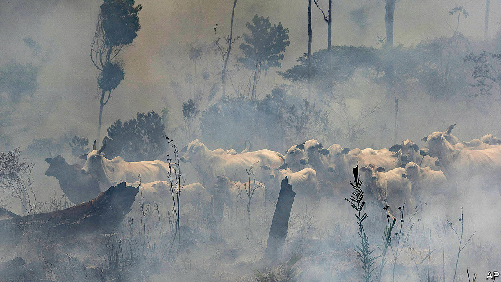
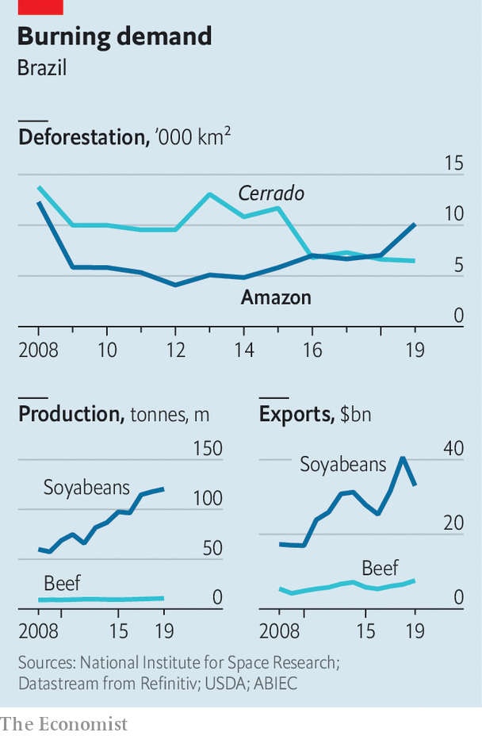

## Of chainsaws and supply chains

# How big beef and soya firms can stop deforestation

> They don’t chop down Amazonian trees, but their suppliers do

> Jun 11th 2020SÃO PAULO

THE WORLD’S emissions of carbon dioxide may fall by 7% this year because of lockdowns in response to the pandemic, according to Nature Climate Change, a journal. Brazil is a glaring exception. Its emissions will rise by 10-20% from 2018, when they were last measured, says the Climate Observatory, a consortium of research outfits. The culprit is deforestation. In the first four months of 2020 an estimated 1,202 square km (464 square miles) were cleared in the Brazilian Amazon, 55% more than during the same period in 2019, which was the worst year in a decade. Come August, when ranchers set fire to cleared areas to prepare them for grazing, runaway blazes could outnumber those that shocked the world last year. Scientists say tree loss is nearing a “tipping point”, after which trees will dry out and die, releasing billions of tonnes of carbon into the atmosphere.

Environmentalists blame Brazil’s populist president, Jair Bolsonaro, for the catastrophe. He favours deregulation to allow logging, mining and farming in the forest and has weakened enforcement of environmental laws. Less attention has been paid to the role of big firms like JBS and Cargill, global intermediaries for beef and soya, the commodities that drive deforestation (see [Graphic detail](https://www.economist.com//graphic-detail/2020/06/11/a-study-names-firms-that-buy-products-from-areas-with-deforestation)). 

The companies do not chop down trees themselves. Rather, they are middlemen in complex supply chains that deal in soya and beef produced on deforested land. The process begins when speculators, who tend to operate outside the law, buy or seize land, sell the timber, graze cattle on it for several years and then sell it to a soya farmer. Land in the Amazon is five to ten times more valuable once it is deforested, says Daniel Nepstad, an ecologist. Not chopping down trees would have a large opportunity cost. In 2009 Mr Nepstad estimated that cost (in terms of forgone beef and soy output) would be $275bn over 30 years, about 16% of that year’s GDP.

Under pressure from public opinion, the big firms have made attempts to control the problem. In 2009, a damning report from Greenpeace led JBS, Marfrig and Minerva, meat giants which together handle two-thirds of Brazil’s exports, to pledge to stop buying from suppliers that deforest illegally. (The forest code allows owners to clear 20% of their land.) JBS, which sources from an area in the Amazon larger than Germany, says it has blocked 9,000 suppliers, using satellites to detect clearing. Soya traders such as Cargill and Bunge have used such systems to enforce a zero-deforestation agreement for the region since 2008, when retail firms like McDonald’s and Tesco said they would no longer buy Amazonian soya harvested on deforested land. 

These agreements contributed to a sharp decline in the rate of tree loss until 2012 (see chart). Before the “soya moratorium”, 30% of new fields in the Amazon involved clearing forests. In the eight years after it was signed, 99% of soya expansion was on land that was already treeless. But, warns André Vasconcelos from Trase, a research initiative that tracks commodity supply chains, the frenzy of deforestation under Mr Bolsonaro could reverse this trend. 

The deforestation surge shows that the agreements have an Achilles’ heel, says Mr Nepstad. The big firms are still not exerting the control they could over all their suppliers. And even if they did, large amounts of soya, and especially beef, are traded by smaller firms with weaker incentives to persuade farmers to change behaviour.

The problem is especially acute in ranching, which accounts for roughly 80% of deforestation in the Amazon, nearly all of it illegal. “Cows move around,” explains Paulo Pianez of Marfrig. Every fattening farm the big meatpackers buy from has, on average, 23 of its own suppliers, says Holly Gibbs of the University of Wisconsin. Current monitoring doesn’t cover ranchers who breed and graze cattle, so it misses 85-90% of deforestation. Rogue fattening farms can also “launder” cattle by moving them to lawful farms—perhaps their own—right before selling them. A new Greenpeace report alleges that through this mechanism JBS, Marfrig and Minerva ended up selling beef from farms that deforested a protected Amazon reserve on the border between Brazil and Bolivia. They said they had not known about any illegality.

Soya-driven deforestation more directly affects the cerrado, the tropical savannah southeast of the rainforest. In Mato Grosso, a state that straddles the Amazon and the cerrado, 27% of deforestation between 2012 and 2017 took place on soya farms, according to a new report by Imaflora and Instituto Centro de Vida (ICV), Brazilian research institutes, and Trase. The state provides a third of the EU’s soya imports from Brazil. Ninety-five per cent of clearing on soya farms was illegal. A third occurred in the Amazon, revealing a gap in the soya moratorium. Since it only covers land where soya is planted, a farmer who illegally clears another part of his farm—say, for cattle—can continue selling to traders, who crush and export the soya. 

André Nassar of Abiove, a soya-industry lobby, points out that the area of new soya fields planted on deforested land in the cerrado has fallen: from 215,000 hectares (530,000 acres) a year in 2000-06 to 79,000 hectares in 2013-18. The industry should distinguish legal from illegal deforestation, he says—it doesn’t do annual monitoring in the cerrado—but embargoing farms is the responsibility of the government. Nonetheless, Bunge and Cargill have vowed to source only from land that has not been deforested, legally or illegally. They missed their 2020 deadline but plan to succeed by 2025 and 2030, respectively. 

Perhaps they would move faster if they felt more pressure from customers and investors. One reason that soya giants seem more serious than meat producers about reducing deforestation, says Maria Lettini of FAIRR, a network of investors concerned about sustainability, is that most soya is exported. The EU is the second-top destination after China. But companies struggle to get people to pay more for a “hidden commodity”, says Juliana Lopes of Amaggi, a Brazilian soya behemoth. “You know your clothing is made of cotton and your chocolate comes from cacao,” she says. But few people will pay extra for chicken made with sustainable soya, which explains why just 2-3% is certified deforestation-free. Better labelling could help, she says.

Four-fifths of Brazilian beef, by contrast, is eaten in Brazil. Exports go mostly to China, Russia and the Middle East, where feeding people is a higher priority than saving trees. Investors, for their part, see beef firms as unsexy businesses with thin margins. They haven’t demanded huge efforts to reduce deforestation, says João Paulo Dibo of Rio Bravo Investimentos, an asset manager in São Paulo. Sexy or not, beef producers are doing well. While Brazilian share prices overall are down by 18% this year, Marfrig has seen its share price rise by 27% and Minerva has recovered what it lost at the start of the pandemic. JBS, the world’s largest meatpacker, said 2019 was the most profitable year ever.

Morgan Stanley, Itaú and Santander declined to discuss soya and meat companies with The Economist. A new 58-page report by Itaú recommends investing in JBS, Marfrig and Minerva. (It doesn’t contain the word “deforestation”.) This reflects “myopia” at a time when investing in sustainable industry is rapidly expanding, says Fabio Alperowitch of FAMA Investimentos. It is one of 230 funds with more than $16trn in assets that signed a letter in the wake of last year’s fires calling on firms to end deforestation. BlackRock, one of JBS’s top-ten shareholders, did not sign, even though it is divesting from coal. 

Economic turmoil makes it unlikely that companies will soon spend a lot to combat deforestation, says Marcello Brito of the Brazilian Agribusiness Association. “Shareholders won’t want it,” he says.

Despite these discouragements, the firms say they are making progress. The meatpackers claim they are working towards their promise, made in 2009, to expand tracing to indirect suppliers. One idea is to use animal-transit permits, which track vaccinations as cattle are passed between ranchers, to flag deforestation. But the agriculture ministry has yet to agree. Minerva is considering using a tool developed by the University of Wisconsin, called Visipec, to map suppliers, identify regions with high deforestation and prioritise suppliers in other areas. Minerva gets 30% of its beef via full-cycle breeding, which it can guarantee is deforestation-free. Commercial restrictions could actually benefit the top firms, says its sustainability director, Taciano Custodio. “We’re better positioned to adapt.”

But change from the top three meatpackers won’t guarantee a reduction in deforestation, because they account for less than half of the market. “When we block a supplier, he can cross the road and sell to another slaughterhouse,” says Márcio Nappo of JBS. Industry-wide progress will require better enforcement and incentives for ranchers. “We have to make production sustainable as a whole,” says Mr Pianez.

That sentiment is echoed in the soya industry, where cracking down on deforestation is logistically simple but politically tough. According to the Mato Grosso study, 80% of illegal deforestation took place on 400 farms, 2% of the total. They are “low-hanging fruit” for action, says Mr Vasconcelos. But two years of talks about expanding the moratorium to the cerrado stalled. According to soya growers, multinational firms failed to raise $250m to launch a fund for compensating farmers who retain woodland. “They demand, demand, demand, but don’t offer anything in return,” complains Ricardo Arioli.

Cargill says it will spend $30m on ways to stop deforestation industry-wide. Marfrig and Amaggi are backing an initiative launched by the government of Mato Grosso in 2015 to reduce deforestation through a “landscape approach”. Fernando Sampaio, the director of its committee, which includes NGOs and companies, says municipalities that reduce deforestation will receive technical assistance and credit and more business from the big firms, incentivising others to follow. But although the rate of deforestation in the state between August 2018 and July 2019 decreased by 4% from a year earlier, the initiative looks set to fall far short of its goal of ending illegal deforestation by 2020: 85% of the 1,685 square km cleared were done so illegally. 

Among the biggest obstacles to progress is the lack of co-operation from the federal government. In a video of a cabinet meeting in April released by the Supreme Court, the environment minister, Ricardo Salles, called on the government to “push through” deregulation while people are distracted by the pandemic. A rule change in the indigenous agency allows landowners to claim chunks of indigenous territories that are awaiting official demarcation. Even the Amazon soya moratorium appears shaky. Aprosoja, a growers’ lobby, threatened to abandon it (because it forbids legal deforestation). The agriculture minister, Tereza Cristina, called it “absurd”.

Reducing deforestation will require consensus on tricky issues like the fate of tens of thousands of poor settlers on public lands in the Amazon, where half of deforestation takes place. However, environmentalists say that the “land regularisation” bill currently in Congress would also grant titles for big deforested tracts to “land-grabbers”, sending the message that further clearing might also get a pass. An earlier version of the bill was rejected on May 20th after British supermarkets threatened to boycott Brazilian products.

Though still faint, such noises are growing louder. They add to the argument that companies should make changes not just for ethical reasons, but also for business reasons. Supermarkets could speed things up by telling consumers where their beef and soya come from. Getting farmers and ranchers on board will require the right balance of pressure and incentives. The companies have leverage, Ms Gibbs insists. A decade ago, after JBS, Marfrig and Minerva pledged to purge suppliers who deforested, more than 30 other beef firms signed similar agreements. “If you could get a big company to take the first step, others would follow,” she predicts. ■

Correction (June 11th 2020): A previous version of this article identified Trase as an NGO.

Sign up to our fortnightly climate-change newsletter [here](https://www.economist.com//theclimateissue/)