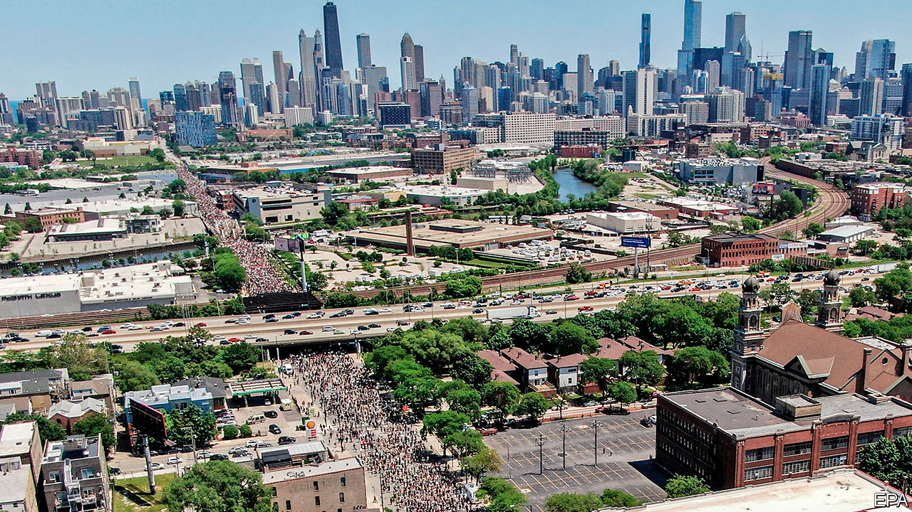
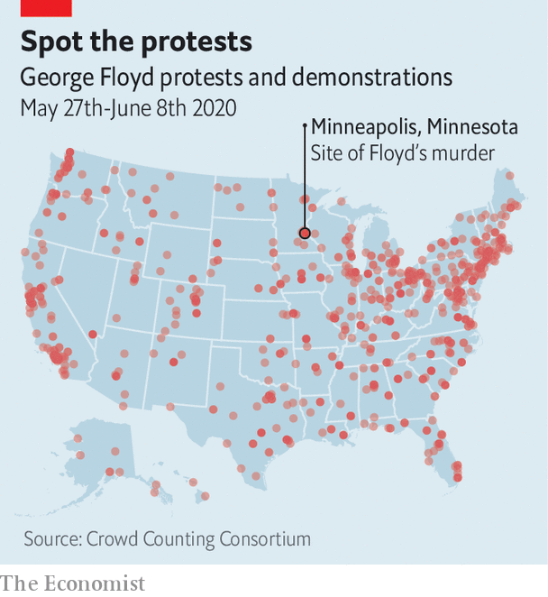

## No justice, no peace

# America’s protests turn jubilant

> Democrats are not organising them, but they do stand to gain

> Jun 11th 2020WASHINGTON, DC

A WEEK AFTER the Trump administration ordered riot police to charge a peaceful crowd in Lafayette Square, it was transformed. The leafy park in front of the White House was enclosed by a steel fence, through which police could be seen loitering. The streets alongside it—including newly named “Black Lives Matter Plaza”, at the bottom of 16th Street, in direct view of the White House—had been colonised by protesters and were far more fun.

Late into the sultry evening, the chanting throng that had filled the plaza for much of the day—and most days since George Floyd’s murder—was winding down. Black musicians and street artists performed for a thinning crowd. A young woman had set up a stall offering free deodorants, tampons and fruit: “Take what you need—just know you are loved,” she carolled. Well-wishers ambled along the fence-line, perusing the banners, drawings and personal messages plastering it.

They offer a cultural history of America’s recent decades of racial injustice, including prayers for many of its victims. “I’m still crying for Emmett Till”, read one note decorated with hearts, beside a sketch of the 14-year-old child lynched in 1955. They also included more overtly political messages, such as “Who do you call when the police murders?” and, in reference to the White House’s well-guarded chief resident, “Bunker bitch”.

This potpourri also reflects the diffuse and largely spontaneous nature of the protests. A minority, especially in the early days after Mr Floyd’s death, have seen violence, first by protesters, then increasingly also by the police (though it is not clear that any of this was caused by the shadowy anarcho-leftists William Barr, the attorney general, has pointed to). The vast majority of the multiracial gatherings have been peaceful, however. Many have been organised by groups of friends and neighbours in small towns. By one count there have been protests in 1,280 places—including such hotbeds of left-wing militancy as Sister Bay, Wisconsin, and Sheridan, Wyoming.

In big cities such as Washington, DC, black activist groups have played a significant organising role. Many are members of a national coalition, the Movement for Black Lives, which was formed in 2014 and has 150 constituent parts. Its best-known, Black Lives Matter (BLM), which came to prominence over police killings during Barack Obama’s second term, has been especially influential, in part by rallying left-leaning whites, whose mass participation in these protests is their most novel feature. “The political weather has shifted,” says Makia Green of Black Lives Matter DC, “We now have widespread multiracial, multi-generation support.”

A broader growth of centre-left activism during Mr Trump’s tenure has probably also played a role. Much of it is rooted in the Women’s March that drew millions onto the streets shortly after the president’s inauguration to protest against misogyny. Indeed, some of the many grassroots groups spawned by that protest have been involved in organising demonstrations in recent days. One such in Pennsylvania, a state-wide organisation called Pennsylvania Stands Up, which campaigns on voting rights, immigration reform, racial justice and other centre-left issues, helped boost turnout and marshal crowds in Lancaster and Philadelphia.

Where is this headed? Perhaps not to the radical reforms many of the protesters demand. The current Congress has passed little except coronavirus stimuli. It is not about to start defunding the police. Yet academic research into the long-term political effects of the Women’s March and Tea Party movement of 2009 suggests such protests do not merely reflect public opinion. They also increase voter turnout. That sounds like more bad news for the president’s overwhelmingly white voting base.

“A lot of people who don’t normally vote say they’re going to vote now,” said Elena, a Hispanic property manager from Fairfax, Virginia, who had spent a long hot day at the plaza, “to be part of history” with her daughter and black boyfriend. “People can argue about whichever party is better for this or that,” she said. “But on this issue, it’s completely clear.”■

## URL

https://www.economist.com/united-states/2020/06/11/americas-protests-turn-jubilant
