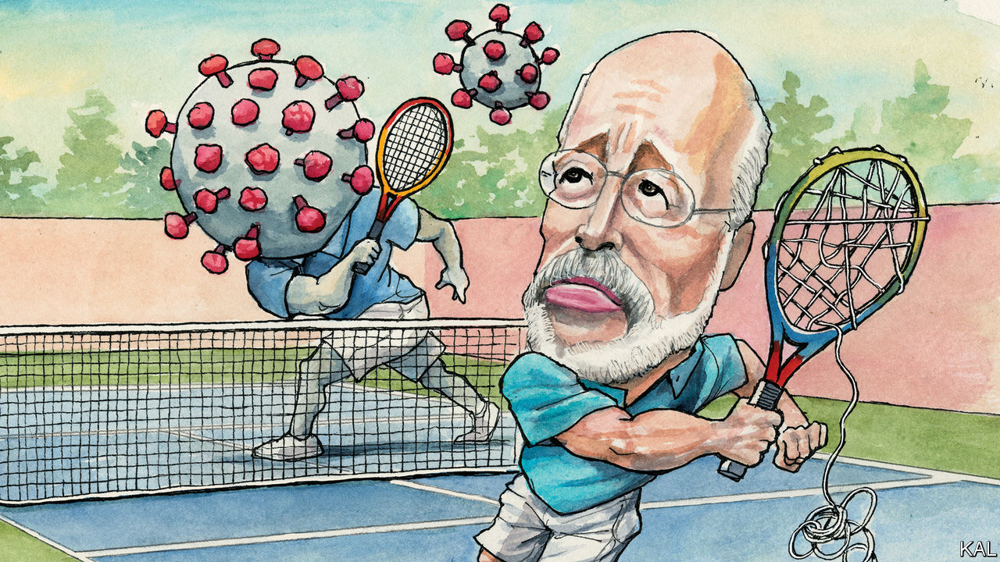

## Lexington

# How Pennsylvania’s governor is battling the pandemic

> A day on the frontline with Tom Wolf is an unnerving experience

> Jun 11th 2020

IN RELAXED pre-9/11 days, your columnist was once permitted to sit in the cockpit for a flight from Delhi to London. The experience left him with mixed feelings about flight safety. On the one hand, the two Canadian pilots who generously included him in their competition to get through the first-class dessert menu were experienced and relaxed. On the other, the plane was on autopilot almost the whole way. And the only time one of them was called upon to intervene—when a coil of wiring suddenly let off sparks—he didn’t seem to know what he was doing. Even the most technically proficient operations can look all too human up close.

Lexington experienced something similar during a rainy day in Harrisburg, shadowing Governor Tom Wolf and his covid-19 team.

The 71-year-old Democrat’s evidence-based handling of the crisis has been justly admired. Though over 6,000 Pennsylvanians have succumbed to the virus, the early lockdown he instituted probably helped avoid the greater tragedies seen in New York and New Jersey. It was therefore all the more unnerving to hear the governor describe the large assumptions and insufficient resources that—three months into this emergency—one of America’s better-governed states is still labouring under. As Lexington listened to Mr Wolf and his team fix the details of Pennsylvania’s reopening and defence against the second wave of infections they expect, he could not help but recall the image of a pilot trying to rewire his cabin with a wrench at 35,000 feet.

The amiable governor might even be considered an ideal leader for this crisis. An MIT PhD who eschewed academia to turn his family kitchen-cabinet business into one of America’s biggest, he is by turn cerebral and pragmatic. To underline his many points about the plague realities confronting America, Mr Wolf, wearing a home-made blue face mask, cited Adam Smith, John Maynard Keynes, Lord Beaverbrook, the novels of Hilary Mantel and this newspaper. Yet he is by no means doctrinaire.

Pennsylvania adopted strict criteria to determine which industries could function through the lockdown. It also put in place a flexible process for companies to challenge them—as over 6,000 did. “I recognise the legitimacy of the argument that we can easily hurt ourselves by overdoing it,” the governor says. “You’ve got to be right down the centre.”

Centrism is a dying art in Pennsylvania—James Carville’s description of it as Philadelphia and Pittsburgh with Alabama in between has never seemed truer. Mr Wolf has been attacked from the left ever since he won election in 2014 as a pragmatic outsider. Inspired by Donald Trump, the local Republican Party has meanwhile gone insane—as illustrated by the angry protests against social distancing its leaders took part in. At the time of Lexington’s visit, one of those Republican state representatives was revealed to be in quarantine, a Republican colleague having tested positive for the virus. When the governor noticed the story playing on muted televisions in his war-room, he permitted himself a small smile.

One of America’s foremost patricians—he had driven in that morning from his ancestral home in Mount Wolf, a town founded by a forebear—he prefers to avoid partisanship. He is correspondingly reluctant to criticise the Trump administration. He says the president’s tweeted encouragement to the crazies (the “great people of Pennsylvania want their freedom”) was merely “not helpful”. He considers it “a lame exercise to be too critical of how prepared the administration was”. Yet such carefulness makes his account of its pandemic response all the more devastating.

He describes the federal distribution of medical supplies to the states as an enthusiastic mess. The six private companies charged with this task do not tell states what they have delivered, leading to confusion and potential hoarding. The administration’s failure to co-ordinate the states’ own purchasing has meanwhile locked them in a mutually destructive bidding war for additional resources. Mr Wolf gives your columnist’s suggestion that such state proactiveness has nonetheless compensated for the absence of presidential leadership short shrift. Not since the second world war has the indispensability of a strong centre been so apparent, he suggests. He is additionally damning of the administration’s failure to launch a big push for better testing, or for a vaccine, or to reincentivise health-care providers to prepare for future viral waves. “No state has the capacity to do such things,” he says.

How can America return to a semblance of normality without them? Mr Wolf does not claim to know. The idea of population-wide testing-tracing is a fiction, he says. To test every Pennsylvanian once a month would require over 3m tests a week. The state can currently do 80,000, a figure it is striving to double by the autumn, when Mr Wolf expects falling temperatures to bring the feared second wave. And he means to devote most of that capacity to vulnerable populations, including minorities and residents of Pennsylvania’s 2,000 care homes, which have been especially ravaged. That will not leave much for everyone else. “We’re so far from testing being at the heart of restoring confidence that we’re going to have to come up with something else,” he says.

Like thermometers, perhaps? “That’s nothing.” Then like self-reporting any possible exposure to the virus—a system Amazon and other big firms are adopting? “Something like that could work,” he muses. “But the trouble is you’re trusting people to tell the truth. If I were in fifth grade there’d be someone sick in my family every week so I didn’t have to go to school.”

Pennsylvanians seem to appreciate Mr Wolf. His ratings have risen during the pandemic as Mr Trump’s have dropped. Hopefully they have heeded his frankness, too. Through luck and solid leadership at every level below the presidency, America seems to be emerging from the first wave of the pandemic less scathed than it might have been. But it is largely unprepared for the virus’s resurgence.■

Editor’s note: Some of our covid-19 coverage is free for readers of The Economist Today, our daily [newsletter](https://www.economist.com/https://my.economist.com/user#newsletter). For more stories and our pandemic tracker, see our [coronavirus hub](https://www.economist.com//news/2020/03/11/the-economists-coverage-of-the-coronavirus)

## URL

https://www.economist.com/united-states/2020/06/11/how-pennsylvanias-governor-is-battling-the-pandemic
