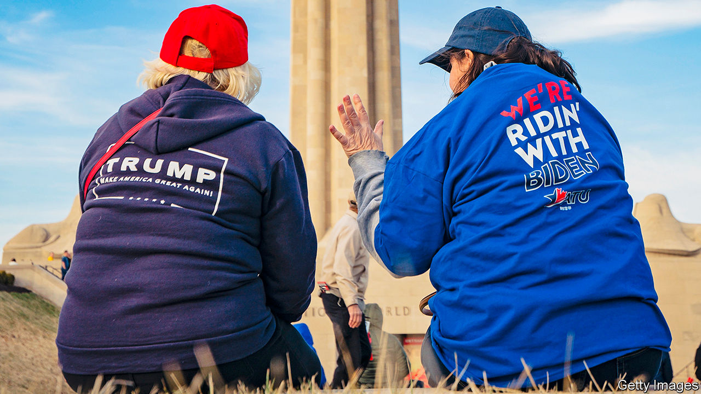
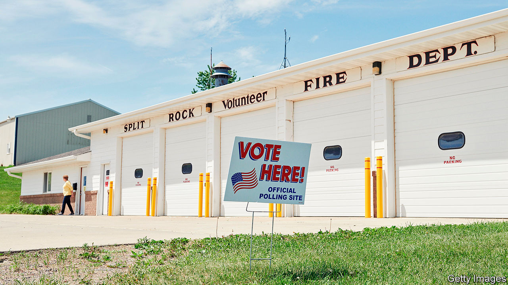
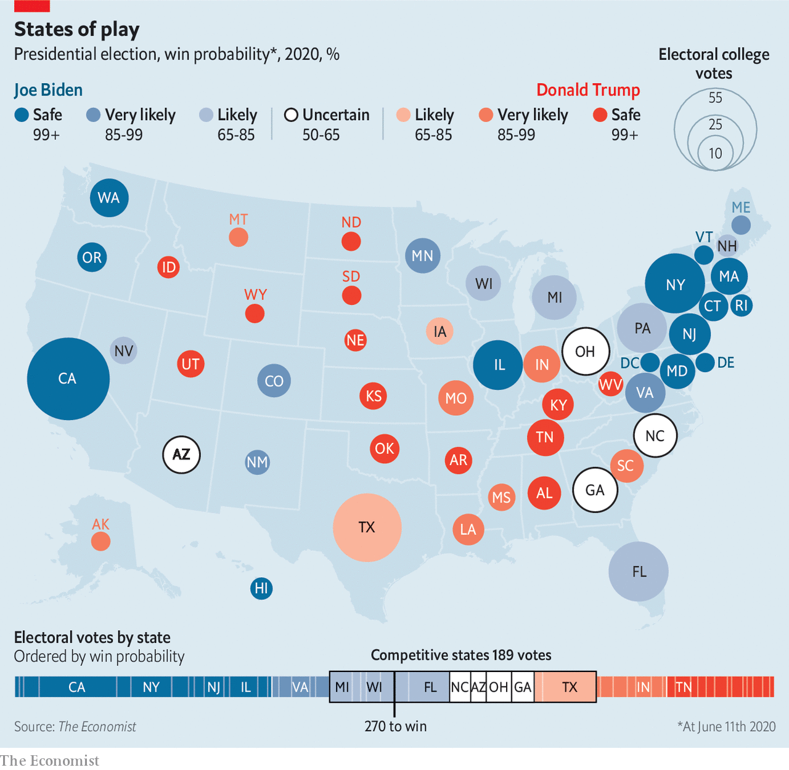
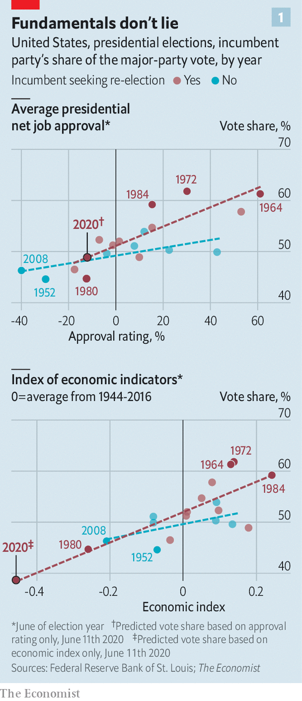
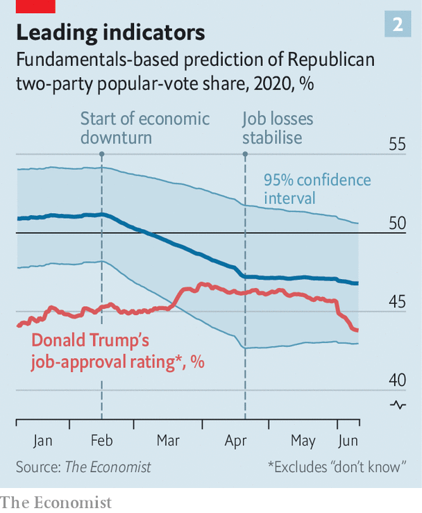
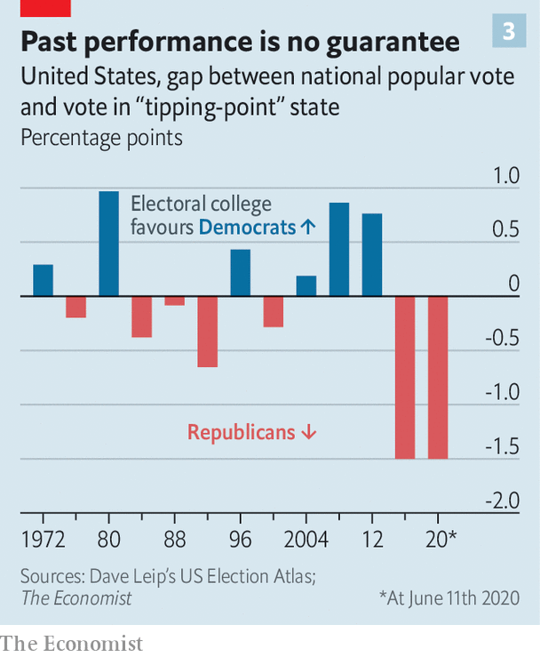

## Model voters

# Meet our US 2020 election-forecasting model

> In early June, it gives Donald Trump a one-in-five shot at re-election

> Jun 11th 2020

FOUR MONTHS ago, Donald Trump’s odds of winning a second term had never looked better. After an easy acquittal in his impeachment trial, his approval rating had reached its highest level in three years, and was approaching the upper-40s range that delivered re-election to George W. Bush and Barack Obama. Unemployment was at a 50-year low, setting him up to take credit for a strong economy. And Bernie Sanders, a self-described socialist, had won the popular vote in each of the first three Democratic primary contests.

But even by Mr Trump’s frenetic standards, the tumble in his political stock since then has been remarkably abrupt. First, Joe Biden, Barack Obama’s moderate and well-liked vice-president, pulled off a comeback for the ages, surging from the verge of dropping out to presumptive nominee. Then covid-19 battered America, claiming at least 110,000 lives and 30m jobs. And just when deaths from the virus began to taper off, protests sparked by the killing of George Floyd convulsed cities across America. Mr Trump’s callous response has widened the empathy gap separating him from Mr Biden into a chasm.

Even at the president’s high-water mark in February, he trailed Mr Biden by five percentage points in national polling averages. That deficit has now swelled to eight. Polls of swing states tell a similar tale. Mr Biden is not only ahead in the midwestern battlegrounds that elected Mr Trump the first time, but also in Florida and Arizona. Even states that Mr Trump won easily in 2016, such as Georgia, Texas, Iowa and Ohio, look competitive. There is little question that if the election were held today, Mr Biden would win in a near-landslide.

The election, of course, will not be held today. In fact, more time remains between now and November 3rd than has passed since Mr Trump’s impeachment trial. And given the devotion of the president’s base, Mr Biden is probably approaching his electoral ceiling, whereas Mr Trump has plenty of room to win back soft supporters.

Indeed, there are good reasons to expect he will. First, the latest jobs report suggests that the economy may have bottomed out. In 1984 Ronald Reagan trounced Walter Mondale by declaring “Morning in America”, though unemployment remained high by historical standards. Mr Trump plans to make the same argument. The Black Lives Matter protests could also backfire on Democrats if they rally white voters behind the “law and order” candidate, as they are thought to have done in 1968.

Given all this uncertainty, it is tempting to conclude that it is too early for predictions, and call the election a virtual toss-up. That is the view of bettors, who currently make Mr Biden a bare 55-45 favourite. Yet a hard look at the data and at history suggests that this is too generous to Mr Trump. [The Economist’s first-ever statistical forecast](https://www.economist.com/https://projects.economist.com/us-2020-forecast/president) of an American presidential race, which we launch this week and will update every day until the election, gives Mr Biden an 82% chance of victory.

Mr Trump’s unlikely triumph in 2016 left many quantitative election forecasters looking silly. Sam Wang, a professor at Princeton, vowed to eat a bug if Mr Trump, whom he said had just a 1% chance of victory in November 2016, came even close to winning. (He chose a cricket.)

However, statistical models that used a historically accurate amount of polling error, and factored in the tendency of such errors to benefit the same candidate in similar states, actually fared rather well. Given that Hillary Clinton led polls both nationwide and in a sufficient number of states to deliver her the electoral college, no rigorous forecast on the day of the election could have anointed Mr Trump the favourite. But numerous models put her chances at below 85%, and some were as low as 70%. (When applied retroactively to 2016, our own election-day forecast would have given Mrs Clinton a 71% shot—roughly the same probability it would have assigned to Mr Obama beating Mitt Romney on election day in 2012.) Just as solid number-crunching revealed the brittleness of Mrs Clinton’s position, we hope it will shed similar light on this year’s race.

Like most forecasts, our model, built with the aid of two academics from Columbia, Andrew Gelman and Merlin Heidemanns, applies past patterns of voters’ behaviour to new circumstances. Its stated probability of victory answers the question: “How often have previous candidates in similar positions gone on to win?” If those historical relationships break down, our forecast will misfire. But one of the paradoxes presented by Mr Trump’s unprecedented presidency is that voters have mostly treated him as they would handle any other Republican.

Our analysis begins with “fundamentals”, or structural factors that shape the public’s choices. Predictably, when presidents have high approval ratings, their parties’ candidates tend to get more votes (see chart 1). Incumbents seeking re-election also fare better if the economy does well, though growing partisan polarisation has shrunk this effect. And voters seem to have an “eight-year itch”: only once since term limits were enacted in 1951 has the same party won three times in a row.

Because of the two-term penalty, these factors correctly predicted Mr Trump’s victory in 2016. Until recently, they were poised to favour him again: a typical modern incumbent with a good-not-great economy and bad-not-terrible approval ratings should win around 51% of the vote. However, the recession set off by covid-19 has turned the fundamentals against him.

Just how much this hurts Mr Trump is hard to estimate. First, no post-war president has been saddled with an economic crash this deep. Does moving from 10% unemployment to 15% hurt an incumbent as much as moving from 5% to 10%? Second, whereas recovery from previous economic calamities has been slow and grinding, the easing of lockdowns is likely to put millions of Americans back to work before the election. Come November, will voters punish Mr Trump for the big decline since February, or reward him for a smaller gain since April? Finally, voters may not treat a recession caused by a pandemic the same as one with economic roots. Despite mass unemployment, Mr Trump’s approval rating remains above its lows of 2017.

Our model acknowledges these unknowns by increasing the uncertainty in its predictions when economic conditions differ vastly from their historical norms, and dampening the impact of unusually large booms and busts (see chart 2). As a result, it treats the current downturn as merely 40% worse than 2009, rather than twice as bad. This is consistent with Mr Biden winning 53% of votes cast for either him or Mr Trump—a margin halfway between Mr Obama’s in 2008 and 2012, and one similar to his lead in the polls before the Floyd protests began.

Such fundamentals, however, are only a starting-point. Early in a campaign, they tend to predict final results far more reliably than polls do. Eventually, polls reveal whether voters are indeed reacting to the candidates as the fundamentals imply.

Polls are prone to biases, above and beyond their stated margins of error. Their results vary based on whether they are conducted by phone or online, which demographic categories they use to weight responses and how they seek to predict who will turn out to vote. Their results can also oscillate if one side’s partisans become unusually eager or disinclined to answer survey questions—a phenomenon known as “partisan non-response bias”.

Rather than analysing polls individually, our model considers them collectively. It assumes that particular survey methods, weighting schemes, adjustments for partisan non-response bias and the like influence reported results in unknown ways. Using a statistical method called Markov Chain Monte Carlo, it then estimates the impact of these factors, by finding the values for them that best explain the differences in results between pollsters surveying similar places at similar times. Finally, it blends the resulting polling average with a forecast based on fundamentals, placing greater weight on polls as time goes on.

With the election five months away, the model now relies mostly on fundamentals. These are sufficiently grim for Mr Trump that it gives him just a 5% chance of getting more votes than Mr Biden does. However, his overall odds of victory are about four times higher than that, thanks to a healthy chance that he once again wins the electoral college while losing the popular vote.

Reports of Mr Trump’s vice-like grip on the battleground states are a bit premature. States’ partisan leans relative to each other shift frequently. For example, in 2012 Barack Obama won Iowa by six percentage points while losing Texas by 16. Four years later, Mrs Clinton came closer to winning Texas than Iowa. Such volatility means advantages in the electoral college can be short-lived. Had the national popular vote been tied every year, the college would have delivered the presidency to Democrats in four of the five elections from 1996 to 2012 (see chart 3).

There is no guarantee that the electoral college will continue to favour Mr Trump. Mr Biden has fared well in polls of Arizona, whose Republican lean has shrunk since 2016. The state could provide him with another path to victory if he cannot wrest back Wisconsin—or, along with Florida, a sunbelt alternative to the entire rustbelt.

At the same time, there is also no evidence that Mr Trump’s electoral-college advantage has dwindled. In 2016 his vote share (excluding third parties) in Wisconsin, the state that delivered him the election, was 1.4 percentage points higher than his performance overall. Today, our model puts Mr Biden on track to win 53.5% of the nationwide two-party vote, and 52% in Pennsylvania, the most likely decisive state—a nearly identical gap of 1.5 points.

An electoral-college advantage of this size would not save Mr Trump if Mr Biden’s lead remains near its current level. But if Mr Trump were to cut Mr Biden’s edge in half, the current state of the electoral map would make him highly competitive. In such a scenario, Mr Biden would win the popular vote by as much as Mr Obama did in 2012—and be rewarded with a near-tie and possibly a disputed election.

The eerie resemblance between our estimate of Mr Biden’s chances and many calculations of Mrs Clinton’s odds four years ago may give Democrats a sense of déjà vu. Now as then, Mr Trump has a clear path to victory. An accelerating economic recovery, a continuing edge in battleground states, and an ill-timed gaffe, senior moment or scandal from Mr Biden could do the trick. Our model does not account for the impact of covid-19 on voter turnout (or, potentially, on the health of the two geriatric male nominees). As the underdog, Mr Trump should welcome this uncertainty. His chances of re-election are far greater than Mr Biden’s were in late February of winning the Democratic nomination.

But just as it was wrong to count Mr Trump out four years ago, it is wrong to regard him as invincible now. In 2016 polls favoured Mrs Clinton, whereas fundamentals favoured Mr Trump.

This time, history suggests that the electorate will punish an unpopular incumbent saddled with a depressed economy, and voters are currently telling pollsters they plan to do just that. What Mr Biden needs to do is run out the clock. ■

Dig deeper:

## URL

https://www.economist.com/united-states/2020/06/11/meet-our-us-2020-election-forecasting-model
