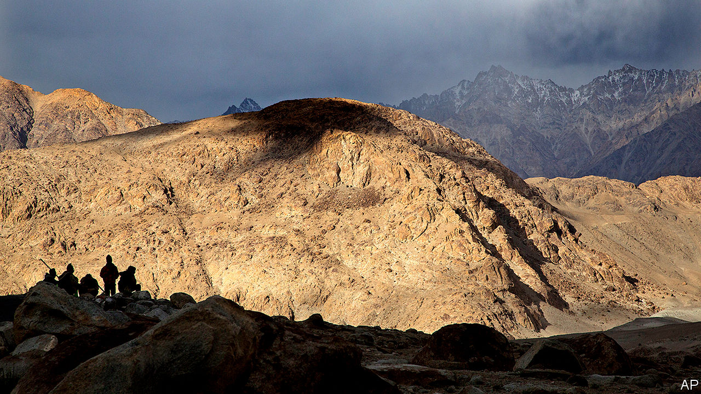

## Death valley

# India and China have their first deadly clashes in 45 years

> Bloodshed on the border marks a turning point in relations between Asia’s giants

> Jun 18th 2020

THE TWO armies each had machineguns, artillery and tanks to the rear. But they wielded only sticks and stones at the front, as night fell on June 15th. That was deadly enough. When the brawl ended, and the last rocks had been thrown, at least 20 Indian troops lay dead or dying in the picturesque Galwan valley, high in the mountains of Ladakh. Chinese casualties are unknown. These were the first combat deaths on the border between India and China in 45 years, ending an era in which Asia’s two largest powers had managed their differences without bloodshed.

The Indian and Chinese armies had been locked in a stand-off at three sites along their disputed border, known as the Line of Actual Control (LAC), since May. China’s People’s Liberation Army (PLA) grabbed 40 to 60 square kilometres of territory that India considers to be its own, estimates Lieut-General H.S. Panag, a former head of the Indian army’s northern command, including areas it had never previously contested. Both sides moved thousands of troops and heavy weapons towards the border, and brawls erupted twice in May.

India’s government played down the crisis, eager to avoid giving the impression that it had been caught napping—and mindful that a nationalist backlash would make it harder to defuse the situation. On June 6th both sides agreed to “disengage” at two of the three sites, including the Galwan valley. Talks had been “very fruitful”, enthused General M.M. Naravane, India’s army chief, on June 13th.

Not fruitful enough, it would seem. According to Indian press accounts, an argument developed after an Indian patrol tried to dislodge a Chinese position on the south bank of the Galwan river, an area that was supposed to be a buffer zone. China says that India “twice crossed the border line for illegal activities and provoked and attacked Chinese personnel”. On June 15th the PLA launched what India called a “premeditated and planned” attack with rocks and nail-studded clubs, during which Indian troops fell and were pushed down a steep slope into the river below. Some were beaten to death; others died of hypothermia.

China’s state-run media largely ignored the clashes and the PLA did not give details of its casualties, though Narendra Modi, India’s prime minister, said on June 17th that “our soldiers died having battled and killed the enemy.” India acknowledges that over 20 of its own soldiers lost their lives, with others thought to be missing. But despite Mr Modi’s threat of a “befitting reply if antagonised”, neither side seems keen to escalate matters. On the same day, both countries agreed to press ahead with their earlier disengagement agreement.

The immediate cause of the current crisis seems to have been India’s build-up of infrastructure in eastern Ladakh, including a key north-south road, making it easier to move troops and redressing China’s advantage in logistics. “What we’re seeing right now is the friction of both sides adjusting to a more capable and more resolved Indian approach to the LAC,” says Rohan Mukherjee of Yale-NUS College. But the two countries have also been carried to this point by wider geopolitical currents.

Though India and China have been rivals for a half-century—the PLA thumped India’s army in a brief border war in 1962—their rivalry has grown more intense over the past decade. The border has turned stormier, with a 73-day stand-off occurring on the edge of Bhutan in 2017. India is anxious about China’s growing economic and political clout on India’s periphery—in Pakistan, Nepal, Bhutan, Bangladesh and Sri Lanka—and about the influx of Chinese warships into the Indian Ocean.

In response, successive Indian governments have tilted closer to America, with which India signed a $3.5bn arms deal in February, and China’s rivals in Asia, such as Vietnam. A quartet of China-sceptic countries known as the “Quad”, comprising America, Australia, India and Japan, now meet regularly. Though India is at pains to stress that the Quad is not an alliance, Australia may soon join naval exercises involving the other three countries.

The violent turn in the border dispute is likely to accelerate these trends. “We are at a worrisome and extremely serious turning-point in our relations with China,” says Nirupama Rao, a former head of India’s diplomatic service and ambassador to China. She notes a “clear asymmetry of power” between the two countries. India is likely to deepen its relationship with America and increase its defence budget, says Mr Mukherjee. As both sides shift resources to the border, “there will be a period of adjustment in which things may be especially heated,” he says.

On June 17th India was elected to a two-year term as a non-permanent member of the UN Security Council. Yet it now has its hands full on its own borders. On June 12th an Indian citizen was killed by Nepalese border guards, amid a separate border row between India and Nepal. Relations with Pakistan are also fraught. An Indian soldier was killed by Pakistani shellfire in Kashmir on June 14th and, the next day, two Indian officials in Pakistan were allegedly abducted and tortured by “Pakistani agencies”. And then more soldiers were sent tumbling to their deaths by China’s troops. ■